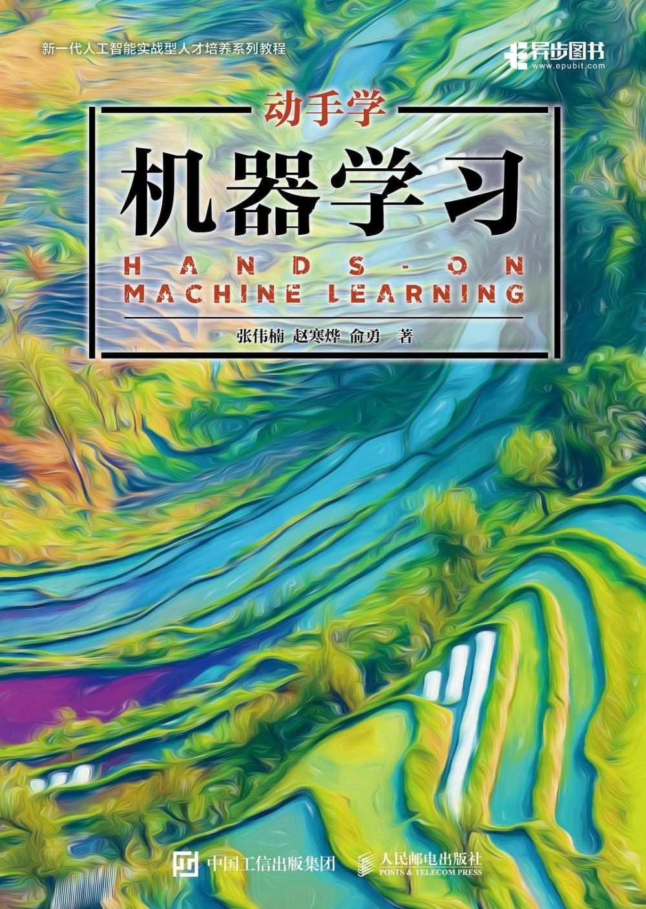

# hands-on-ML
动手学习 ML

## Kaggle入门：逻辑回归应用之Kaggle泰坦尼克之灾 

[Kaggle Titanic jupyter notebook](titanic/kaggle_titanic.ipynb)

## 参考资料

### 《动手学机器学习》

> 配套源代码下载地址：
https://github.com/boyu-ai/Hands-on-ML
> 
> 已完成部分解答：https://github.com/motewei/Hands-on-ML-solutions

> 教学PPT课件下载地址：
http://hml.boyuai.com

> 教学视频：[上海交大张伟楠机器学习课程第1讲：机器学习简介I-哔哩哔哩](https://b23.tv/QkbYWyR)