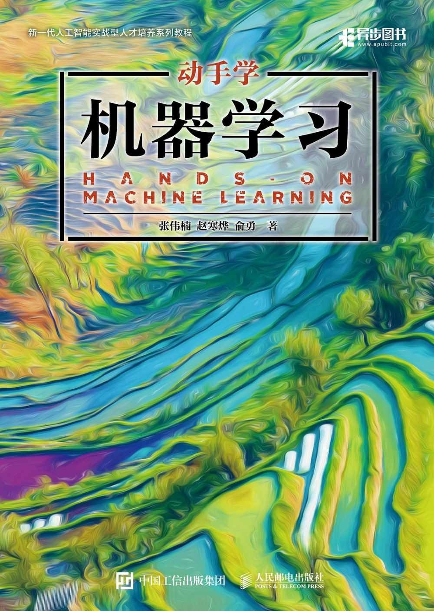
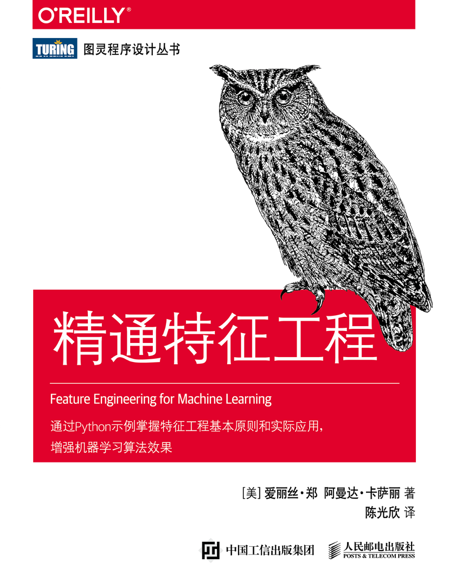
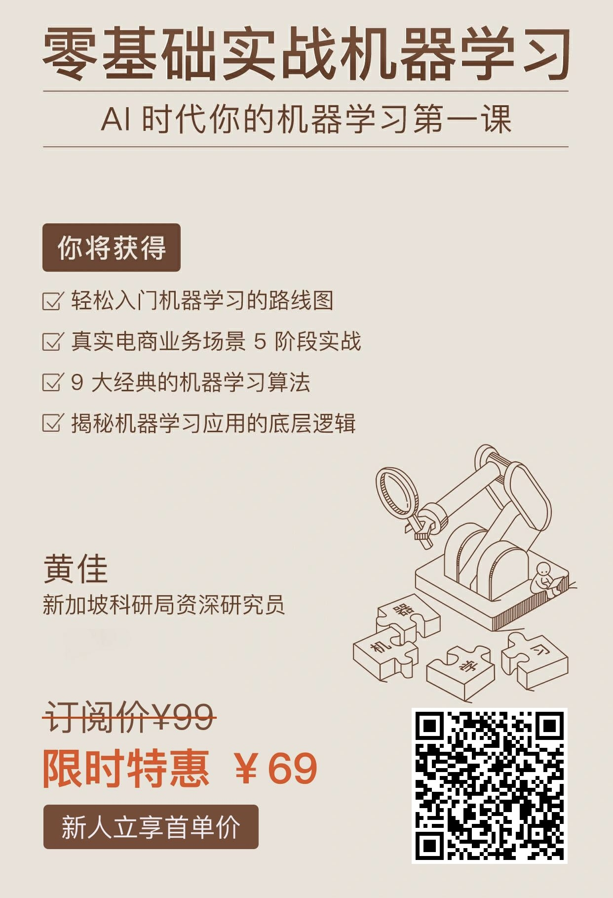

# 动手学机器学习

本仓库提供结构化的机器学习学习路径，涵盖核心理论、可运行代码与典型实战案例，便于按章节循序学习与复现。

---

## 1. 项目概述

本项目整合了多个优质的机器学习学习资源：

- **NJU 软件学院课程**：系统的机器学习理论与实践
- **上海交大课程**：《动手学机器学习》配套资源
- **特征工程专题**：《精通特征工程》实战案例
- **零基础实战**：极客时间机器学习课程

---

## 2. 学习路径

本章节按照机器学习的知识体系逻辑，以 **NJU 软件学院课程**为主线，辅以 **上海交大《动手学机器学习》** 资源，将理论学习与代码实战深度融合。建议初学者按照章节顺序循序渐进，从基础概念入手，逐步掌握监督学习、无监督学习及深度学习的核心算法。

### 2.1 导论与学习准备

**理论学习：**

- [**人工智能与机器学习概述**](nju_software/ch-01/人工智能与机器学习概述.md)
- [**机器学习通用流程与核心概念**](nju_software/ch-02/机器学习通用流程与核心概念.md)
- [**数据准备与数据处理**](nju_software/ch-02/参考材料/数据准备与数据处理.md)
- [**机器学习数学基础**](nju_software/ch-02/02_机器学习数学基础.md)
- [**通俗理解机器学习核心概念**](nju_software/ch-02/参考材料/通俗理解机器学习核心概念.md)
- [**梯度下降算法：从直觉到实践**](nju_software/ch-02/参考材料/梯度下降算法：从直觉到实践.md) | [配套代码](nju_software/ch-02/参考材料/梯度下降算法：从直觉到实践.ipynb)
- [**混淆矩阵评价指标**](nju_software/ch-02/参考材料/混淆矩阵评价指标.md)
- [**数学中希腊字母表**](nju_software/ch-02/参考材料/数学中希腊字母表.md)
- [**误差 vs 残差**](nju_software/ch-02/参考材料/误差%20vs%20残差.md)

**上海交大配套资源：**

- [第 2 章 机器学习的数学基础](sjtu-hands-on-ML/第2章%20机器学习的数学基础/) | [习题解答](sjtu-hands-on-ML/第2章%20机器学习的数学基础/章节习题解答/)
- [第 5 章 机器学习的基本思想](sjtu-hands-on-ML/第5章%20机器学习的基本思想/) | [习题解答](sjtu-hands-on-ML/第5章%20机器学习的基本思想/章节习题解答/)

### 2.2 监督学习算法

涵盖线性模型、决策树、SVM 等经典算法，利用标记数据解决分类与回归问题。

#### 2.2.1 基础监督学习算法

**理论学习：**

- [**动手学机器学习线性回归算法**](nju_software/ch-03/01_动手学机器学习线性回归算法.md) | [配套代码](nju_software/ch-03/01_linear_regression.ipynb)
- [**动手学机器学习逻辑回归算法**](nju_software/ch-03/02_动手学机器学习逻辑回归算法.md) | [配套代码](nju_software/ch-03/02_logistic_regression.ipynb)
- [**动手学机器学习 KNN 算法**](nju_software/ch-03/03_动手学机器学习KNN算法.md) | [配套代码](nju_software/ch-03/03_knn.ipynb)
- [**动手学机器学习朴素贝叶斯算法**](nju_software/ch-03/04_动手学机器学习朴素贝叶斯算法.md) | [配套代码](nju_software/ch-03/04_naive_bayes.ipynb)
- [**动手学机器学习决策树算法**](nju_software/ch-03/05_动手学机器学习决策树算法.md) | [配套代码](nju_software/ch-03/05_decision_tree.ipynb)
- [**动手学机器学习支持向量机算法**](nju_software/ch-03/06_动手学机器学习支持向量机算法.md) | [配套代码](nju_software/ch-03/06_svm.ipynb)

**上海交大配套资源：**

- [第 3 章 k 近邻算法](sjtu-hands-on-ML/第3章%20k近邻算法/) | [习题解答](sjtu-hands-on-ML/第3章%20k近邻算法/章节习题解答/)
- [第 4 章 线性回归](sjtu-hands-on-ML/第4章%20线性回归/) | [习题解答](sjtu-hands-on-ML/第4章%20线性回归/章节习题解答/)
- [第 6 章 逻辑斯谛回归](sjtu-hands-on-ML/第6章%20逻辑斯谛回归/) | [习题解答](sjtu-hands-on-ML/第6章%20逻辑斯谛回归/章节习题解答/)
- [第 11 章 支持向量机](sjtu-hands-on-ML/第11章%20支持向量机/) | [习题解答](sjtu-hands-on-ML/第11章%20支持向量机/章节习题解答/)
- [第 12 章 决策树](sjtu-hands-on-ML/第12章%20决策树/) | [习题解答](sjtu-hands-on-ML/第12章%20决策树/章节习题解答/)

#### 2.2.2 集成学习

**理论学习：**

- [**集成学习综述**](nju_software/ch-04/01_集成学习综述.md)
- [**Bagging：随机森林**](nju_software/ch-04/02_Bagging_随机森林.md) | [配套代码](nju_software/ch-04/02_Bagging_随机森林.ipynb)
- [**Boosting：AdaBoost 示例**](nju_software/ch-04/03_Boosting_AdaBoost示例.md) | [配套代码](nju_software/ch-04/03_Boosting_AdaBoost示例.ipynb)
- [**Boosting：GBDT 详解**](nju_software/ch-04/04_Boosting_GBDT详解.md) | [配套代码](nju_software/ch-04/04_Boosting_GBDT详解.ipynb)

**实战案例：**

- [Stacking 示例一（心脏病预测）](nju_software/ch-04/05_Stacking_实战_Heart.ipynb)
- [Stacking 示例二（鸢尾花分类）](nju_software/ch-04/05_Stacking_实战_Iris.ipynb)
- [综合案例：Kaggle 房价预测](nju_software/ch-04/06_综合案例_Kaggle房价预测/06_综合案例_Kaggle房价预测.ipynb)

**上海交大配套资源：**

- [第 13 章 集成学习与梯度提升决策树](sjtu-hands-on-ML/第13章%20集成学习与梯度提升决策树/) | [习题解答](sjtu-hands-on-ML/第13章%20集成学习与梯度提升决策树/章节习题解答/)

### 2.3 无监督学习

无需标记数据，探索数据内部的分布规律与潜在结构，涵盖聚类与概率估计。

#### 2.3.1 聚类算法

**理论学习：**

- [**K-Means 聚类算法**](nju_software/ch-05/02_Kmeans聚类算法.md) | [配套代码](nju_software/ch-05/02_Kmeans_beer.ipynb)
- [**层次聚类算法**](nju_software/ch-05/04_层次聚类算法.md) | [配套代码](nju_software/ch-05/04_Hierarchical.ipynb)
- [**DBSCAN 密度聚类算法**](nju_software/ch-05/03_DBSCAN密度聚类算法.md) | [配套代码](nju_software/ch-05/03_DBSCAN.ipynb)

**上海交大配套资源：**

- [第 14 章 k 均值聚类](sjtu-hands-on-ML/第14章%20k均值聚类/) | [习题解答](sjtu-hands-on-ML/第14章%20k均值聚类/章节习题解答/)

#### 2.3.2 概率模型与 EM 算法

**理论学习：**

- [**最大似然估计（MLE）简介**](nju_software/ch-06/01_最大似然估计（MLE）简介.md) | [配套代码](nju_software/ch-06/01_MLE.ipynb)
- [**一文了解 EM 算法**](nju_software/ch-06/02_一文了解%20EM%20算法.md) | [配套代码](nju_software/ch-06/02_EM.ipynb)
- [**一文了解 GMM 算法**](nju_software/ch-06/03_一文了解%20GMM%20算法.md) | [配套代码](nju_software/ch-06/03_GMM.ipynb)

**上海交大配套资源：**

- [第 17 章 EM 算法](sjtu-hands-on-ML/第17章%20EM算法/) | [习题解答](sjtu-hands-on-ML/第17章%20EM算法/章节习题解答/)

### 2.4 特征工程

“数据决定模型的上限”，深入掌握数据清洗、特征提取与构造技巧。

**理论学习：**

- [**特征工程概述**](nju_software/ch-07/01_特征工程.md)
- [**词袋模型（Bag of Words）介绍**](nju_software/ch-07/02_词袋模型介绍.md) | [配套代码](nju_software/ch-07/02_词袋模型介绍.ipynb)
- [**GBDT 特征提取**](nju_software/ch-07/03_GBDT特征提取.md) | [配套代码](nju_software/ch-07/03_GBDT特征提取.ipynb)
- [**时间序列数据及特征提取**](nju_software/ch-07/04_时间序列数据及特征提取.md) | [配套代码](nju_software/ch-07/04_时间序列数据及特征提取.ipynb)

**实战案例：**

- [**数据探索：根据历史订单信息求 RFM 值**](nju_software/ch-07/RFM/数据探索-根据历史订单信息求RFM值.md) | [配套代码](nju_software/ch-07/RFM/数据探索-根据历史订单信息求RFM值.ipynb)
- [聚类：根据 RFM 值为用户分组画像](nju_software/ch-07/RFM/聚类-根据RFM值为用户分组画像.ipynb)

**《精通特征工程》配套代码：**

- [Feature Engineering Book Code](feature-engineering-book/)

### 2.5 模型评估与调优

掌握科学的评估指标与调优策略（如交叉验证、网格搜索），提升模型泛化能力。

**理论学习：**

- [模型评估](nju_software/ch-08/01_模型评估.md)
- [模型调优](nju_software/ch-09/01_模型优化.md)

**实战案例：**

- [回归任务评估](nju_software/ch-08/02_模型评估_回归.ipynb)
- [分类任务评估](nju_software/ch-08/03_模型评估_分类.ipynb)
- [模型调优实战](nju_software/ch-09/01_模型优化.ipynb)

### 2.6 特征选择与降维

剔除冗余信息，通过特征选择与降维技术（如 PCA）提升模型效率与可解释性。

**理论学习：**

- [特征选择方法概述](nju_software/ch-10/特征选择方法概述.md) | [示例代码](nju_software/ch-10/特征选择概述.ipynb)
- [特征降维](nju_software/ch-11/01_特征降维.md) | [示例代码](nju_software/ch-11/01_特征降维.ipynb)

**上海交大配套资源：**

- [第 15 章 主成分分析](sjtu-hands-on-ML/第15章%20主成分分析/) | [习题解答](sjtu-hands-on-ML/第15章%20主成分分析/章节习题解答/)

### 2.7 推荐系统

进阶算法应用，涵盖基于协同过滤的个性化推荐与矩阵分解技术。

**理论学习：**

- [推荐系统入门](nju_software/ch-12/recommendation_intro.md)
- [协同过滤推荐算法：原理、实现与分析](nju_software/ch-12/协同过滤推荐算法：原理、实现与分析.md) | [配套代码](nju_software/ch-12/user-cf.ipynb)
- [基于内容的推荐算法：原理与实践](nju_software/ch-12/基于内容的推荐算法：原理与实践.md)
- [一文读懂 SVD 推荐算法：矩阵分解的直观解释与示例](nju_software/ch-12/一文读懂%20SVD%20推荐算法：矩阵分解的直观解释与示例.md)
- [基于矩阵分解的推荐算法：原理与实践](nju_software/ch-12/基于矩阵分解的推荐算法：原理与实践.md) | [配套代码](nju_software/ch-12/movie-recommendation.ipynb)
- [理解推荐系统中的 Embedding 表示](nju_software/ch-12/理解推荐系统中的%20Embedding%20表示.md)
- [常见推荐算法对比分析](nju_software/ch-12/常见推荐算法对比分析.md)
- [使用 Apriori 算法进行关联分析：原理与示例](nju_software/ch-12/使用%20Apriori%20算法进行关联分析：原理与示例.md)

### 2.8 概率图模型

处理不确定性的有力工具，涵盖贝叶斯网络与隐马尔可夫模型。

**理论学习：**

- [贝叶斯垃圾邮件过滤器](nju_software/ch-13/贝叶斯垃圾邮件过滤器.md)
- [贝叶斯网络经典例子](nju_software/ch-13/贝叶斯网络经典例子.md)
- [一文读懂贝叶斯网络](nju_software/ch-13/一文读懂贝叶斯网络.md)
- [马尔可夫模型简介](nju_software/ch-13/马尔可夫模型简介.md)
- [你看不见天气，但能看到穿衣：隐马尔可夫模型的典型例子](nju_software/ch-13/你看不见天气，但能看到穿衣：隐马尔可夫模型的典型例子.md)
- [一文读懂隐马尔可夫模型（HMM）](nju_software/ch-13/一文读懂隐马尔可夫模型（HMM）.md)

**上海交大配套资源：**

- [第 16 章 概率图模型](sjtu-hands-on-ML/第16章%20概率图模型/) | [习题解答](sjtu-hands-on-ML/第16章%20概率图模型/章节习题解答/)

### 2.9 深度学习

从感知机到深度神经网络，探索自动特征学习与非线性建模的强大能力。

**理论学习：**

- [什么是深度学习？](nju_software/ch-14/什么是深度学习？.md)
- [深度学习概述](nju_software/ch-14/深度学习概述.md)
- [神经网络示例](nju_software/ch-14/神经网络示例.md) | [配套代码](nju_software/ch-14/nn.ipynb)

**上海交大配套资源：**

- [第 8 章 神经网络与多层感知机](sjtu-hands-on-ML/第8章%20神经网络与多层感知机/) | [习题解答](sjtu-hands-on-ML/第8章%20神经网络与多层感知机/章节习题解答/)
- [第 9 章 卷积神经网络](sjtu-hands-on-ML/第9章%20卷积神经网络/) | [习题解答](sjtu-hands-on-ML/第9章%20卷积神经网络/章节习题解答/)
- [第 10 章 循环神经网络](sjtu-hands-on-ML/第10章%20循环神经网络/)
- [第 18 章 自动编码器](sjtu-hands-on-ML/第18章%20自动编码器/) | [习题解答](sjtu-hands-on-ML/第18章%20自动编码器/章节习题解答/)

---

## 3. 参考资料

### 3.1 上海交大《动手学机器学习》



[配套 PPT](sjtu-hands-on-ML/动手学机器学习配套PPT/)

[教学视频：上海交大张伟楠机器学习课程](https://b23.tv/QkbYWyR)

### 3.2 《精通特征工程》



[配套代码](feature-engineering-book/)

### 3.3 极客时间《零基础实战机器学习》



[课程链接](https://time.geekbang.org/column/article/420372) | [配套代码](let-us-machine-learning/)

---

## 4. 环境配置

### 4.1 Docker 一键启动（推荐）

本仓库提供了基于 Docker 的 JupyterLab 启动脚本 [run_jupyterlab.sh](run_jupyterlab.sh)。脚本会在本地创建并启动容器，将当前仓库目录挂载到容器的工作目录，启动成功后输出可直接访问的 URL（包含 token）。

前置条件：

- 已安装并启动 Docker

启动方式：

```bash
# 在仓库根目录执行
bash run_jupyterlab.sh
```

如需强制重建镜像：

```bash
# --build 会停止并删除现有容器，然后基于 Dockerfile 重建镜像
bash run_jupyterlab.sh --build
```

镜像构建逻辑与依赖清单见 [Dockerfile](Dockerfile)。

### 4.2 本地安装 JupyterLab

如需在本地（非 Docker）安装与使用 JupyterLab，请参考 [jupyterlab_installation.md](jupyterlab_installation.md)。

### 4.3 依赖说明

本仓库的 Docker 环境基于 `jupyter/scipy-notebook:python-3.11`，并通过 [Dockerfile](Dockerfile) 安装常用数据科学库（例如 NumPy、Pandas、scikit-learn、Matplotlib）以及部分扩展库（例如 LightGBM、XGBoost 等）。如需复现依赖版本，以 [Dockerfile](Dockerfile) 为准。
