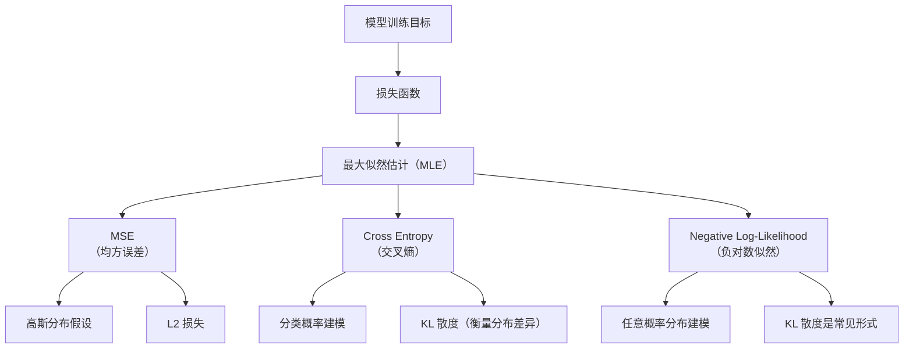

# 你真的懂"损失函数"吗？一文通透机器学习中的核心概念

在机器学习中，我们希望模型能够**不断"学得更好"**：也就是说，经过大量样本训练后，它能够对新数据做出更加准确的预测。

但"学得好"到底是什么意思？我们需要一个**明确的标准**来衡量模型的预测是否准确，这个标准就是 —— **损失函数**（_Loss Function_）。

围绕"**损失函数**"，机器学习中还发展出一系列密切相关的核心概念，例如：

- **似然**（_Likelihood_）
- **最大似然估计**（_Maximum Likelihood Estimation_, _MLE_）
- **交叉熵**（_Cross Entropy_）
- **KL 散度**（_KL Divergence_）
- **最小二乘法**（_Least Squares_）
- **正则化**（_Regularization_）
- **贝叶斯估计**（_Bayesian Estimation_）

这些概念不仅构成了众多算法的数学基础，更是理解"为什么要这么训练模型"的关键所在。

本文将通过**通俗易懂的方式**，从"误差是如何定义的"出发，逐步梳理这些概念之间的联系与区别，帮助你从直觉上理解模型训练背后的逻辑与原理。

---

## 1. 背景：模型学习的核心问题是什么？

在现实生活中，我们经常遇到"**根据已有信息做出判断**"的问题，比如：

- 根据身高、体重预测一个人的体脂率；
- 根据用户浏览记录推荐感兴趣的视频；
- 根据病人病史判断是否可能患某种疾病。

这些问题的共同点在于：

> 给定一组输入，我们希望模型**自动得出一个合理的输出**。

### 1.1 机器学习的核心目标

在机器学习中，我们的目标是让**计算机自动学出某种规律**，把输入 $x$ 映射为预测结果 $\hat{y}$：

$$
\hat{y} = f(x; \theta)
$$

其中：

- $x$：输入特征（如年龄、学历、浏览记录）
- $\hat{y}$：模型预测的输出（如评分、概率、类别）
- $\theta$：模型的参数（可以理解为模型"记住"的知识）
- $f$：我们希望"学出来"的函数形式

> 训练的本质，就是找到一组"最优参数" $\theta$，让预测结果 $\hat{y}$ 尽可能接近真实值 $y$。

### 1.2 模型到底在"学"什么？

在训练阶段，我们手头有大量"已知答案"的训练样本：

$$
(x_1, y_1), (x_2, y_2), \dots, (x_n, y_n)
$$

也就是说，对于每一个输入 $x\_i$，我们知道它应该对应的真实输出 $y\_i$。
我们的目标是：

> 让模型学到的函数 $f(x; \theta)$，对这些样本的预测结果 $\hat{y}\_i$ 尽量接近真实值 $y\_i$。

### 1.3 引出两个关键问题

为了实现上述目标，我们必须回答两个核心问题：

#### 1.3.1 怎么衡量"准不准"？—— 引入损失函数（Loss Function）

我们需要一个指标，告诉我们：

> 当前模型预测得有多准？也就是说，预测值 $\hat{y}$ 离真实值 $y$ 有多远？

这个指标，就是我们定义的**损失函数**，它用来衡量模型预测误差的大小。

#### 1.3.2 怎么找到"最好的一组参数"？—— 最小化总损失

接下来要做的事情就是：

> 不断调整参数 $\theta$，让所有训练样本的**总损失最小**。

这就构成了一个数学优化问题，常见的求解方式是梯度下降等：

$$
\theta^\ast = \arg\min_\theta \ \text{Loss}(f(x; \theta), y)
$$

### 1.4 类比一下：像是在打靶训练

模型训练过程其实很像打靶练习：

- 每次观察偏离靶心的距离（对应损失函数）；
- 根据偏差调整姿势（对应更新参数 $\theta$）；
- 不断尝试，直到每次都尽量接近靶心（即最小化损失）。

### 1.5 小结

我们可以将机器学习训练过程总结为下表：

| 想解决的问题             | 在机器学习中的做法                   |
| ------------------------ | ------------------------------------ |
| 怎么判断预测准不准？     | 设计损失函数（衡量预测误差）         |
| 怎么让模型能进行预测？   | 学习函数 $f(x; \theta)$              |
| 怎么找到最优的参数？     | 最小化损失函数，优化参数 $\theta$    |
| 怎么防止模型"学得太死"？ | 引入正则化、最大似然、概率建模等机制 |

接下来，我们将从"损失函数"出发，深入理解几个机器学习中的核心概念，包括：**最大似然估计、交叉熵、KL 散度、最小二乘、正则化与贝叶斯估计**，一探模型训练背后的数学逻辑。

---

## 2. 损失函数：模型好坏的"量尺"

训练一个机器学习模型，最核心的问题之一是：

> **如何判断模型好不好？**

我们不能凭感觉说"这个模型还行"，而是需要一个**数学指标**，来衡量模型预测值 $\hat{y}$ 与真实值 $y$ 的差距，这就是：

### 2.1 损失函数（Loss Function）

你可以把"损失函数"理解为一个**打分系统**：

- 分数越高 → 模型越差
- 分数越低 → 模型越好

我们训练模型的目标，就是让这个"损失"**尽量小**，从而找到最优的模型参数 $\theta$。

### 2.2 不同任务，损失函数也不同

不同类型的任务，使用的损失函数也不一样：

| 任务类型     | 常用损失函数               | 通俗解释                         |
| ------------ | -------------------------- | -------------------------------- |
| **回归问题** | 均方误差（MSE）            | 预测值和真实值越接近越好         |
| **分类问题** | 交叉熵（Cross Entropy）    | 预测的概率越接近真实标签越好     |
| **概率建模** | 负对数似然（NLL）、KL 散度 | 模型的概率分布越接近真实分布越好 |

### 2.3 均方误差（Mean Squared Error, MSE）

最常用于回归任务（如预测房价、身高等数值）。公式如下：

$$
\text{MSE} = \frac{1}{n} \sum_{i=1}^{n} (y_i - \hat{y}_i)^2
$$

含义非常直观：

- 把每个预测误差平方后累加
- 然后求平均

**平方的作用：**

- 把负误差变为正值
- 加大到"大的错误"的惩罚

> 使用 MSE 等价于最小二乘法，让整体误差平方和最小。

#### 2.3.1 举例

- 真实值 100，预测 80 → 误差 20 → 损失 $20^2 = 400$
- 真实值 100，预测 95 → 误差 5 → 损失 $5^2 = 25$

显然后者更准，MSE 能清晰体现这一点。

### 2.4 交叉熵（Cross Entropy）

交叉熵是分类任务中最常用的损失函数，特别适用于输出为**概率分布**的模型。

#### 2.4.1 举例

模型判断一张图片是"猫"还是"狗"，输出：

- 猫：0.9
- 狗：0.1

真实标签是"猫"（即猫 = 1，狗 = 0）。我们希望模型预测的概率分布**越接近真实分布越好**。

#### 2.4.2 二分类交叉熵公式

$$
\text{CE}(y, \hat{y}) = -[y \log(\hat{y}) + (1 - y)\log(1 - \hat{y})]
$$

其中：

- $y \in \{0, 1\}$：真实标签
- $\hat{y} \in (0, 1)$：模型预测的概率

#### 2.4.3 通俗理解

交叉熵在惩罚什么？

- 如果真实是 1，但你只给出 0.1 → 惩罚很大
- 如果你预测了 0.95 → 惩罚就很小

> **预测越接近真实，损失越小；预测越偏，损失越大。**

#### 2.4.4 拓展

交叉熵来源于信息论，表示：

> 用预测分布 $\hat{y}$ 逼近真实分布 $y$ 时，需要多花多少"信息量"。

本质上，交叉熵 = **最大似然估计**下的对数损失。

### 2.5 概率建模中的损失函数：NLL & KL 散度

有些任务不只关注是否预测正确，更关注预测出的**概率分布是否合理**。

例如：

> 不是只说"这是猫"，而是要说"这是猫的概率是 95%"。

这时，损失函数不再是简单的误差，而是衡量两个概率分布的差距。

#### 2.5.1 负对数似然（Negative Log-Likelihood, NLL）

公式：

$$
\text{NLL} = -\log P(y \mid x; \theta)
$$

含义：

> **如果一个事件真实发生了，我们希望模型给它的概率越大越好。**

- 给出正确标签的概率越小，损失越大
- 本质上是最大似然估计的等价形式

**举例：**

- 模型给正确标签概率 0.9 → 损失 $\approx -\log(0.9) = 0.105$
- 概率 0.1 → 损失 $\approx -\log(0.1) = 2.302$

> 概率越高，NLL 越小，表示模型更确信、更准确。

#### 2.5.2 KL 散度（Kullback-Leibler Divergence）

衡量两个概率分布 $P$ 和 $Q$ 的"差异"：

$$
D_{KL}(P \| Q) = \sum_{i} P(i) \log \frac{P(i)}{Q(i)}
$$

- $P$：真实分布
- $Q$：模型预测分布

含义：

> **用 Q 来近似 P 时，平均"损失"了多少信息？**

**注意：**

- KL 散度不是对称的：$D_{KL}(P \| Q) \ne D_{KL}(Q \| P)$
- 在训练中使用不同方向会影响模型的"保守性"或"激进性"

#### 2.5.3 小结对比

| 概念 | 通俗含义 |
|---------|----------------------------------------------------||
| **NLL** | 模型对"真实发生"的事件给了多小的概率（越小惩罚越大） |
| **KL 散度** | 模型预测的概率分布与真实分布之间的差距 |
| **交叉熵** | 结合了真实分布与预测分布的"信息差"，本质是 NLL 的推广形式 |

### 2.6 损失函数是桥梁

损失函数连接了：

- **模型的预测输出**
- **训练数据的真实值**

是整个训练优化过程的"桥梁"。

可以理解为：

> **想让模型"长记性"？就得靠损失函数来"惩罚错误"！**

接下来我们将看到：

- 损失函数从哪里来？
- 为什么交叉熵、MSE 这些设计是合理的？
- 它们和概率模型的关系是什么？

这就引出了下一个关键概念 —— **似然函数与最大似然估计（MLE）**。

---

## 3. 似然与最大似然估计

### 3.1 什么是"似然"？

我们经常说："模型要能解释数据"。那么，**如何衡量一个模型解释数据的能力强不强呢？**

这里就用到了一个重要概念：**似然（Likelihood）**。

> 似然描述的是：**在假设模型参数为 $\theta$ 的情况下，观察到当前数据的可能性有多大？**

你可以这样理解：

- 假设你认为一枚硬币正面朝上的概率是 0.6；
- 你实际抛了 10 次，结果是 7 次正面、3 次反面；
- 你就会问："如果硬币的正面概率真的是 0.6，那么观察到 7 次正面、3 次反面的结果有多大可能？"

这个"可能性"就是**似然**，记作：

$$
P(\text{data} \mid \theta)
$$

需要注意的是，这里不是问参数 $\theta$ 的概率（它是已知的假设），而是问：**数据在给定参数下出现的可能性有多大**。

### 3.2 最大似然估计

了解了"似然"后，我们就可以提出一种训练模型的方法：

> 在所有可能的参数（模型）中，找出一个让观察到的数据**最有可能出现**的参数！

这就是**最大似然估计（MLE）**的核心思想：

$$
\hat{\theta}_{\mathrm{MLE}} = \arg\max_{\theta} P(\text{data} \mid \theta)
$$

换句话说：我们找出能让当前数据出现概率最高的参数，这个参数就是我们认为的最佳模型。

#### 3.2.1 类比理解

你像一名侦探，案发后收集到一堆线索（数据）。
你依次假设每个人是嫌疑犯，问一句：

> "如果是他干的，出现这些线索的可能性有多大？"

最大似然估计就是：**选出那个最可能导致这些线索出现的嫌疑人**。

### 3.3 从最大似然到"损失函数"：为什么用负对数？

前面我们讲过很多损失函数，比如：

- MSE（均方误差，回归）
- 交叉熵（分类）

这些损失函数都是**希望最小化的目标**。
而 MLE 是**希望最大化似然**，看起来好像方向相反？

其实，只需要一个简单技巧就能统一两者：**最大似然估计等价于最小化负对数似然（NLL）**

$$
\text{NLL} = - \log P(\text{data} \mid \theta)
$$

因此，训练模型的本质就是：

> **最小化负对数似然 = 最大化似然**

为什么取对数？

- 概率通常是多个事件概率相乘，直接计算数值可能非常小甚至下溢；
- 取对数后，乘法变加法，计算更稳定更方便；
- 负号是因为我们习惯用"最小化损失"而非"最大化目标"。

#### 3.3.1 举个分类例子

假设有一个二分类模型，输出 $\hat{y}$ 是预测为正类的概率，真实标签是 $y \in \{0,1\}$，则负对数似然为：

$$
\text{NLL} = - \bigl[y \log(\hat{y}) + (1 - y)\log(1 - \hat{y})\bigr]
$$

这正是我们熟悉的**交叉熵损失函数**！

### 3.4 贝叶斯估计 vs 最大似然估计

很多同学会问：

> 只看当前数据来估计参数，靠谱吗？能不能结合已有的"经验"或"背景知识"？

这正是**贝叶斯估计（Bayesian Estimation）**的思想所在。

#### 3.4.1 最大似然估计

- 只关注当前数据的似然：$P(\text{data} \mid \theta)$；
- 假设所有参数一开始都同等可能（无先验偏好）。

#### 3.4.2 贝叶斯估计（最大后验估计，MAP）

- 在数据的基础上**加入先验知识**（先验分布 $P(\theta)$）；
- 估计参数的**后验概率最大值**：

$$
\hat{\theta}_{\mathrm{MAP}} = \arg\max_{\theta} P(\theta \mid \text{data}) = \arg\max_{\theta} \frac{P(\text{data} \mid \theta) P(\theta)}{P(\text{data})}
$$

简单来说，贝叶斯估计利用**数据似然 × 先验分布**来判断最合适的参数。

#### 3.4.3 类比理解

- `MLE` 好比"只看谁说得最像真的"；
- 贝叶斯估计则像是"我本来就觉得这个人靠谱，现在他说得更像真的，所以更相信他"。

#### 3.4.4 总结对比：MLE 与贝叶斯估计

| 方法         | 依赖信息            | 优点                     | 缺点                         |
| ------------ | ------------------- | ------------------------ | ---------------------------- |
| 最大似然估计 | 仅依赖数据的似然    | 简单高效，推导清晰       | 无法引入先验知识，容易过拟合 |
| 贝叶斯估计   | 数据似然 + 参数先验 | 可融合历史经验，鲁棒性强 | 推导复杂，计算量较大         |

### 3.5 概率 vs 似然：方向不同，角度不同

很多人初学时容易混淆"概率"和"似然"，它们关注的是**相反的方向**：

| 角度     | 概率（Probability）           | 似然（Likelihood）          |
| -------- | ----------------------------- | --------------------------- |
| 已知     | 模型参数 $\theta$             | 数据 $x$                    |
| 求解目标 | 数据出现的概率 $P(x\|\theta)$ | 参数的合理性 $L(\theta\|x)$ |
| 应用场景 | 预测、采样、模拟              | 参数估计（如最大似然估计）  |
| 方向     | 模型 $\to$ 数据               | 数据 $\to$ 模型             |

#### 3.5.1 数学表达

- **概率**：$P(x|\theta)$ —— 给定模型参数，计算数据出现的概率。
- **似然**：$L(\theta|x) \propto P(x|\theta)$ —— 给定数据，评估模型参数的合理程度。

#### 3.5.2 通俗类比

> 在法庭上，
>
> - **概率**是："如果他是凶手，那他出现现场的概率是多少？"
> - **似然**是："他已经出现在现场，那他是凶手的可能性有多大？"

### 3.6 小结

- **似然**告诉我们：在假设参数为 $\theta$ 的前提下，观察到数据的可能性有多大。
- **最大似然估计（MLE）**通过最大化似然，找到最能解释数据的参数。
- **负对数似然（NLL）**是 MLE 在训练时最常用的损失函数形式。
- **贝叶斯估计**则在 MLE 基础上引入先验知识，更加稳健。
- **概率和似然**虽然数学形式类似，但关注的角度和用途完全不同。

---

## 4. 信息熵、交叉熵与 KL 散度 —— 分类损失的本质解析

### 4.1 为什么 KL 散度不是对称的？

$$
D_{KL}(P \| Q) \neq D_{KL}(Q \| P)
$$

- 因为它只在 $P(x)$ 存在时才惩罚 $Q(x)$
- 类似于"只从真实情况出发去衡量误差"

这也解释了为什么生成模型中选择 $D_{KL}(Q \| P)$ 还是 $D_{KL}(P \| Q)$ 会导致不同的行为。

### 4.2 信息论视角下的三大概念

这些损失背后，其实有着深厚的信息论基础。以下是几个关键概念：

| 概念                                      | 数学定义                                | 含义                                                 |
| ----------------------------------------- | --------------------------------------- | ---------------------------------------------------- |
| **信息熵** $H(p)$                         | $-\sum_i p_i \log p_i$                  | 描述真实分布 $p$ 的**不确定性**（平均信息量）        |
| **交叉熵** $H(p, \hat{p})$                | $-\sum_i p_i \log \hat{p}_i$            | 描述模型预测 $\hat{p}$ 对真实分布 $p$ 的**拟合程度** |
| **KL 散度** $D_{\text{KL}}(p \| \hat{p})$ | $\sum_i p_i \log \frac{p_i}{\hat{p}_i}$ | 测量两个分布之间的"距离"（非对称）                   |

交叉熵可以拆解为：

$$
H(P, Q) = H(P) + D_{KL}(P \| Q)
$$

其中：

- $H(P)$：真实分布自身的信息熵（不依赖模型）
- $D_{KL}(P \| Q)$：KL 散度，模型预测和真实分布的差异

这意味着：

- 交叉熵 = 真正的不确定性 + KL 散度（模型与真相的距离）
- **最小化交叉熵 = 最小化 KL 散度**（因为 $H(P)$ 是固定的）

#### 4.2.1 三者关系小结

- **信息熵 $H(p)$**：现实到底有多复杂？（和模型无关）
- **交叉熵 $H(p, \hat{p})$**：模型"以为"现实多复杂
- **KL 散度 $D_{\text{KL}}$**：模型和现实差了多少？

---

## 5. 模型太"聪明"？引入正则化来防止过拟合

在训练过程中，模型有时候会变得**太聪明**：它能完美地记住训练数据中的每一个细节，但一旦面对没见过的新数据，就发挥失常——这就是**过拟合**。

这就像考试时你死记硬背了所有练习题，但换个题型就不会了。

那该怎么办？我们要想办法让模型：

> **别学得太死板，别背题，而是学到通用的规律。**

一个经典的解决方案就是引入——**正则化（Regularization）**。

### 5.1 正则化的基本思路：给模型"加点约束"

正则化的核心思想是：

> 在模型的损失函数里，加一个"**惩罚项**"，让模型别太任性。

公式如下：

$$
\text{总损失} = \text{原始损失（例如 MSE）} + \lambda \cdot \text{正则化项}
$$

- 原始损失：衡量模型对训练数据的拟合效果；
- 正则化项：限制模型的复杂度（尤其是参数大小）；
- $\lambda$：控制惩罚力度的"权重参数"。

### 5.2 L1 / L2 正则化：让参数"收敛一点"

我们来看看两个最常见的正则化方式：L1 和 L2。

#### 5.2.1 L2 正则化（Ridge 回归）：让参数"别太大"

L2 正则化的公式是：

$$
\text{Loss}_{L2} = \text{原始损失} + \lambda \sum_j \theta_j^2
$$

它的特点是：

- 惩罚的是**参数的平方和**；
- 越大的参数惩罚越重，让模型"偏爱小系数"；
- 不会把参数变成 0，但会让它们更均匀、更平滑。

理解方式：

> 就像老师说："每门课你都得学点，但别太偏科。"

#### 5.2.2 L1 正则化（Lasso 回归）：让部分参数"干脆归零"

L1 正则化的公式是：

$$
\text{Loss}_{L1} = \text{原始损失} + \lambda \sum_j |\theta_j|
$$

它的特点是：

- 惩罚的是**参数的绝对值和**；
- 一些参数会被压缩到 0 → 直接"剪掉无用特征"；
- 模型变得更加稀疏，便于解释和部署。

理解方式：

> 就像老师说："你不需要每科都学精，挑重点主攻，没用的别浪费时间。"

### 5.3 L1 vs L2：到底选哪个？

| 正则化方式  | 适用场景               | 模型行为                           |
| ----------- | ---------------------- | ---------------------------------- |
| L2（Ridge） | 所有特征都可能有用     | 所有参数保留但变小，更平滑         |
| L1（Lasso） | 特征太多，需要自动筛选 | 有些参数会变成 0，实现特征选择功能 |

### 5.4 弹性网（Elastic Net）：我全都要

如果你既想要 L1 的"特征筛选能力"，又想保留 L2 的"稳定性"，那就用：

> **弹性网** —— 折中方案

它的损失函数如下：

$$
\text{Loss} = \text{原始损失} + \lambda_1 \sum_j |\theta_j| + \lambda_2 \sum_j \theta_j^2
$$

- $\lambda_1$ 控制稀疏性（L1 部分）；
- $\lambda_2$ 控制平滑性（L2 部分）。

### 5.5 小结

> **正则化 = 在损失函数中加"惩罚项"，约束模型别学得太偏。**

它帮助我们：

- 抑制过拟合，让模型泛化得更好；
- 控制参数大小，提升模型简洁性；
- 自动筛选特征，让模型更易理解。

---

## 6. 损失函数的总结图谱

### 6.1 损失函数是"训练目标"的核心桥梁

我们在训练一个模型时，本质是在**最小化损失函数**。而这些损失函数的背后，往往都可以从**最大似然估计**的角度进行解释。

### 6.2 小结

大多数损失函数本质上是从概率建模出发，通过最大似然推导出来的。理解这一点，可以帮助我们从更本质的角度设计或选择合适的损失函数。

---
