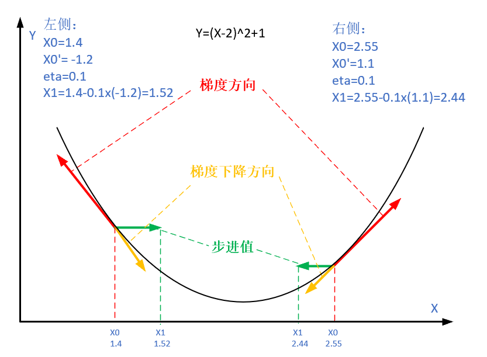
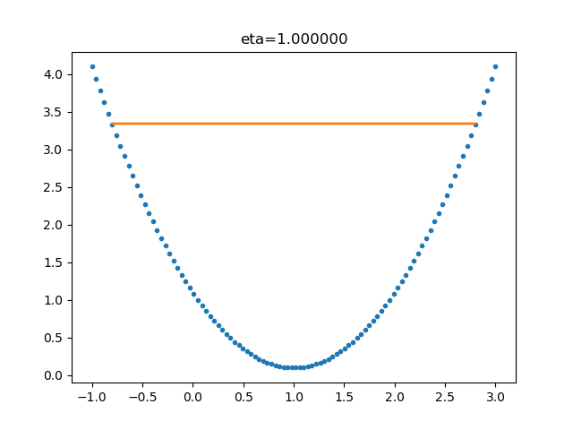
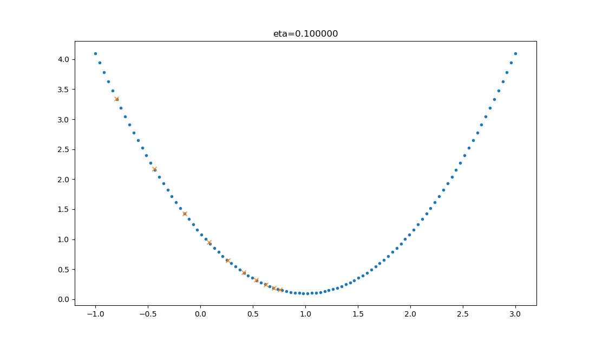

# 梯度下降算法：从直觉到实践

**梯度下降 (Gradient Descent)** 是机器学习中最基础也是最重要的优化算法之一。从简单的线性回归到复杂的深度神经网络，梯度下降都是训练模型、求解参数的核心驱动力。它通过不断调整参数，使模型的预测误差最小化，从而让机器从数据中“学习”到规律。

本文将带领读者从直观的生活场景出发，深入理解梯度下降的数学原理，掌握其常见变体（如 SGD、Mini-batch）与高级优化器（如 Adam），并探索其在各类机器学习算法中的实际应用。

---

## 1. 建立直觉：什么是梯度下降？

在深入数学推导之前，我们先通过生活中的例子和直观的类比，建立对梯度下降算法的感性认识。理解其背后的逻辑，有助于我们更好地掌握后续的数学定义。

### 1.1 从人类学习过程理解

在深入技术细节之前，让我们思考人类是如何学习的。人类大脑通过**突触可塑性**的过程学习——当获得新信息后，新的神经连接会形成和加强。类似地，人工神经网络通过计算预测误差，并根据这些误差来加强或削弱神经元之间的内部连接。

与机器不同，人类不需要大量数据来理解问题或做出预测；我们主要从经验和错误中学习。这种"**从错误中学习**"的思想正是梯度下降算法的核心。

### 1.2 自然现象中的梯度下降理解

许多教材喜欢用“登山者下山”来比喻梯度下降：一个人被困在山上，需要沿着最陡峭的方向迅速下到谷底。虽然这个比喻很经典，但它忽略了一个关键点：人是有远见的，可以规划路径，而算法通常是“短视”的。

相比之下，**泉水下山的过程**是梯度下降更精准的自然隐喻：

1. **自动寻找最陡方向**：水受重力牵引，总是本能地流向当前地势最低洼、坡度最陡峭的方向（对应计算负梯度）。
2. **路径的多样性**：从山顶不同位置出发的水流，可能会汇入不同的溪流，最终抵达不同的终点（对应模型可能收敛到不同的解）。
3. **局部最优的困境**：水流在下山途中可能会汇聚在某个山腰的洼地（湖泊），因无法翻越周围的高地而停滞不前，无法到达真正的山脚大海（对应算法陷入局部最优解而非全局最优解）。

这个自然现象生动地诠释了梯度下降算法的核心机制及其面临的潜在挑战。

### 1.3 梯度下降的术语解析

让我们拆解"梯度下降"这个术语：

- **梯度**（Gradient）：数学上指函数在某点处变化最快的方向（指向函数值增长最快的方向），记作 $\nabla J$，量化了"陡度"
- **下降**（Descent）：向下的运动，寻找更低的值

"梯度下降"包含了两层含义：

1. **梯度**：函数当前位置的最快上升点；
2. **下降**：与导数相反的方向，用数学语言描述就是那个减号。

亦即与上升相反的方向运动，就是下降。



因此，梯度下降算法就是**利用梯度信息来指导参数向损失函数更小值移动的过程**。

### 1.4 数学函数的视角与损失函数

在机器学习中，我们要最小化的"山谷"是**损失函数**（Loss Function，通常记为 $J(\theta)$ 或 $L(\theta)$），其中 $\theta$ 是模型参数：

- **高度** = 损失函数值（预测错误程度）
- **位置** = 参数取值组合
- **坡度** = 梯度（损失函数对参数的偏导数）

损失函数量化了模型预测值和实际数据样本值之间的误差。**损失函数越小，模型的性能越好**。

常见的损失函数包括：

- **均方误差**（MSE）：适用于回归问题
- **交叉熵损失**：适用于分类问题
  - 二元交叉熵：二分类
  - 分类交叉熵：多分类
- **对数损失**：概率预测问题

### 1.5 实际应用示例：房价预测中的梯度下降

为了更直观地理解梯度下降算法，我们通过一个简单的一元线性回归例子进行详细讲解。

#### 1.5.1 问题背景：预测房屋价格

我们希望建立一个模型，根据房屋的面积来预测其价格。我们收集了以下训练数据：

| 面积（㎡） | 价格（万元） |
| ---------- | ------------ |
| 50         | 150          |
| 80         | 240          |
| 100        | 300          |
| 120        | 360          |
| 150        | 450          |

目标是拟合线性函数：

$$
\hat{y} = wx + b
$$

其中：

- $x$：房屋面积（特征）
- $\hat{y}$：预测价格
- $w$：斜率（每平米房价）
- $b$：截距（起始房价）

---

#### 1.5.2 步骤 1：定义损失函数

采用**均方误差（MSE）**作为损失函数：

$$
J(w, b) = \frac{1}{n} \sum_{i=1}^n \left(wx^{(i)} + b - y^{(i)}\right)^2
$$

---

#### 1.5.3 步骤 2：计算梯度

对损失函数分别对 $w$ 和 $b$ 求偏导：

$$
\frac{\partial J}{\partial w} = \frac{2}{n} \sum_{i=1}^n (wx^{(i)} + b - y^{(i)}) \cdot x^{(i)}
$$

$$
\frac{\partial J}{\partial b} = \frac{2}{n} \sum_{i=1}^n (wx^{(i)} + b - y^{(i)})
$$

---

#### 1.5.4 步骤 3：参数更新（梯度下降）

使用梯度下降算法迭代更新参数：

$$
w_{\text{new}} = w_{\text{old}} - \eta \cdot \frac{\partial J}{\partial w}, \quad
b_{\text{new}} = b_{\text{old}} - \eta \cdot \frac{\partial J}{\partial b}
$$

---

#### 1.5.5 步骤 4：具体计算示例与收敛过程

**初始设置**：

- 初始参数：$w = 0$, $b = 0$
- 学习率：$\eta = 0.000001$ (1e-06)
- 样本数量：$n = 5$

##### 1.5.5.1. 初始损失计算（第 0 次迭代）

$$
\hat{y}^{(i)} = 0, \quad \text{for all } i
$$

$$
J(0, 0) = \frac{1}{5} \left[(150)^2 + (240)^2 + (300)^2 + (360)^2 + (450)^2\right] = \frac{1}{5} \cdot 502200 = 100440
$$

##### 1.5.5.2. 初始梯度计算

$$
\frac{\partial J}{\partial w} = \frac{2}{5} \left[-150 \cdot 50 - 240 \cdot 80 - 300 \cdot 100 - 360 \cdot 120 - 450 \cdot 150\right]
$$

$$
= \frac{2}{5} \cdot (-7500 - 19200 - 30000 - 43200 - 67500) = \frac{2}{5} \cdot (-167400) = -66960
$$

$$
\frac{\partial J}{\partial b} = \frac{2}{5}(-150 - 240 - 300 - 360 - 450) = \frac{2}{5} \cdot (-1500) = -600
$$

##### 1.5.5.3. 第一次更新

$$
w_1 = 0 + 0.000001 \cdot 66960 = 0.06696,\quad b_1 = 0 + 0.000001 \cdot 600 = 0.0006
$$

---

#### 1.5.6 多轮迭代收敛情况

| 迭代 | $w$     | $b$     | 损失 $J(w,b)$ | $\partial J / \partial w$ | $\partial J / \partial b$ |
| ---- | ------- | ------- | ------------- | ------------------------- | ------------------------- |
| 0    | 0.00000 | 0.00000 | 100440.00     | -66960.0                  | -600.0                    |
| 1    | 0.06696 | 0.00060 | 96006.04      | -65465.3                  | -586.6                    |
| 10   | 0.60619 | 0.00543 | 63947.77      | -53428.7                  | -478.8                    |
| 50   | 2.02951 | 0.01819 | 10507.52      | -21657.7                  | -194.1                    |
| 100  | 2.68594 | 0.02407 | 1099.24       | -7005.0                   | -62.8                     |
| 500  | 2.99972 | 0.02688 | 0.00          | -0.8                      | -0.0                      |
| 1000 | 2.99976 | 0.02687 | 0.00          | -0.0                      | 0.0                       |
| 2000 | 2.99976 | 0.02687 | 0.00          | -0.0                      | 0.0                       |
| 5000 | 2.99976 | 0.02685 | 0.00          | -0.0                      | 0.0                       |

---

#### 1.5.7 收敛结果分析

- **收敛结果**：$w \approx 2.99976$, $b \approx 0.02685$
- **含义**：每平米房价 $\approx$ 3.000 万元，起始价格 $\approx$ 0.027 万元
- **收敛特点**：在第 500 次迭代时基本收敛，损失函数降至接近 0
- 该结果可有效拟合样本点，预测误差接近于 0

#### 1.5.8 使用方程求解验证

对一元线性回归，可通过正规方程直接计算最优解：

设：

$$
\bar{x} = \frac{50 + 80 + 100 + 120 + 150}{5} = 100
$$

$$
\bar{y} = \frac{150 + 240 + 300 + 360 + 450}{5} = 300
$$

$$
w = \frac{\sum (x_i - \bar{x})(y_i - \bar{y})}{\sum (x_i - \bar{x})^2} = \frac{17400}{5800} = 3
$$

$$
b = \bar{y} - w \cdot \bar{x} = 300 - 3 \cdot 100 = 0
$$

因此，最优解为：

- $w^* = 3.0$
- $b^* = 0.0$

可以看到，梯度下降算法得到的结果（$w \approx 2.99976$, $b \approx 0.02685$）与解析解非常接近，验证了算法的正确性。

#### 1.5.9 小结

通过这个示例，我们可以看到：

1. **梯度指向误差增加最快的方向**，因此取负号后指向误差减少最快的方向
2. **学习率决定了收敛速度**：使用较小的学习率 (1e-06) 确保了稳定收敛
3. **迭代过程是自动的**：算法会根据当前参数自动计算下一步调整方向
4. **收敛过程平稳**：损失函数单调递减，最终收敛到全局最优解
5. **最终结果符合直觉**：学到的线性关系（每平米 3 万元）反映了数据中的真实模式

---

### 1.6 局部最小值与全局最小值问题

在损失函数的参数空间中，我们要理解两个重要概念：

- **局部最小值**：损失函数在指定范围或区域内的最小参数值
- **全局最小值**：整个损失函数域内的最小参数值

在实际应用中，尤其是处理复杂的非凸损失函数时，梯度下降算法容易陷入**局部最小值**而无法到达**全局最小值**。为了解决这一挑战，研究者们提出了多种策略来帮助算法“跳出”局部洼地，寻找更优的解：

- **随机初始化多次运行**：从不同起点开始，选择最优结果
- **模拟退火法**：逐步减小学习率 $\eta$，如 $\eta_t = \eta_0 / \sqrt{t}$
- **动量法**：利用历史梯度信息加速穿越平坦区域
- **随机梯度下降**：引入噪声帮助跳出局部最优

在上面的线性回归示例中，由于 MSE 损失函数是凸函数，局部最小值就是全局最小值，因此梯度下降保证能找到最优解。

### 1.7 为什么需要梯度下降

在处理现代机器学习任务时，我们经常面临海量数据和超高维度的参数空间（例如深度神经网络的参数量可达数十亿）。在这些场景下，直接求解解析解（如涉及矩阵求逆的正规方程）在计算成本上通常是不可接受的。

梯度下降作为一种高效的**迭代式数值优化方法**，通过逐步逼近的方式寻找最优解，特别适用于以下场景：

- **高维参数空间**：有效规避了大规模矩阵运算（如 $O(n^3)$ 复杂度）带来的计算瓶颈。
- **复杂非凸函数**：能够处理没有闭式解（Closed-form Solution）的复杂损失函数，如神经网络。
- **大规模数据与在线学习**：支持基于数据流的增量更新，无需一次性将所有数据载入内存。

以图像分类为例：查看一张图像时，需要确定图像是猫还是狗。为了建立模型，需要使用正确标记的猫和狗图像数据样本来训练算法。神经网络通过调整权重和偏差的值，以最好地表示数据集的特征。

---

## 2. 数学原理深入

在建立了直观认识后，我们需要从数学角度严谨地定义梯度下降算法。本节将详细推导单变量和多变量情况下的更新规则，并分析学习率对算法行为的影响。

### 2.1 梯度下降的数学定义

梯度下降的核心迭代公式如下：

$$
\theta_{t+1} = \theta_{t} - \eta \cdot \nabla J(\theta_t)
$$

这个公式精炼地包含了算法的**三个核心要素**：

1. **当前位置 $\theta_t$**：模型当前的参数值。
2. **下降方向 $-\nabla J(\theta_t)$**：
   - $\nabla J(\theta)$ 是目标函数 $J$ 在 $\theta$ 处的**梯度**，指向函数值增长最快的方向。
   - **负号** $-$ 确保我们沿着梯度反方向（即函数值下降最快的方向）移动。
3. **步长（学习率）$\eta$**：
   - 控制每次参数更新的幅度。
   - 如果 $\eta$ 太小，收敛速度会很慢。
   - 如果 $\eta$ 太大，可能会越过极小值点，导致震荡甚至发散。

### 2.2 单变量函数的梯度下降

对于一元函数 $J(x)$，梯度下降的核心更新规则为：

$$x_{t+1} = x_{t} - \eta \cdot J'(x_{t})$$

其中：

- $\eta$：学习率（步长）
- $J'(x_{t})$：函数在当前点的导数

**核心思想**：导数 $J'(x)$ 指示了函数值增长最快的方向（切线斜率）。取其负方向 $-J'(x)$ 移动，即可让函数值下降。

下面我们通过一个具体的**二次函数优化**例子来演示这一过程：

**目标函数**：

$$J(x) = x ^2$$

**目标**：寻找使 $J(x)$ 最小的 $x$ 值。

**导数**：

$$J'(x) = 2x$$

**初始设置**：

- 初始位置：$x_0 = 1.2$
- 学习率：$\eta = 0.3$

**迭代公式**：

$$x_{t+1} = x_{t} - 0.3 \cdot (2x_t) = x_t - 0.6x_t = 0.4x_t$$

**迭代过程计算**：

1. **第 1 次迭代**：
   $$x_1 = 1.2 - 0.3 \cdot (2 \cdot 1.2) = 1.2 - 0.72 = 0.48$$
   $$J(x_1) = 0.48^2 = 0.2304$$

2. **后续迭代**（假设终止条件 $J(x) < 0.01$）：

| 迭代次数 ($t$) | 当前值 $x_t$ | 导数 $J'(x_t)$ | 下一步 $x_{t+1}$ | 函数值 $J(x_t)$ |
| :------------- | :----------- | :------------- | :--------------- | :-------------- |
| 0              | 1.2000       | 2.4000         | 0.4800           | 1.4400          |
| 1              | 0.4800       | 0.9600         | 0.1920           | 0.2304          |
| 2              | 0.1920       | 0.3840         | 0.0768           | 0.0369          |
| 3              | 0.0768       | 0.1536         | 0.0307           | 0.0059          |

**结果分析**：
经过 3 次迭代，函数值降至 0.0059，满足终止条件。可以看到 $x$ 值迅速向 0 逼近（真实最小值点）。

---

### 2.3 多变量函数的梯度下降

对于多元函数 $J(\boldsymbol{\theta}) = J(\theta_1, \theta_2, \ldots, \theta_n)$，其梯度 $\nabla_{\boldsymbol{\theta}} J$ 是一个由所有偏导数构成的向量：

$$
\nabla_{\boldsymbol{\theta}} J = \begin{bmatrix}
\frac{\partial J}{\partial \theta_1} \\
\frac{\partial J}{\partial \theta_2} \\
\vdots \\
\frac{\partial J}{\partial \theta_n}
\end{bmatrix}
$$

更新规则扩展为向量形式：

$$\boldsymbol{\theta}_{t+1} = \boldsymbol{\theta}_{t} - \eta \cdot \nabla_{\boldsymbol{\theta}} J(\boldsymbol{\theta}_t)$$

**几何解释**：在多维空间中，梯度向量指向函数值增长最快的方向。算法沿梯度的反方向移动，确保每次迭代都朝着函数值减小的方向前进。

下面我们通过一个**双变量函数优化**的例子来演示：

**目标函数**：

$$J(x,y) = x^2 + \sin^2(y)$$

**目标**：寻找使 $J(x, y)$ 最小的 $(x, y)$ 坐标。

**梯度（偏导数）**：

$$
\nabla J(x, y) = \begin{bmatrix}
\frac{\partial J}{\partial x} \\
\frac{\partial J}{\partial y}
\end{bmatrix} = \begin{bmatrix}
2x \\
2 \sin y \cos y
\end{bmatrix} = \begin{bmatrix}
2x \\
\sin(2y)
\end{bmatrix}
$$

**初始设置**：

- 初始位置：$(x_0, y_0) = (3, 1)$
- 学习率：$\eta = 0.1$

**迭代公式**：

$$
\begin{bmatrix} x_{t+1} \\ y_{t+1} \end{bmatrix} = \begin{bmatrix} x_t \\ y_t \end{bmatrix} - 0.1 \cdot \begin{bmatrix} 2x_t \\ \sin(2y_t) \end{bmatrix}
$$

**迭代过程计算**：

1. **第 1 次迭代**：
   $$x_1 = 3 - 0.1 \cdot (2 \cdot 3) = 3 - 0.6 = 2.4$$
   $$y_1 = 1 - 0.1 \cdot \sin(2) \approx 1 - 0.1 \cdot 0.9093 = 0.9091$$
   $$J(2.4, 0.9091) = 2.4^2 + \sin^2(0.9091) \approx 5.76 + 0.622 = 6.382$$

2. **后续迭代**（假设终止条件 $J(x,y) < 0.01$）：

| 迭代次数 ($t$) | 当前 $x_t$ | 当前 $y_t$ | $J(x_t, y_t)$ |
| :------------- | :--------- | :--------- | :------------ |
| 0              | 3.0000     | 1.0000     | 9.7081        |
| 1              | 2.4000     | 0.9091     | 6.3824        |
| ...            | ...        | ...        | ...           |
| 15             | 0.1056     | 0.0635     | 0.0152        |
| 16             | 0.0844     | 0.0508     | 0.0097        |

**结果分析**：
迭代 16 次后，函数值降至 0.0097，满足终止条件。这展示了算法在三维曲面上沿着坡度向下移动，最终抵达谷底的过程。

### 2.4 学习率 $\eta$ 的选择

学习率（Learning Rate，代码中常记为 `lr`、`learning_rate` 或 `eta`）是梯度下降中最重要的超参数。它控制了参数更新的步幅，直接决定了算法能否收敛以及收敛的速度。

#### 2.4.1 学习率对收敛的影响

不同量级的学习率会导致截然不同的训练效果：

| **学习率 $\eta$** | **行为特征**  | **迭代路线示意**                         | **潜在问题**                                                                                               |
| :---------------- | :------------ | :--------------------------------------- | :--------------------------------------------------------------------------------------------------------- |
| **过大** (如 1.0) | **发散/震荡** |  | 步长太大，跨过了极小值点，导致损失值在两岸反复横跳甚至不断增大（发散）。                                   |
| **偏大** (如 0.8) | **震荡收敛**  |  | 虽然最终能收敛，但路径曲折，在极小值附近剧烈震荡，导致训练不稳定且耗时。                                   |
| **合适** (如 0.4) | **平稳收敛**  |  | 损失值稳步下降，在最初几步就能大幅降低误差，并快速逼近最优解。                                             |
| **过小** (如 0.1) | **缓慢收敛**  |  | 步子太碎，虽然方向正确且稳定，但需要极多的迭代次数才能到达终点，浪费计算资源，且容易卡在鞍点或局部极小值。 |

#### 2.4.2 实用的学习率选择策略

在实际工程中，我们通常采用以下策略来确定最佳学习率：

1. **网格搜索（Grid Search）**：

   - 在对数尺度上设置候选值，例如：`[0.1, 0.01, 0.001, 0.0001]`。
   - 先运行少量迭代（如 10 轮），观察损失下降趋势，快速剔除不合理的候选值。

2. **经验法则**：

   - **经典机器学习**（如线性回归）：$\eta \approx \frac{0.1}{\sqrt{d}}$（$d$ 为特征维度）。
   - **深度学习**：通常从 `0.001` 或 `0.0003` 开始尝试（如 Adam 优化器的默认值）。

3. **动态调整（Learning Rate Scheduling）**：
   - **预热（Warmup）**：训练初期使用较小学习率，避免参数剧烈波动，然后逐渐增加。
   - **衰减（Decay）**：随着训练进行，逐渐减小学习率，以便在最优解附近进行精细搜索。常见公式：
     $$\eta_t = \eta_0 \cdot \gamma^{\lfloor t / T \rfloor}$$
     （其中 $\gamma$ 为衰减因子，如 0.9）。
   - **自适应（Adaptive）**：使用 Adam、RMSprop 等优化器，让算法自动为每个参数调整学习率。

### 2.5 收敛判断准则

梯度下降是一个迭代过程，理论上需要无穷多步才能达到精确的极小值点。在实际计算中，我们需要设定合理的终止条件（Termination Criteria）来结束迭代。

#### 2.5.1 常用判断标准

我们通常关注**梯度的大小**、**函数值的下降量**以及**迭代资源**的消耗。

- **梯度范数准则**

  - **数学表达**：$\|\nabla_{\boldsymbol{\theta}} J(\boldsymbol{\theta}_t)\| < \epsilon$
  - **物理含义**：坡度趋近于平坦，已到达驻点（极值点或鞍点）附近。
  - **分析**：最符合数学上的最优性条件，但在平坦区域（Plateau）可能过早停止，且不同问题的 $\epsilon$ 难以统一。

- **函数值变化准则**

  - **数学表达**：$|J(\boldsymbol{\theta}_{t+1}) - J(\boldsymbol{\theta}_t)| < \delta$
  - **物理含义**：目标函数值不再显著下降，每一步的收益极小。
  - **分析**：直观反映优化效果，但在梯度很小但仍未到达极值点时（如长峡谷地形）可能误判。

- **最大迭代次数**
  - **数学表达**：$t > T_{\text{max}}$
  - **物理含义**：耗尽了预设的计算预算。
  - **分析**：作为兜底策略，保证程序必然终止，防止死循环。

#### 2.5.2 进阶策略

在处理复杂的非凸优化或深度学习任务时，仅依靠上述单一的基础准则往往不够稳健。例如，函数值量级差异大导致阈值难设定，或者模型在训练集上收敛但泛化能力变差。因此，我们需要引入更高级的策略：

1. **相对变化准则**：
   当函数值本身很大或很小时，绝对变化量 $\delta$ 难以设定。此时使用相对变化率更为鲁棒：
   $$ \frac{|J(\boldsymbol{\theta}\_{t+1}) - J(\boldsymbol{\theta}\_t)|}{|J(\boldsymbol{\theta}\_t)| + \varepsilon} < \tau $$
    （其中 $\varepsilon$ 是防止分母为零的微小常数，$\tau$ 为相对阈值，如 $10^{-6}$）。

2. **验证集早停（Early Stopping）**：
   在机器学习任务中，我们更关心模型在**未见数据**上的表现。通常会划分一个验证集，每隔一定轮次计算验证集误差。当验证集误差不再下降甚至开始上升时（出现过拟合），立即停止训练，即使训练集上的 $J(\boldsymbol{\theta})$ 还在下降。这是防止过拟合最有效的正则化手段之一。

3. **综合判据**：
   工程实践中，通常采用 **"逻辑或"** 的组合策略：

   ```python
   if (grad_norm < epsilon) or (delta_loss < threshold) or (iter > max_iter):
       break
   ```

   这确保了无论哪种收敛迹象先出现，或者达到计算极限，算法都能安全退出。

---

## 3. 梯度下降变种

在实际应用中，计算梯度时使用的数据量决定了算法的计算效率和收敛行为。根据每次参数更新所使用的样本数量，梯度下降主要分为三种形式。

### 3.1 批量梯度下降（Batch Gradient Descent, BGD）

**核心逻辑**：每次迭代都使用**整个训练集**来计算梯度。

$$
\boldsymbol{\theta}_{t+1} = \boldsymbol{\theta}_t - \eta \cdot \frac{1}{m} \sum_{i=1}^{m} \nabla_{\boldsymbol{\theta}} L(\boldsymbol{\theta}; x^{(i)}, y^{(i)})
$$

（其中 $m$ 是样本总数，$L$ 是单个样本的损失函数）

- **优点**：
  - 梯度方向准确，对于凸问题保证收敛到全局最优解。
  - 对噪声不敏感。
- **缺点**：
  - **计算极其缓慢**：每走一步都要遍历百万级甚至亿级数据。
  - **内存瓶颈**：无法一次性将海量数据载入内存。
  - **不支持在线学习**：必须等待所有数据到位才能开始训练。

### 3.2 随机梯度下降（Stochastic Gradient Descent, SGD）

**核心逻辑**：每次迭代**随机抽取 1 个样本**来计算梯度并更新参数。

$$
\boldsymbol{\theta}_{t+1} = \boldsymbol{\theta}_t - \eta \cdot \nabla_{\boldsymbol{\theta}} L(\boldsymbol{\theta}; x^{(i)}, y^{(i)})
$$

- **优点**：
  - **速度极快**：每处理一个样本就更新一次，收敛速度（在早期）远快于 BGD。
  - **跳出局部最优**：样本的随机噪声使得算法有可能跳出浅层的局部极小值。
  - 支持在线学习（Online Learning）。
- **缺点**：
  - **剧烈震荡**：梯度方差大，损失曲线波动剧烈，很难精确收敛到最优点（通常在最小值附近徘徊）。
  - 无法利用矩阵运算的并行加速优势。

### 3.3 小批量梯度下降（Mini-batch Gradient Descent, MBGD）

**核心逻辑**：折中方案，每次迭代使用一小批样本（Batch Size，通常为 $2^n$，如 32, 64, 128）来计算梯度。

$$
\boldsymbol{\theta}_{t+1} = \boldsymbol{\theta}_t - \eta \cdot \frac{1}{|B|} \sum_{i \in B} \nabla_{\boldsymbol{\theta}} L(\boldsymbol{\theta}; x^{(i)}, y^{(i)})
$$

- **优点**：
  - **兼顾效率与稳定**：比 SGD 稳定，比 BGD 快。
  - **硬件友好**：完美契合 GPU/TPU 的矩阵并行计算架构。
- **应用**：**现代深度学习的标准做法**。实际上，当我们提到“SGD 优化器”时，在代码库（如 PyTorch/TensorFlow）中通常指的就是 Mini-batch GD。

---

## 4. 高级优化算法

基础的梯度下降方法（特别是 SGD）在面对病态曲率（如峡谷地形）或鞍点时，往往表现不佳。为了提升收敛速度和稳定性，现代优化器引入了**历史梯度信息（动量）**和**自适应学习率**机制。

### 4.1 动量法（Momentum）

标准的梯度下降算法在遇到"峡谷"状的函数曲面时，容易在峡谷两侧来回震荡，导致收敛速度变慢。动量法通过引入物理学中"动量"的概念，模拟物体运动的惯性，有效解决了这一问题。

**核心思想**：利用梯度的"惯性"来加速收敛。

$$
\begin{aligned}
\boldsymbol{v}_t &= \beta \boldsymbol{v}_{t-1} + (1 - \beta) \nabla_{\boldsymbol{\theta}} J(\boldsymbol{\theta}_t) \\
\boldsymbol{\theta}_{t+1} &= \boldsymbol{\theta}_t - \eta \cdot \boldsymbol{v}_t
\end{aligned}
$$

- $\boldsymbol{v}_t$：速度向量（累计的历史梯度）。
- $\beta$：动量系数（通常取 0.9），控制"记忆"多久之前的梯度。

**物理直觉**：
想象一个小球在碗中滚动。

- **平坦区域**：梯度虽小，但小球已积累了速度，能继续快速前进。
- **峡谷震荡**：在峡谷两侧，梯度方向不断反转，动量项的平均作用会相互抵消，从而抑制震荡；在沿着峡谷底部的方向，梯度方向一致，速度会不断叠加，从而加速通过。

---

### 4.2 Adam 优化器（Adaptive Moment Estimation）

Adam 是目前深度学习领域最受欢迎的优化器。它集各家之长，既沿用了 Momentum 的惯性机制来平滑优化路径，又借鉴了 RMSProp 的自适应学习率机制来处理稀疏梯度，被视为"全能型"选手。

**核心思想**：结合了 Momentum（一阶动量）和 RMSProp（二阶动量）的优势，为**每个参数**单独计算自适应学习率。

**算法步骤**：

1. **计算梯度的一阶矩（均值）和二阶矩（方差）估计**：

   $$
   \begin{aligned}
   \boldsymbol{m}_t &= \beta_1 \boldsymbol{m}_{t-1} + (1 - \beta_1) \nabla_{\boldsymbol{\theta}} J(\boldsymbol{\theta}_t) \\
   \boldsymbol{v}_t &= \beta_2 \boldsymbol{v}_{t-1} + (1 - \beta_2) [\nabla_{\boldsymbol{\theta}} J(\boldsymbol{\theta}_t)]^2
   \end{aligned}
   $$

2. **偏差修正**（解决初期估计偏向 0 的问题）：

   $$
   \hat{\boldsymbol{m}}_t = \frac{\boldsymbol{m}_t}{1 - \beta_1^t}, \quad \hat{\boldsymbol{v}}_t = \frac{\boldsymbol{v}_t}{1 - \beta_2^t}
   $$

3. **参数更新**：
   $$
   \boldsymbol{\theta}_{t+1} = \boldsymbol{\theta}_t - \eta \cdot \frac{\hat{\boldsymbol{m}}_t}{\sqrt{\hat{\boldsymbol{v}}_t} + \epsilon}
   $$

**关键理解**：

- **自适应步长**：分母中的 $\sqrt{\hat{\boldsymbol{v}}_t}$ 实际上衡量了该参数历史梯度的波动大小（方差）。
  - 如果某参数梯度一直很大（波动剧烈），分母变大，学习率自动**减小**，防止震荡。
  - 如果某参数梯度一直很小（稀疏特征），分母变小，学习率自动**增大**，加速学习。
- **默认首选**：由于其无需手动精调学习率且鲁棒性极强，Adam 是目前大多数深度学习任务的**首选优化器**。
  - 推荐超参数：$\eta=0.001, \beta_1=0.9, \beta_2=0.999, \epsilon=10^{-8}$。

---

## 5. 传统机器学习中的应用

虽然深度学习让梯度下降名声大噪，但它实际上是绝大多数机器学习模型（包括线性回归、逻辑回归、SVM 等）背后的通用求解引擎。

### 5.1 线性回归（Linear Regression）

**模型**：$h_{\boldsymbol{\theta}}(\boldsymbol{x}) = \boldsymbol{\theta}^\top \boldsymbol{x}$

**损失函数**（均方误差 MSE）：

$$
J(\boldsymbol{\theta}) = \frac{1}{2m} \sum_{i=1}^{m} (h_{\boldsymbol{\theta}}(\boldsymbol{x}^{(i)}) - y^{(i)})^2
$$

**更新公式**：

$$
\boldsymbol{\theta} \leftarrow \boldsymbol{\theta} - \eta \cdot \frac{1}{m} \sum_{i=1}^{m} (h_{\boldsymbol{\theta}}(\boldsymbol{x}^{(i)}) - y^{(i)}) \boldsymbol{x}^{(i)}
$$

_注：虽然线性回归有解析解（Normal Equation），但当特征维度 $d$ 很高（如 $d > 10^4$）时，矩阵求逆计算量过大，梯度下降反而更高效。_

### 5.2 逻辑回归（Logistic Regression）

**模型**：$h_{\boldsymbol{\theta}}(\boldsymbol{x}) = \sigma(\boldsymbol{\theta}^\top \boldsymbol{x}) = \frac{1}{1 + e^{-\boldsymbol{\theta}^\top \boldsymbol{x}}}$

**损失函数**（对数似然损失 Log-Loss）：

$$
J(\boldsymbol{\theta}) = -\frac{1}{m} \sum_{i=1}^{m} \left[y^{(i)} \log(h_{\boldsymbol{\theta}}(\boldsymbol{x}^{(i)})) + (1 - y^{(i)}) \log(1 - h_{\boldsymbol{\theta}}(\boldsymbol{x}^{(i)}))\right]
$$

**更新公式**：

$$
\boldsymbol{\theta} \leftarrow \boldsymbol{\theta} - \eta \cdot \frac{1}{m} \sum_{i=1}^{m} (h_{\boldsymbol{\theta}}(\boldsymbol{x}^{(i)}) - y^{(i)}) \boldsymbol{x}^{(i)}
$$

> 注意：逻辑回归的梯度更新公式形式上与线性回归**完全一致**！区别仅在于 $h_{\boldsymbol{\theta}}(\boldsymbol{x})$ 的定义不同。这种一致性源于它们都属于**广义线性模型（GLM）**。

### 5.3 支持向量机（SVM）

**模型**：$f(\boldsymbol{x}) = \boldsymbol{\theta}^\top \boldsymbol{x} + b$

**损失函数**（Hinge Loss + L2 正则）：

$$
J(\boldsymbol{\theta}) = C \sum_{i=1}^{m} \max\left(0, 1 - y^{(i)} f(\boldsymbol{x}^{(i)})\right) + \frac{1}{2} \|\boldsymbol{\theta}\|^2
$$

**优化挑战**：由于 Hinge Loss 函数 $\max(0, z)$ 在 $z=0$ 处不可导，标准的梯度下降无法直接使用。此时需要使用 **次梯度（Sub-gradient）** 来替代梯度进行参数更新。

---

## 6. 神经网络中的核心引擎：反向传播（Backpropagation）

神经网络之所以强大，归功于其包含数以亿计的参数（权重 $\boldsymbol{W}$ 和偏置 $\boldsymbol{b}$）。要同时优化这么多参数，朴素的梯度计算方法行不通。**反向传播算法（BP）** 正是为解决这一难题而生，它是梯度下降在多层复合函数中的高效实现。

### 6.1 前向传播（Forward Propagation）

这是数据“顺流而下”的过程：输入 $\boldsymbol{x}$ 经过层层加权和激活，最终生成预测值 $\hat{y}$。

$$
\begin{aligned}
\boldsymbol{z}^{[l]} &= \boldsymbol{W}^{[l]} \boldsymbol{a}^{[l-1]} + \boldsymbol{b}^{[l]} \\
\boldsymbol{a}^{[l]} &= g^{[l]}(\boldsymbol{z}^{[l]})
\end{aligned}
$$

说明：

- $\boldsymbol{z}^{[l]}$：第 $l$ 层的线性加权输入。
- $\boldsymbol{a}^{[l]}$：第 $l$ 层的激活输出（下一层的输入）。
- $g^{[l]}$：激活函数（如 ReLU、Sigmoid）。

### 6.2 反向传播（Backward Propagation）

这是误差“逆流而上”的过程：损失 $J$ 对每一层参数的梯度，通过**链式法则（Chain Rule）** 从输出层逐层向输入层传递。其核心本质上是在问一个问题：**“最终的误差 $J$，有多少是由第 $l$ 层的某个神经元造成的？”**

我们可以将这个过程想象成一条误差传递链：

```text
损失 J
  ↓ (计算误差)
输出层误差 δ^{[L]}
  ↓ (通过权重 W[L] 回传)
隐藏层误差 δ^{[L-1]}
  ↓ ...
输入层误差
```

对于第 $l$ 层，梯度的通用计算公式为：

1. **误差项**：
   $\delta^{[l]}$（即 $\frac{\partial J}{\partial \boldsymbol{z}^{[l]}}$）：
   $$ \delta^{[l]} = (\boldsymbol{W}^{[l+1]})^\top \delta^{[l+1]} \odot g'(\boldsymbol{z}^{[l]}) $$
   _（误差由后一层传回，并经过当前层激活函数的导数缩放）_

2. **参数梯度**：
   $$ \frac{\partial J}{\partial \boldsymbol{W}^{[l]}} = \delta^{[l]} (\boldsymbol{a}^{[l-1]})^\top $$
    $$ \frac{\partial J}{\partial \boldsymbol{b}^{[l]}} = \delta^{[l]} $$

### 6.3 梯度下降的“终极形态”

在神经网络中，梯度下降的完整循环如下：

1. **前向传播**：计算预测值 $\hat{y}$ 和损失 $J$。
2. **反向传播**：利用链式法则高效计算所有参数梯度 $\frac{\partial J}{\partial \boldsymbol{W}^{[l]}}, \frac{\partial J}{\partial \boldsymbol{b}^{[l]}}$。
3. **参数更新**：
   $$ \boldsymbol{W}^{[l]} \leftarrow \boldsymbol{W}^{[l]} - \eta \cdot \frac{\partial J}{\partial \boldsymbol{W}^{[l]}} $$
    $$ \boldsymbol{b}^{[l]} \leftarrow \boldsymbol{b}^{[l]} - \eta \cdot \frac{\partial J}{\partial \boldsymbol{b}^{[l]}} $$

---

## 7. 总结

梯度下降不仅是现代机器学习大厦的基石，更是连接经典模型与深度神经网络的通用语言。从直观的“下山”类比到严谨的数学推导，再到反向传播的高效计算，这一算法展示了如何通过简单的迭代逻辑驾驭复杂的参数空间。

无论是处理简单的线性回归，还是训练拥有千亿参数的大语言模型，梯度下降及其变体始终是驱动智能进化的核心引擎。深入理解其背后的数学原理与工程权衡，不仅意味着掌握了模型训练的钥匙，更为我们在算法优化与创新的道路上提供了从“知其然”到“知其所以然”的理论底气。

---
