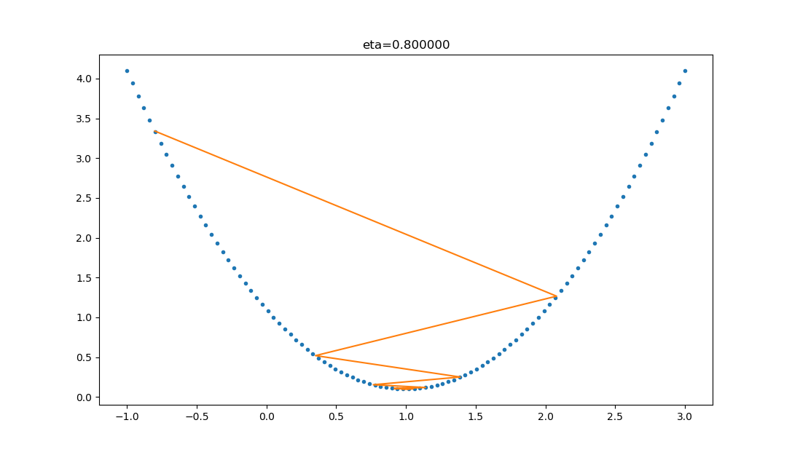
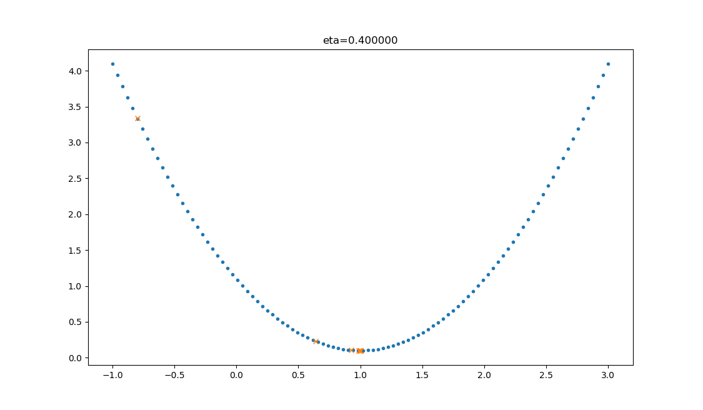

# 梯度下降算法：从直觉到实践

## 1. 建立直觉：什么是梯度下降？

### 1.1 从人类学习过程理解

在深入技术细节之前，让我们思考人类是如何学习的。人类大脑通过**突触可塑性**的过程学习——当获得新信息后，新的神经连接会形成和加强。类似地，人工神经网络通过计算预测误差，并根据这些误差来加强或削弱神经元之间的内部连接。

与机器不同，人类不需要大量数据来理解问题或做出预测；我们主要从经验和错误中学习。这种"从错误中学习"的思想正是梯度下降算法的核心。

### 1.2 自然现象中的梯度下降理解

在大多数文章中，都以"一个人被困在山上，需要迅速下到谷底"来举例，这个人会"寻找当前所处位置最陡峭的地方向下走"。这个例子中忽略了安全因素，这个人不可能沿着最陡峭的方向走，要考虑坡度。

在自然界中，梯度下降的最好例子，就是**泉水下山的过程**：

1. 水受重力影响，会在当前位置，沿着最陡峭的方向流动，有时会形成瀑布（梯度下降）；
2. 水流下山的路径不是唯一的，在同一个地点，有可能有多个位置具有同样的陡峭程度，而造成了分流（可以得到多个解）；
3. 遇到坑洼地区，有可能形成湖泊，而终止下山过程（不能得到全局最优解，而是局部最优解）。

这个自然现象完美地诠释了梯度下降算法的特点和潜在问题。

### 1.3 梯度下降的术语解析

让我们拆解"梯度下降"这个术语：

- **梯度**（Gradient）：数学上指函数在某点处变化最快的方向，记作 $\nabla L$，量化了"陡度"
- **下降**（Descent）：向下的运动，寻找更低的值

"梯度下降"包含了两层含义：

1. **梯度**：函数当前位置的最快上升点；
2. **下降**：与导数相反的方向，用数学语言描述就是那个减号。

亦即与上升相反的方向运动，就是下降。


因此，梯度下降算法就是**利用梯度信息来指导参数向损失函数更小值移动的过程**。

### 1.4 数学函数的视角与损失函数

在机器学习中，我们要最小化的"山谷"是**损失函数**（Loss Function，也称成本函数）$L(\theta)$，其中 $\theta$ 是模型参数：

- **高度** = 损失函数值（预测错误程度）
- **位置** = 参数取值组合
- **坡度** = 梯度（损失函数对参数的偏导数）

损失函数量化了模型预测值和实际数据样本值之间的误差。**损失函数越小，模型的性能越好**。

常见的损失函数包括：

- **均方误差**（MSE）：适用于回归问题
- **交叉熵损失**：适用于分类问题
  - 二元交叉熵：二分类
  - 分类交叉熵：多分类
- **对数损失**：概率预测问题

### 1.5 实际应用示例：房价预测中的梯度下降

为了更直观地理解梯度下降算法，我们通过一个简单的一元线性回归例子进行详细讲解。

#### 问题背景：预测房屋价格

我们希望建立一个模型，根据房屋的面积来预测其价格。我们收集了以下训练数据：

| 面积（㎡） | 价格（万元） |
| ---------- | ------------ |
| 50         | 150          |
| 80         | 240          |
| 100        | 300          |
| 120        | 360          |
| 150        | 450          |

目标是拟合线性函数：

$$
\hat{y} = wx + b
$$

其中：

- $x$：房屋面积（特征）
- $\hat{y}$：预测价格
- $w$：斜率（每平米房价）
- $b$：截距（起始房价）

---

#### 步骤 1：定义损失函数

采用**均方误差（MSE）**作为损失函数：

$$
L(w, b) = \frac{1}{n} \sum_{i=1}^n \left(wx^{(i)} + b - y^{(i)}\right)^2
$$

---

#### 步骤 2：计算梯度

对损失函数分别对 $w$ 和 $b$ 求偏导：

$$
\frac{\partial L}{\partial w} = \frac{2}{n} \sum_{i=1}^n (wx^{(i)} + b - y^{(i)}) \cdot x^{(i)}
$$

$$
\frac{\partial L}{\partial b} = \frac{2}{n} \sum_{i=1}^n (wx^{(i)} + b - y^{(i)})
$$

---

#### 步骤 3：参数更新（梯度下降）

使用梯度下降算法迭代更新参数：

$$
w_{\text{new}} = w_{\text{old}} - \alpha \cdot \frac{\partial L}{\partial w}, \quad
b_{\text{new}} = b_{\text{old}} - \alpha \cdot \frac{\partial L}{\partial b}
$$

---

#### 步骤 4：具体计算示例与收敛过程

**初始设置**：

- 初始参数：$w = 0$, $b = 0$
- 学习率：$\alpha = 0.000001$ (1e-06)
- 样本数量：$n = 5$

##### 1. 初始损失计算（第 0 次迭代）

$$
\hat{y}^{(i)} = 0, \quad \text{for all } i
$$

$$
L(0, 0) = \frac{1}{5}[(150)^2 + (240)^2 + (300)^2 + (360)^2 + (450)^2] = \frac{1}{5} \cdot 502200 = 100440
$$

##### 2. 初始梯度计算

$$
\frac{\partial L}{\partial w} = \frac{2}{5} \left[-150 \cdot 50 - 240 \cdot 80 - 300 \cdot 100 - 360 \cdot 120 - 450 \cdot 150\right]
$$

$$
= \frac{2}{5} \cdot (-7500 - 19200 - 30000 - 43200 - 67500) = \frac{2}{5} \cdot (-167400) = -66960
$$

$$
\frac{\partial L}{\partial b} = \frac{2}{5}(-150 - 240 - 300 - 360 - 450) = \frac{2}{5} \cdot (-1500) = -600
$$

##### 3. 第一次更新

$$
w_1 = 0 + 0.000001 \cdot 66960 = 0.06696,\quad b_1 = 0 + 0.000001 \cdot 600 = 0.0006
$$

---

#### 多轮迭代收敛情况

| 迭代 | $w$     | $b$     | 损失 $L(w,b)$ | $\partial L / \partial w$ | $\partial L / \partial b$ |
| ---- | ------- | ------- | ------------- | ------------------------- | ------------------------- |
| 0    | 0.00000 | 0.00000 | 100440.00     | -66960.0                  | -600.0                    |
| 1    | 0.06696 | 0.00060 | 96006.04      | -65465.3                  | -586.6                    |
| 10   | 0.65962 | 0.00591 | 63947.77      | -53428.7                  | -478.8                    |
| 50   | 2.05117 | 0.01838 | 10507.52      | -21657.7                  | -194.1                    |
| 100  | 2.69294 | 0.02413 | 1099.24       | -7005.0                   | -62.8                     |
| 500  | 2.99972 | 0.02688 | 0.00          | -0.8                      | -0.0                      |
| 1000 | 2.99976 | 0.02687 | 0.00          | -0.0                      | 0.0                       |
| 2000 | 2.99976 | 0.02687 | 0.00          | -0.0                      | 0.0                       |
| 5000 | 2.99976 | 0.02685 | 0.00          | -0.0                      | 0.0                       |

---

#### 收敛结果分析

- **收敛结果**：$w \approx 2.99976$, $b \approx 0.02685$
- **含义**：每平米房价 ≈ 3.000 万元，起始价格 ≈ 0.027 万元
- **收敛特点**：在第 500 次迭代时基本收敛，损失函数降至接近 0
- 该结果可有效拟合样本点，预测误差接近于 0

---

#### 使用方程求解验证

对一元线性回归，可通过正规方程直接计算最优解：

设：

$$
\bar{x} = \frac{50 + 80 + 100 + 120 + 150}{5} = 100
$$

$$
\bar{y} = \frac{150 + 240 + 300 + 360 + 450}{5} = 300
$$

$$
w = \frac{\sum (x_i - \bar{x})(y_i - \bar{y})}{\sum (x_i - \bar{x})^2} = \frac{15000}{5000} = 3
$$

$$
b = \bar{y} - w \cdot \bar{x} = 300 - 3 \cdot 100 = 0
$$

因此，最优解为：

- $w^* = 3.0$
- $b^* = 0.0$

可以看到，梯度下降算法得到的结果（$w \approx 2.99976$, $b \approx 0.02685$）与解析解非常接近，验证了算法的正确性。

#### 关键洞察

通过这个示例，我们可以看到：

1. **梯度指向误差增加最快的方向**，因此取负号后指向误差减少最快的方向
2. **学习率决定了收敛速度**：使用较小的学习率（1e-06）确保了稳定收敛
3. **迭代过程是自动的**：算法会根据当前参数自动计算下一步调整方向
4. **收敛过程平稳**：损失函数单调递减，最终收敛到全局最优解
5. **最终结果符合直觉**：学到的线性关系（每平米 3 万元）反映了数据中的真实模式

---

### 1.6 局部最小值与全局最小值问题

在损失函数的参数空间中，我们要理解两个重要概念：

- **局部最小值**：损失函数在指定范围或区域内的最小参数值
- **全局最小值**：整个损失函数域内的最小参数值

#### 1.6.1 应对局部最小值陷阱的策略

**问题识别**：算法可能陷入局部最优而非全局最优

**解决方案**：

- **随机初始化多次运行**：从不同起点开始，选择最优结果
- **模拟退火法**：逐步减小学习率 $\alpha$，如 $\alpha_t = \alpha_0 / \sqrt{t}$
- **动量法**：利用历史梯度信息加速穿越平坦区域
- **随机梯度下降**：引入噪声帮助跳出局部最优

在上面的线性回归示例中，由于 MSE 损失函数是凸函数，局部最小值就是全局最小值，因此梯度下降保证能找到最优解。

### 1.7 为什么需要梯度下降

在复杂模型中，参数空间可能是高维的（成千上万个参数），直接求解析解通常不可行。梯度下降提供了一种**迭代式的数值优化方法**，特别适合：

- 参数维度很高的问题
- 损失函数复杂且无解析解的情况
- 需要在线学习或增量更新的场景

以图像分类为例：查看一张图像时，需要确定图像是猫还是狗。为了建立模型，需要使用正确标记的猫和狗图像数据样本来训练算法。神经网络通过调整权重和偏差的值，以最好地表示数据集的特征。

---

## 2. 数学原理深入

### 2.1 梯度下降的数学理解

梯度下降的数学公式：

$$\theta_{n+1} = \theta_{n} - \eta \cdot \nabla J(\theta)$$

其中：

- $\theta_{n+1}$：下一个值；
- $\theta_n$：当前值；
- $-$：减号，梯度的反向；
- $\eta$：学习率或步长，控制每一步走的距离，不要太快以免错过了最佳景点，不要太慢以免时间太长；
- $\nabla$：梯度，函数当前位置的最快上升点；
- $J(\theta)$：函数。

#### 2.1.1 梯度下降的三要素

1. **当前点**；
2. **方向**；
3. **步长**。

### 2.2 单变量函数的梯度下降

对于一元函数 $f(x)$，梯度下降的核心更新规则为：

$$x_{\text{new}} = x_{\text{old}} - \alpha \cdot f'(x_{\text{old}})$$

其中各参数含义如下：

- $\alpha$：学习率（步长），控制每次迭代的移动距离
- $f'(x_{\text{old}})$：函数在当前点的导数，即梯度 $\nabla_x f$

**核心思想**：导数 $f'(x)$ 表示函数值增长最快的方向，取其负值 $-f'(x)$ 即得到函数值下降最快的方向。算法通过沿此方向迭代更新，逐步逼近极值点。

#### 2.2.1 具体示例：二次函数优化

假设一个单变量函数：

$$J(x) = x ^2$$

我们的目的是找到该函数的最小值，于是计算其微分：

$$J'(x) = 2x$$

假设初始位置为：

$$x_0=1.2$$

假设学习率：

$$\eta = 0.3$$

根据公式，迭代公式：

$$x_{n+1} = x_{n} - \eta \cdot \nabla J(x)= x_{n} - \eta \cdot 2x$$

假设终止条件为 $J(x)<0.01$，迭代过程是：

```text
x=0.480000, y=0.230400
x=0.192000, y=0.036864
x=0.076800, y=0.005898
x=0.030720, y=0.000944
```

这个过程展示了梯度下降法在单变量情况下的迭代收敛过程。

---

### 2.3 多变量情况

对于多元可微函数 $f(\boldsymbol{\theta}) = f(\theta_1, \theta_2, \ldots, \theta_n)$，其梯度定义为所有偏导数构成的向量：

$$
\nabla_{\boldsymbol{\theta}} f = \begin{bmatrix}
\frac{\partial f}{\partial \theta_1} \\
\frac{\partial f}{\partial \theta_2} \\
\vdots \\
\frac{\partial f}{\partial \theta_n}
\end{bmatrix}
$$

相应的参数更新规则扩展为：

$$\boldsymbol{\theta}_{\text{new}} = \boldsymbol{\theta}_{\text{old}} - \alpha \cdot \nabla_{\boldsymbol{\theta}} f$$

**几何解释**：在多维空间中，梯度向量指向函数值增长最快的方向，其大小表示变化率的强度。梯度下降算法沿梯度的反方向移动，确保每次迭代都朝着函数值减小的方向前进，从而实现全局或局部最优化。

#### 2.3.1 双变量梯度下降示例

假设一个双变量函数：

$$J(x,y) = x^2 + \sin^2(y)$$

我们的目的是找到该函数的最小值，于是计算其微分：

$${\partial{J(x,y)} \over \partial{x}} = 2x$$
$${\partial{J(x,y)} \over \partial{y}} = 2 \sin y \cos y$$

假设初始位置为：

$$(x_0,y_0)=(3,1)$$

假设学习率：

$$\eta = 0.1$$

根据公式，迭代过程的计算公式：

$$
(x_{n+1},y_{n+1}) = (x_n,y_n) - \eta \cdot \nabla J(x,y)
$$

$$
 = (x_n,y_n) - \eta \cdot (2x,2 \cdot \sin y \cdot \cos y)
$$

假设终止条件为 $J(x,y)<0.01$，迭代过程如下表所示：

| 迭代次数 | x        | y        | J(x,y)   |
| -------- | -------- | -------- | -------- |
| 1        | 3        | 1        | 9.708073 |
| 2        | 2.4      | 0.909070 | 6.382415 |
| ...      | ...      | ...      | ...      |
| 15       | 0.105553 | 0.063481 | 0.015166 |
| 16       | 0.084442 | 0.050819 | 0.009711 |

迭代 16 次后，$J(x,y)$ 的值为 $0.009711$，满足小于 $0.01$ 的条件，停止迭代。

这个过程展示了在三维空间内的梯度下降过程，算法沿着坡度向下走，从高地一直到达洼地。

### 2.4 学习率 η 的选择

在公式表达时，学习率被表示为$\eta$。在代码里，我们把学习率定义为`learning_rate`，或者`eta`。学习率 $\alpha$ 的合理选择是算法成功的关键因素，直接影响收敛速度和稳定性。

#### 2.4.1 不同学习率的影响分析

| 学习率 | 迭代路线图                                            | 说明                                                                          |
| ------ | ----------------------------------------------------- | ----------------------------------------------------------------------------- |
| 1.0    |  | 学习率太大，迭代的情况很糟糕，在一条水平线上跳来跳去，永远也不能下降。        |
| 0.8    |               | 学习率大，会有这种左右跳跃的情况发生，这不利于神经网络的训练。                |
| 0.4    |               | 学习率合适，损失值会从单侧下降，4 步以后基本接近了理想值。                    |
| 0.1    |               | 学习率较小，损失值会从单侧下降，但下降速度非常慢，10 步了还没有到达理想状态。 |

#### 2.4.2 学习率过小的问题

- 收敛速度过慢，需要大量迭代才能达到最优解
- 容易在损失函数的平坦区域停滞不前
- 计算资源消耗大，实用性差

#### 2.4.3 学习率过大的问题

- 步长过大可能跨越最优点，导致参数在最优解附近震荡
- 严重情况下可能导致算法发散，损失函数值不断增大
- 数值不稳定，难以获得可靠的优化结果

#### 2.4.4 实用的学习率选择方法

**经验公式法**：

- 线性回归等凸优化问题：$\alpha = \frac{0.1}{\sqrt{d}}$（$d$ 为特征维数）
- 神经网络训练：通常从 $\alpha = 0.001$ 开始调试
- 这些公式基于理论分析和大量实验经验总结

**自适应调整策略**：

1. **指数衰减**：
   $$\alpha_t = \alpha_0 \cdot \gamma^{\lfloor t / T \rfloor}$$
   其中 $\alpha_0$ 为初始学习率，$\gamma \in (0,1)$ 为衰减因子，$T$ 为衰减周期

2. **网格搜索法**：
   在对数尺度区间（如 $[10^{-4}, 10^{-3}, 10^{-2}, 10^{-1}]$）内系统性地测试不同学习率

3. **损失监控法**：
   实时观察训练损失曲线，根据收敛行为动态调整学习率

---

### 2.5 收敛判断准则

算法通常在满足以下任一条件时终止迭代：

#### 基于梯度的准则

$$
\|\nabla_{\boldsymbol{\theta}} f\| < \epsilon
$$

当梯度范数小于预设阈值 $\epsilon$ 时，表明已接近驻点（梯度为零的点）。

#### 基于函数值变化的准则

$$
|f(\boldsymbol{\theta}_{k+1}) - f(\boldsymbol{\theta}_k)| < \delta
$$

连续两次迭代的函数值变化小于阈值 $\delta$，说明算法已基本收敛。

#### 相对变化准则

$$
\frac{|f(\boldsymbol{\theta}_{k+1}) - f(\boldsymbol{\theta}_k)|}{|f(\boldsymbol{\theta}_k)| + \varepsilon} < \tau
$$

其中 $\varepsilon$ 是防止分母为零的小常数。这种准则对函数值的量级不敏感，特别适用于函数值范围变化较大的优化问题。

#### 迭代次数限制

设定最大迭代次数 $N_{\text{max}}$，防止算法无限循环，确保程序在合理时间内结束。

> **实践建议**：在实际应用中，通常会同时使用多个收敛准则，采用"或"逻辑关系。例如，当梯度足够小**或**函数值变化足够小**或**达到最大迭代次数时停止算法，这样可以提高收敛判断的鲁棒性。

---

## 3. 梯度下降变种

### 3.1 批量梯度下降（Batch Gradient Descent）

使用整个训练集计算梯度：

$$
\theta = \theta - \alpha \cdot \frac{1}{m} \sum_{i=1}^{m} \nabla_\theta L(\theta; x^{(i)}, y^{(i)})
$$

**特点**：

- 每次更新方向最准确
- 对于凸函数保证收敛到全局最优
- 计算成本高，不适合大数据集

### 3.2 随机梯度下降（Stochastic Gradient Descent, SGD）

每次只使用一个样本计算梯度：

$$
\theta = \theta - \alpha \cdot \nabla_\theta L(\theta; x^{(i)}, y^{(i)})
$$

**特点**：

- 更新频繁，收敛快
- 具有逃离局部最优的能力（噪声效应）
- 梯度估计不准确，收敛路径震荡

### 3.3 小批量梯度下降（Mini-batch Gradient Descent）

使用小批量样本（通常 32-256 个）：

$$
\theta = \theta - \alpha \cdot \frac{1}{|B|} \sum_{i \in B} \nabla_\theta L(\theta; x^{(i)}, y^{(i)})
$$

**特点**：

- 平衡了计算效率和梯度准确性
- 现代深度学习的标准做法
- 便于并行计算

---

## 4. 高级优化算法

在基本梯度下降方法的基础上，许多优化器通过引入历史梯度、动态学习率等机制，提升了收敛速度和稳定性。本节介绍两种常用的高级优化方法：动量法与 Adam。

---

### 4.1 动量法（Momentum）

动量法通过引入过去梯度的指数加权平均（即"动量项"），在参数更新中累计历史梯度的方向，从而减少震荡、加速收敛：

$$
v_t = \beta v_{t-1} + (1 - \beta) \nabla_\theta L(\theta_t)
$$

$$
\theta_{t+1} = \theta_t - \alpha v_t
$$

其中：

- $v_t$ 是第 $t$ 步的动量（速度）项
- $\beta \in [0,1)$ 是动量系数，常取 0.9
- $\alpha$ 是学习率
- $\nabla_\theta L(\theta_t)$ 是当前梯度

**物理直觉**：类似于一个带摩擦力的小球在地形曲面上滚动。动量项使得优化路径在陡峭方向上加速前进，同时在震荡方向上抑制来回波动，从而更稳健地逼近极小值。

---

### 4.2 Adam 优化器（Adaptive Moment Estimation）

Adam 是当前最常用的优化器之一，结合了动量法与 RMSProp 的思想，分别对梯度的一阶矩（均值）和二阶矩（方差）进行自适应估计：

$$
m_t = \beta_1 m_{t-1} + (1 - \beta_1) \nabla_\theta L(\theta_t)
$$

$$
v_t = \beta_2 v_{t-1} + (1 - \beta_2) [\nabla_\theta L(\theta_t)]^2
$$

由于 $m_t$ 和 $v_t$ 是指数加权的估计值，初期会偏向于 0，因此使用偏差修正项：

$$
\hat{m}_t = \frac{m_t}{1 - \beta_1^t}, \quad \hat{v}_t = \frac{v_t}{1 - \beta_2^t}
$$

最终的参数更新公式为：

$$
\theta_{t+1} = \theta_t - \alpha \cdot \frac{\hat{m}_t}{\sqrt{\hat{v}_t} + \epsilon}
$$

常用超参数设置：

- $\beta_1 = 0.9$（一阶矩动量系数）
- $\beta_2 = 0.999$（二阶矩衰减系数）
- $\epsilon = 10^{-8}$（防止除零的小常数）

Adam 在大多数非凸优化任务中表现出良好的稳定性和收敛速度，特别适用于稀疏梯度、高维参数空间的深度学习场景。

---

### 4.3 进阶说明

Adam 中的二阶矩估计 $v_t$ 实质上捕捉了每个参数维度上梯度的方差变化情况，其作用相当于对每个参数分配一个**自适应学习率**。当某一维度的梯度波动较大时，$\sqrt{\hat{v}_t}$ 会变大，导致该参数的学习率相应减小，从而避免震荡；反之亦然。

这种"逐维自适应"机制，使得 Adam 能够在不同尺度的参数上实现精细调控，提升整体优化效率。

---

## 5. 传统机器学习中的应用

梯度下降不仅在深度学习中是基础优化方法，也广泛应用于传统机器学习模型的参数求解过程，尤其在线性回归、逻辑回归和支持向量机等模型中。本节将系统展示梯度下降如何作用于这些模型的损失函数优化中。

---

### 5.1 线性回归（Linear Regression）

**问题设定**：

给定训练样本 $\{(x^{(i)}, y^{(i)})\}_{i=1}^{m}$，目标是学习一个线性模型，使预测值 $h_\theta(x)$ 与真实值 $y$ 的均方误差最小：

$$
h_\theta(x) = \theta_0 + \theta_1 x
$$

**损失函数**（均方误差）：

$$
J(\theta) = \frac{1}{2m} \sum_{i=1}^{m} (h_\theta(x^{(i)}) - y^{(i)})^2
$$

**梯度计算**：

对 $\theta_0$ 和 $\theta_1$ 分别求偏导，可得：

$$
\frac{\partial J}{\partial \theta_0} = \frac{1}{m} \sum_{i=1}^{m} (h_\theta(x^{(i)}) - y^{(i)})
$$

$$
\frac{\partial J}{\partial \theta_1} = \frac{1}{m} \sum_{i=1}^{m} (h_\theta(x^{(i)}) - y^{(i)}) \cdot x^{(i)}
$$

**梯度下降更新规则**：

$$
\theta_0 := \theta_0 - \alpha \cdot \frac{\partial J}{\partial \theta_0}
$$

$$
\theta_1 := \theta_1 - \alpha \cdot \frac{\partial J}{\partial \theta_1}
$$

该过程在多个迭代步骤中重复执行，直到损失函数收敛。

---

### 5.2 逻辑回归（Logistic Regression）

**模型表达式**：

逻辑回归用于二分类任务，采用 sigmoid 函数将线性输出映射为概率值：

$$
h_\theta(x) = \frac{1}{1 + e^{-\theta^T x}}
$$

其中，$h_\theta(x) \in (0,1)$ 表示预测为正类的概率。

**损失函数**（对数损失 / 交叉熵）：

$$
J(\theta) = -\frac{1}{m} \sum_{i=1}^{m} \left[y^{(i)} \log(h_\theta(x^{(i)})) + (1 - y^{(i)}) \log(1 - h_\theta(x^{(i)}))\right]
$$

该损失函数来源于最大似然估计，对数形式便于求导。

**梯度计算**：

对每个参数 $\theta_j$ 的偏导为：

$$
\frac{\partial J}{\partial \theta_j} = \frac{1}{m} \sum_{i=1}^{m} (h_\theta(x^{(i)}) - y^{(i)}) \cdot x_j^{(i)}
$$

注意：梯度形式与线性回归非常相似，主要区别在于 $h_\theta(x)$ 的定义不同，这使逻辑回归的损失函数非线性、不可闭式求解。

---

### 5.3 支持向量机（Support Vector Machine, SVM）

SVM 通过最大化间隔来提高分类的泛化能力。对于允许少量分类错误的软间隔 SVM，其优化目标可表示为以下正则化合页损失函数：

$$
\min_{\theta, b} \; \frac{1}{2} \|\theta\|^2 + C \sum_{i=1}^{m} \max\left(0, 1 - y^{(i)} (\theta^T x^{(i)} + b)\right)
$$

其中：

- $\|\theta\|^2$ 是间隔最大化目标（正则项）
- 合页损失 $\max(0, 1 - y f(x))$ 促进正确分类
- $C$ 为正则化系数，权衡间隔大小与误分类容忍度

**优化方法**：

由于目标函数不可导（含 max 函数），通常采用**次梯度下降法（sub-gradient descent）**进行优化。其更新规则与传统梯度下降类似，但使用次梯度而非严格梯度。

---

## 6. 神经网络中的应用：反向传播简介

### 6.1 神经网络结构理解

神经网络可被视为一个多层复合函数，通过逐层变换将输入数据映射为输出预测。每一层由若干**神经元**组成，神经元的输出由其**输入加权求和后经激活函数**得到。

一个典型的前馈神经网络结构包括：

- **输入层**：接收特征向量 $\boldsymbol{x} = (x_1, x_2, \ldots, x_n)$；
- **隐藏层**：由多个神经元组成，每个神经元具有独立的**权重** $\boldsymbol{W}$ 与**偏置** $b$；
- **输出层**：输出最终的预测结果 $\hat{y}$。

每个神经元的输出（即激活值）由以下三部分决定：

1. **前一层的激活值**（表示上一层的输出）；
2. **当前神经元的权重参数**；
3. **当前神经元的偏置项**。

### 6.2 前向传播过程（Forward Propagation）

前向传播是将输入数据从输入层依次传递至输出层的过程，具体计算如下：

$$
z^{[l]} = W^{[l]} a^{[l-1]} + b^{[l]}
$$

$$
a^{[l]} = g^{[l]}(z^{[l]})
$$

其中：

- $z^{[l]}$：第 $l$ 层神经元的线性组合；
- $W^{[l]}$：第 $l$ 层的权重矩阵；
- $b^{[l]}$：第 $l$ 层的偏置向量；
- $a^{[l-1]}$：前一层的激活输出；
- $g^{[l]}$：第 $l$ 层的激活函数（如 ReLU、Sigmoid、Tanh 等）。

### 6.3 反向传播机制（Backpropagation）

反向传播的目标是计算损失函数对网络中所有参数的梯度，以实现参数的更新。其核心是**链式法则**在多层函数结构中的应用。

#### 计算流程概述

```text
前向传播:     x → z₁ → a₁ → z₂ → a₂ → L
反向传播:     x ← ∂L/∂W₁ ← ∂L/∂z₁ ← ∂L/∂a₁ ← ∂L/∂z₂ ← ∂L/∂a₂ ← L
```

#### 关键梯度计算公式

反向传播过程中，梯度的计算可分为三类：

1. **权重梯度**：

   $$
   \frac{\partial L}{\partial W^{[l]}} = \frac{\partial L}{\partial z^{[l]}} \cdot (a^{[l-1]})^T
   $$

2. **偏置梯度**：

   $$
   \frac{\partial L}{\partial b^{[l]}} = \frac{\partial L}{\partial z^{[l]}}
   $$

3. **激活值反传**（用于传递误差至前一层）：

   $$
   \frac{\partial L}{\partial a^{[l-1]}} = (W^{[l]})^T \cdot \frac{\partial L}{\partial z^{[l]}}
   $$

#### 执行流程

1. 在输出层，计算预测结果与真实标签之间的损失 $L$；
2. 计算输出层激活 $a^{[L]}$ 的梯度；
3. 逐层向前传播误差 $\frac{\partial L}{\partial z^{[l]}}$，并计算对应参数梯度；
4. 更新参数以减小损失。

### 6.4 分类任务中的实际应用示例

以手写数字识别（如识别数字 0–3）为例：

- 网络输出层包含 4 个神经元，每个对应一个数字类别；
- 使用 Softmax 激活函数将输出转换为概率分布；
- 损失函数采用交叉熵，衡量预测概率与真实标签的匹配程度。

训练流程如下：

1. 输入图像通过前向传播生成预测概率；
2. 期望数字（如"3"）的输出概率越高越好；
3. 通过反向传播计算梯度，调整网络权重，使对应"3"的神经元激活更高；
4. 多轮迭代后，模型能够较好区分不同数字。

### 6.5 参数更新与学习率的作用

每一轮训练中，利用计算得到的梯度对参数进行更新：

$$
W^{[l]} := W^{[l]} - \alpha \cdot \frac{\partial L}{\partial W^{[l]}}
$$

$$
b^{[l]} := b^{[l]} - \alpha \cdot \frac{\partial L}{\partial b^{[l]}}
$$

其中：

- $\alpha$ 为**学习率**，控制每次更新的步长；
- 过小会导致收敛缓慢，过大可能导致训练不稳定甚至发散。

### 6.6 可视化：梯度下降在损失曲面上的表现

可以将损失函数视为一个在高维参数空间中的复杂曲面，训练过程就是在该曲面上不断寻找更低的"谷底"：

- 每个梯度更新点对应于该曲面上的一个位置；
- 梯度方向指向当前点下降最快的方向；
- **训练轨迹**如一条逐步向下的路径，最终趋近于局部或全局最小值。

> 图像（可选）可展示二维损失曲面 + 梯度下降轨迹，帮助直观理解训练过程中的动态变化。

---

## 七、总结

梯度下降作为参数优化的核心算法，贯穿于从线性回归到深度神经网络的各类模型中，构成现代机器学习与深度学习方法的基石。它通过迭代地最小化损失函数，使模型不断逼近最优解，体现出极强的通用性与扩展性。

深入理解梯度下降的原理及其在神经网络中的反向传播机制，不仅有助于掌握主流模型的训练过程，更为模型设计与算法创新提供理论支撑。对于希望深入算法原理和提升建模能力的技术从业者而言，梯度下降的掌握是不可或缺的一环。
