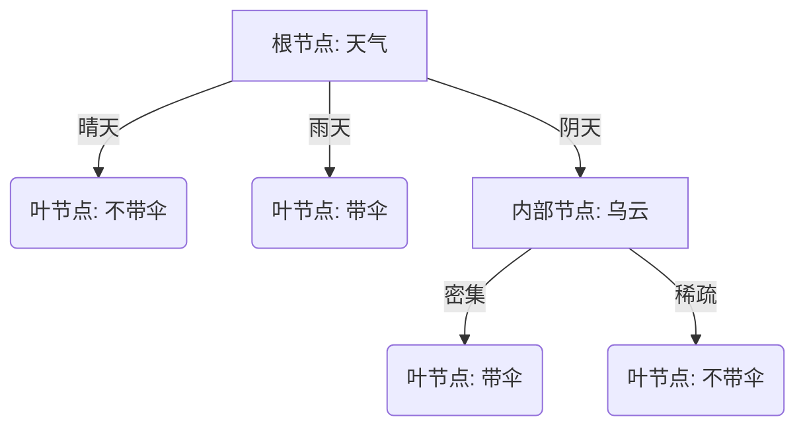

# 动手学机器学习决策树算法

## 1. 学习目标

通过本章节的学习，学生应能够：

1. **理解** 决策树算法的核心思想（分而治之）和树形结构（根节点、内部节点、叶节点）。
2. **掌握** 决策树构建的关键步骤：特征选择（信息熵与信息增益）、树的生成、树的剪枝。
3. **应用** 信息增益公式进行手动计算，完成简单的根节点分裂选择（如高尔夫球数据集）。
4. **实现** 基于 `scikit-learn` 的决策树分类流程，包括特征编码、模型训练与可视化。
5. **分析** 决策树过拟合的原因及剪枝策略的重要性。

---

## 2. 算法概述

### 2.1 什么是决策树

**决策树**（`Decision Tree`）是一种监督学习算法，广泛应用于分类和回归任务。它通过递归地分裂数据集，将数据分成越来越小的子集，直到达到某种停止条件。

为了更好地理解，**你可以把它想象成一系列的 `if-then` 规则集合**，或者我们在日常生活中做决策的思维过程。

> **生活案例：决定是否带伞**
>
> - **步骤 1**：看天气预报。
>   - 如果是“晴天”，则**不带伞**（得出结论）。
>   - 如果是“雨天”，则**带伞**（得出结论）。
>   - 如果是“阴天”，则进入步骤 2。
> - **步骤 2**：看乌云是否密集。
>   - 如果“密集”，则**带伞**。
>   - 如果“稀疏”，则**不带伞**。

这种层层递进的判断过程，就是决策树的核心思想。

### 2.2 决策树的结构

决策树主要由以下几个部分组成：

- **根节点 (Root Node)**：树的最顶层节点，包含所有样本数据。
- **内部节点 (Internal Node)**：表示一个特征或属性的测试（例如“天气是什么？”）。
- **分支 (Branch)**：表示测试结果的输出路径（例如“晴天”或“雨天”）。
- **叶节点 (Leaf Node)**：树的末端节点，表示最终的类别决策或预测值（例如“带伞”）。



### 2.3 决策树的构建过程

构建决策树的本质就是**“如何选择最合适的问题”**来区分数据。主要包含三个步骤：

1. **特征选择**：决定在当前节点使用哪个特征进行分裂（例如，先看“天气”还是先看“乌云”？）。通常使用**信息增益**、**基尼指数**等指标来衡量。
2. **决策树生成**：根据选择的特征，将数据分裂成子集，并递归地重复此过程。
3. **决策树剪枝**：为了防止“过拟合”（树太复杂，死记硬背了训练数据），需要对生成的树进行修剪，去掉一些不必要的分支。

---

## 3. 算法原理

### 3.1 信息熵

对于一个离散的随机变量 $X$，其概率分布为 $P(X) = \{p_1, p_2, \ldots, p_n\}$，**信息熵** $H(X)$ 定义为：

$$
H(X) = -\sum_{i=1}^{n} p_i \log_2 p_i
$$

其中，$p_i$ 是随机变量 $X$ 取值为 $x_i$ 的概率，$\log_2$ 表示以 2 为底的对数。

#### 3.1.1 信息熵的性质

1. **非负性**：信息熵总是非负的，即 $H(X) \geq 0$。
2. **对称性**：信息熵对概率分布的顺序不敏感，即 $H(X)$ 与 $p_i$ 的顺序无关。
3. **最大值**：当所有 $p_i$ 相等时，信息熵达到最大值。对于 $n$ 个等概率事件，最大信息熵为 $\log_2 n$。
4. **最小值**：当某个 $p_i = 1$ 且其他 $p_j = 0$ 时，信息熵达到最小值 0。

#### 3.1.2 信息熵的直观解释

信息熵可以理解为对随机变量的平均信息量的度量。例如，考虑一个公平的六面骰子，每个面的概率都是 $\frac{1}{6}$。此时，信息熵为：

$$
H(X) = -6 \times \left( \frac{1}{6} \log_2 \frac{1}{6} \right) = \log_2 6 \approx 2.585 \text{ 比特}
$$

这表示掷一次骰子的平均信息量约为 2.585 比特。

### 3.2 信息增益

**信息增益**（`Information Gain`）是信息熵的一个重要应用，用于衡量某个特征对减少不确定性的作用。信息增益定义为：

$$
\text{IG}(D, A) = H(D) - H(D \mid A)
$$

其中，$H(D)$ 是数据集 $D$ 在类别标签上的信息熵，$H(D \mid A)$ 是在给定特征 $A$ 的条件下，$D$ 的条件熵（按 $A$ 的取值对数据集划分后加权求和）。

信息增益衡量了某个特征对减少不确定性的作用。信息增益越大，表示该特征对分类的贡献越大。

### 3.3 实例推导：高尔夫球数据集

为了真正理解 ID3 算法，让我们手动计算一下“高尔夫球数据集”根节点的分裂选择。

**数据集回顾**：
总样本数 $N=14$。
类别“是”（玩）：9 个样本。
类别“否”（不玩）：5 个样本。

**步骤 1：计算根节点的信息熵 $H(D)$**

$$
H(D) = - \left( \frac{9}{14} \log_2 \frac{9}{14} + \frac{5}{14} \log_2 \frac{5}{14} \right) \approx 0.940
$$

**步骤 2：计算特征“天气”的信息增益**：

特征“天气”有 3 个取值：晴天、多云、下雨。

1. **晴天**（5 个样本）：2 个“否”，3 个“是”。
   $$ H(\text{晴天}) = - \left( \frac{2}{5} \log_2 \frac{2}{5} + \frac{3}{5} \log_2 \frac{3}{5} \right) \approx 0.971 $$
2. **多云**（4 个样本）：0 个“否”，4 个“是”。
   $$ H(\text{多云}) = - \left( 0 + 1 \log_2 1 \right) = 0 $$
3. **下雨**（5 个样本）：3 个“否”，2 个“是”。
   $$ H(\text{下雨}) = - \left( \frac{3}{5} \log_2 \frac{3}{5} + \frac{2}{5} \log_2 \frac{2}{5} \right) \approx 0.971 $$

**计算“天气”的条件熵 $H(D \mid \text{天气})$**：

$$
H(D \mid \text{天气}) = \frac{5}{14} \times 0.971 + \frac{4}{14} \times 0 + \frac{5}{14} \times 0.971 \approx 0.693
$$

**计算“天气”的信息增益 $\text{IG}(D, \text{天气})$**：

$$
\text{IG}(D, \text{天气}) = H(D) - H(D \mid \text{天气}) = 0.940 - 0.693 = 0.247
$$

**结论**：同理可计算“湿度”的信息增益。比较所有特征的增益，选择最大的作为分裂特征。

### 3.4 基尼系数 (Gini Impurity)

除了信息增益，**基尼系数**（`Gini Impurity`）是另一种常用的分裂标准，也是 `scikit-learn` 中 CART 算法（Classification and Regression Trees）的默认选择。

基尼系数衡量的是从数据集中随机选取两个样本，其类别标签不一致的概率。对于概率分布 $P(X) = \{p_1, p_2, \ldots, p_n\}$，基尼系数定义为：

$$
\text{Gini}(D) = 1 - \sum_{i=1}^{n} p_i^2
$$

其中，$p_i$ 是第 $i$ 类样本在数据集 $D$ 中出现的概率。

#### 3.4.1 基尼系数的性质

1. **取值范围**：在二分类问题中，基尼系数的范围是 $[0, 0.5]$。
   - 当所有样本属于同一类时，$p_1=1, p_2=0$，$\text{Gini}(D) = 1 - (1^2 + 0^2) = 0$（纯度最高）。
   - 当样本均匀分布时（如各占 50%），$p_1=0.5, p_2=0.5$，$\text{Gini}(D) = 1 - (0.5^2 + 0.5^2) = 0.5$（纯度最低）。
2. **计算效率**：与信息熵相比，基尼系数不涉及对数运算，因此计算速度通常更快。

#### 3.4.2 基尼增益

类似于信息增益，我们可以定义基于基尼系数的增益（或称为基尼指数下降），选择使得划分后基尼系数下降最快的特征进行分裂。

$$
\Delta \text{Gini}(D, A) = \text{Gini}(D) - \text{Gini}(D \mid A)
$$

其中 $\text{Gini}(D \mid A)$ 是特征 $A$ 划分后的加权平均基尼系数。

---

## 4. 算法优缺点

### 4.1 优点

- **可解释性强**：决策过程直观，可视化效果好，易于被非专业人士理解。
- **数据处理能力**：能够处理非线性关系，对异常值相对鲁棒；但多数实现对缺失值（如 NaN）仍需要预处理。
- **无需特征缩放**：通常不需要对数据进行标准化或归一化处理。

### 4.2 缺点

- **容易过拟合**：生成的树可能过于复杂，导致泛化能力下降（通常需要剪枝或限制深度）。
- **不稳定性**：对数据的小变化敏感，数据的一点变动可能导致树结构的剧烈改变。
- **偏向性**：在某些分裂准则与数据分布下，决策树可能偏向于选择取值较多（高基数）的特征，需结合验证集与正则化约束进行控制。

---

## 5. 经典案例实战：高尔夫球预测

### 5.1 环境准备

要运行决策树算法，需先准备好相应的 `Python` 环境与库。以下为必需的库导入代码：

```python
import matplotlib.pyplot as plt
import seaborn as sns
import numpy as np
import pandas as pd
from sklearn.tree import DecisionTreeClassifier, plot_tree, export_text
from sklearn.preprocessing import OneHotEncoder
from matplotlib import rcParams
from matplotlib.text import Text

# 配置 matplotlib 使用中文字体
rcParams['font.sans-serif'] = ['Heiti TC'] # Mac 系统使用 Heiti TC
rcParams['axes.unicode_minus'] = False     # 解决负号显示问题
```

### 5.2 数据探索与预处理

本案例使用一个简单的高尔夫球数据集，预测在不同天气和湿度条件下是否适合打高尔夫球。

**1. 创建并查看数据集**：

```python
# 创建数据集
data = {
    '天气': ['晴天', '晴天', '晴天', '多云', '多云', '下雨', '下雨', '下雨', '晴天', '晴天', '多云', '多云', '下雨', '下雨'],
    '湿度': ['高', '高', '高', '高', '正常', '高', '正常', '正常', '正常', '正常', '高', '正常', '高', '正常'],
    '是否玩高尔夫球': ['否', '否', '是', '是', '是', '否', '是', '是', '是', '是', '是', '是', '否', '是']
}

# 将数据转换为 DataFrame
df = pd.DataFrame(data)
print("原始数据集:")
print(df.to_string(index=False))
```

**2. 特征编码**：

由于 `scikit-learn` 的决策树实现不支持字符串特征，我们需要将类别特征转换为数值特征。这里我们使用 `OneHotEncoder` 进行独热编码。

```python
# 特征和目标变量
X = df[['天气', '湿度']]
y = df['是否玩高尔夫球']

# 使用 OneHotEncoder 直接处理
# handle_unknown='ignore' 防止预测时遇到训练集中未见的类别报错
# sparse_output=False 返回 numpy array 而不是 sparse matrix
try:
    encoder = OneHotEncoder(handle_unknown='ignore', sparse_output=False)
except TypeError:
    # 兼容旧版本 sklearn
    encoder = OneHotEncoder(handle_unknown='ignore', sparse=False)

X_encoded = encoder.fit_transform(X)
feature_names = encoder.get_feature_names_out(['天气', '湿度'])

# 转换为 DataFrame 以便查看和训练 (保持列名)
X_encoded_df = pd.DataFrame(X_encoded, columns=feature_names)
```

### 5.3 模型训练与可视化

**1. 训练模型**：

这里我们使用信息熵（Entropy）作为分裂标准，构建决策树。

> **注意：Scikit-learn 的算法实现**
>
> 值得注意的是，虽然我们在理论部分推导了 ID3 算法（支持多叉分裂），但 `scikit-learn` 使用的是优化后的 **CART 算法**（Classification and Regression Trees）。
>
> - **二叉树结构**：CART 算法构建的是**二叉树**，即每个节点严格分为两个分支（例如“是晴天”和“不是晴天”）。
> - **特征处理**：对于多类别特征（如天气=晴/阴/雨），One-Hot 编码后变成了独立的二元特征（如 `天气_晴天` 为 0 或 1），天然契合二叉树的分裂方式。

```python
# 创建并训练模型
clf = DecisionTreeClassifier(criterion='entropy', random_state=42)
clf.fit(X_encoded_df, y)
```

**2. 可视化决策树**：

通过绘图工具，我们可以直观地看到树的结构。

```python
# 打印决策树的结构
plt.figure(figsize=(14, 8))
tree_plot = plot_tree(
    clf,
    feature_names=feature_names,
    class_names=clf.classes_,
    filled=True,
    rounded=True
)

# 遍历图中的每个文本元素并调整字体大小
for t in plt.gca().get_children():
    if isinstance(t, Text):
        t.set_fontsize(14)
plt.show()
```

**3. 文本结构展示**：

除了图形化展示，我们还可以导出树的文本规则，这对于理解树的逻辑非常有帮助。

```python
# 通过文本打印决策树
tree_rules = export_text(clf, feature_names=list(feature_names))
print("决策树文本结构:")
print(tree_rules)
```

### 5.4 模型预测与结果解读

**1. 新样本预测**：

使用训练好的模型对新的天气和湿度组合进行预测。注意：新数据也需要使用同一个 `encoder` 进行转换。

```python
# 预测新样本
new_samples_df = pd.DataFrame(
    [
        ['晴天', '高'],
        ['晴天', '正常'],
        ['多云', '高'],
        ['多云', '正常'],
        ['下雨', '高'],
        ['下雨', '正常'],
    ],
    columns=['天气', '湿度']
)

# 使用训练好的 encoder 进行转换
X_new_encoded = encoder.transform(new_samples_df)
X_new_encoded_df = pd.DataFrame(X_new_encoded, columns=feature_names)

# 进行预测
predictions = clf.predict(X_new_encoded_df)
print("预测结果:")
for (weather, humidity), prediction in zip(new_samples_df.values, predictions):
    print(f"天气: {weather}, 湿度: {humidity} -> {prediction}")
```

**2. 结果解读**：

- **可视化结构**：由于使用 One-Hot 编码，节点上显示的特征形如 `天气_晴天`、`湿度_高`，阈值常见为 `0.50`，表示在 0/1 特征上区分“是否属于该类别”。
- **文本规则**：可从 `export_text` 输出中直接读取树的 if-then 规则，其中 `<= 0.50` 通常对应“该 One-Hot 特征为 0”，`> 0.50` 对应“该 One-Hot 特征为 1”。

通过预测结果可以看到，模型能够根据输入的天气和湿度条件，给出是否玩高尔夫球的建议。

---

## 6. 算法优化与进阶

### 6.1 决策树的过拟合与剪枝

决策树容易过拟合（Overfitting），即在训练集上表现很好，但在测试集上表现较差。我们可以通过**剪枝**（Pruning）来限制树的复杂度。

常用的预剪枝参数：

- `max_depth`: 树的最大深度。
- `min_samples_split`: 节点分裂所需的最小样本数。
- `min_samples_leaf`: 叶子节点所需的最小样本数。

下面使用经典的 Iris (鸢尾花) 数据集来演示不同深度对决策边界的影响。

```python
# 加载 Iris 数据集 (使用 seaborn 替代 sklearn.datasets)
try:
    iris_df = sns.load_dataset('iris')
except:
    # 如果 seaborn 加载失败，尝试从 URL 加载
    url = "https://raw.githubusercontent.com/mwaskom/seaborn-data/master/iris.csv"
    iris_df = pd.read_csv(url)

# 准备数据
# 为了方便可视化，我们只取前两个特征 (Sepal Length, Sepal Width)
feature_names_iris = ['sepal_length', 'sepal_width']
target_name_iris = 'species'

X_iris = iris_df[feature_names_iris].values
y_iris = iris_df[target_name_iris]

# 训练两个模型：一个不限制深度，一个限制深度
clf_deep = DecisionTreeClassifier(max_depth=None, random_state=42)
clf_pruned = DecisionTreeClassifier(max_depth=3, random_state=42)

clf_deep.fit(X_iris, y_iris)
clf_pruned.fit(X_iris, y_iris)

# --- 自定义决策边界绘制函数 ---
def plot_decision_boundary(clf, X, y, ax, title):
    # 创建网格
    x_min, x_max = X[:, 0].min() - 1, X[:, 0].max() + 1
    y_min, y_max = X[:, 1].min() - 1, X[:, 1].max() + 1
    xx, yy = np.meshgrid(np.arange(x_min, x_max, 0.02),
                         np.arange(y_min, y_max, 0.02))

    # 预测
    Z = clf.predict(np.c_[xx.ravel(), yy.ravel()])

    # 将字符串标签转换为数值以便绘图
    classes = clf.classes_
    class_map = {c: i for i, c in enumerate(classes)}
    Z_num = np.array([class_map[label] for label in Z]).reshape(xx.shape)
    y_num = np.array([class_map[label] for label in y])

    # 绘图
    ax.contourf(xx, yy, Z_num, alpha=0.4, cmap=plt.cm.coolwarm)
    scatter = ax.scatter(X[:, 0], X[:, 1], c=y_num, edgecolors='k', cmap=plt.cm.coolwarm)

    ax.set_title(title)
    ax.set_xlabel(feature_names_iris[0])
    ax.set_ylabel(feature_names_iris[1])
    # 添加图例
    handles, _ = scatter.legend_elements()
    ax.legend(handles, classes, loc="upper right")

# 可视化决策边界
plt.figure(figsize=(16, 6))
ax1 = plt.subplot(1, 2, 1)
plot_decision_boundary(
    clf_deep,
    X_iris,
    y_iris,
    ax1,
    f"未剪枝 (max_depth=None)\n训练准确率: {clf_deep.score(X_iris, y_iris):.3f}"
)

ax2 = plt.subplot(1, 2, 2)
plot_decision_boundary(
    clf_pruned,
    X_iris,
    y_iris,
    ax2,
    f"预剪枝 (max_depth=3)\n训练准确率: {clf_pruned.score(X_iris, y_iris):.3f}"
)

plt.show()
```

### 6.2 特征重要性

决策树可以计算每个特征的重要性（Feature Importance），这对于特征选择和理解数据非常有帮助。重要性越高，说明该特征在树的分裂中起到的作用越大。

```python
# 准备所有特征数据
all_feature_names = ['sepal_length', 'sepal_width', 'petal_length', 'petal_width']
X_all = iris_df[all_feature_names].values
y_all = iris_df[target_name_iris]

# 使用所有特征训练一个模型
clf_all = DecisionTreeClassifier(random_state=42)
clf_all.fit(X_all, y_all)

# 获取特征重要性
importances = clf_all.feature_importances_

# 可视化
plt.figure(figsize=(10, 6))
plt.barh(all_feature_names, importances)
plt.title("Iris 数据集特征重要性")
plt.xlabel("重要性 (Importance)")
plt.ylabel("特征")
plt.show()

print("特征重要性数值:")
for name, imp in zip(all_feature_names, importances):
    print(f"{name}: {imp:.4f}")
```

### 6.3 集成学习

为了进一步提升性能，可以使用基于决策树的**集成学习**算法：

- **随机森林**（Random Forest）：通过构建多棵决策树并进行投票（分类）或平均（回归），显著降低了模型的方差。
- **梯度提升树**（GBDT / XGBoost / LightGBM）：通过迭代地训练决策树来拟合前一轮的残差，是目前竞赛和工业界最流行的算法之一。

---

## 7. 思考与扩展讨论

为了加深对决策树算法的理解，建议同学们思考以下问题并进行尝试：

1. **过拟合与树的深度**：
   - 如果不限制树的深度（`max_depth=None`），决策树的训练集与测试集表现可能会出现什么差异？
   - 尝试设置不同的 `max_depth`，观察模型结构和性能的变化，并解释原因。
2. **分裂标准的选择**：
   - `DecisionTreeClassifier` 默认使用 `gini`。本章案例使用 `entropy`。尝试对比两者生成的树结构与训练时间，并解释差异可能来自哪里。
3. **特征重要性**：
   - 决策树模型提供了一个属性 `feature_importances_`。尝试打印它，看看哪个特征（天气 vs 湿度）对分类结果的贡献更大？这与我们在树结构中观察到的根节点特征一致吗？

---

## 8. 总结

决策树是一种直观且强大的监督学习算法，通过递归地分裂数据集来构建树结构。信息熵和信息增益是选择分裂特征的关键指标，能够有效减少不确定性，提高分类准确性。通过上述示例，我们详细展示了如何使用 ID3 算法构建决策树，以及如何使用 `scikit-learn` 进行实现。

---

## 9. 参考文献

1. Quinlan, J. R. (1986). Induction of Decision Trees. _Machine Learning_, 1(1), 81-106.
2. Mitchell, T. M. (1997). _Machine Learning_. McGraw-Hill.

---

## 10. 练习题参考答案

1. **过拟合与树的深度**：
   - 当 `max_depth=None` 或深度很大时，决策树会持续分裂以降低训练误差，训练集准确率往往很高，甚至接近 1，但测试集准确率可能下降，表现为典型过拟合。
   - 限制 `max_depth` 会降低模型复杂度：深度较小通常带来更简单的规则、更平滑的决策边界，训练误差上升但测试误差可能下降；深度逐渐增大时，训练误差下降，测试误差可能先下降后上升。
2. **分裂标准的选择**：
   - `gini` 与 `entropy` 都衡量“纯度”，实际生成的树结构在很多数据集上相近，但并不保证完全一致。
   - 计算效率上，`gini` 通常比 `entropy` 更快（避免对数计算），因此在样本较大或需要大量候选分裂评估时，`gini` 更常用；但最终效果依赖数据分布，需以实验结果为准。
3. **特征重要性**：
   - `feature_importances_` 反映特征在全树范围内带来的不纯度下降贡献的加权汇总，数值越大表示该特征在分裂中整体贡献越大。
   - 若根节点首先按“湿度”分裂，则“湿度”的重要性通常更大，但也可能出现“根节点特征”与“全局重要性”不完全一致的情况（例如某特征在多层节点重复使用，累计贡献更高）。
