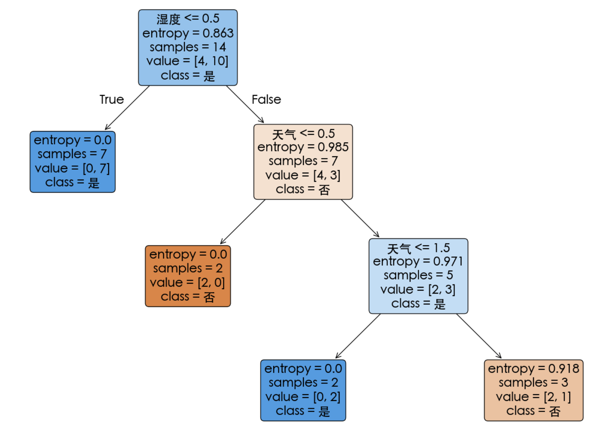

# 动手学机器学习决策树算法

## 1. 决策树

### 1.1 什么是决策树

决策树是一种监督学习算法，广泛应用于分类和回归任务。它通过递归地分裂数据集，将数据分成越来越小的子集，直到达到某种停止条件。每个内部节点表示一个特征或属性，每个分支表示一个决策规则，每个叶节点表示一个类别或预测值。决策树的结构直观，易于理解和解释，因此在许多领域都有广泛应用。

### 1.2 决策树的结构

- **根节点**：包含所有样本的初始节点。
- **内部节点**：表示一个特征或属性的测试。
- **叶节点**：表示一个类别或预测值。
- **分支**：表示根据特征测试结果的决策路径。

### 1.3 决策树的构建过程

1. **选择分裂特征**：使用信息增益、基尼指数等指标选择最佳的分裂特征。
2. **递归分裂**：对每个子节点重复分裂过程，直到满足停止条件。
3. **停止条件**：所有样本属于同一类，或没有更多特征可以分裂，或达到预设的树深度。

### 1.4 决策树的优缺点

- **优点**：
  - 可解释性强，决策过程直观。
  - 能够处理非线性关系。
  - 对缺失值和异常值有一定的鲁棒性。
- **缺点**：
  - 容易过拟合，导致泛化能力下降。
  - 对数据的小变化敏感，可能导致树结构的不稳定。

## 2. 信息熵

对于一个离散的随机变量 $ X $，其概率分布为 $ P(X) = \{p_1, p_2, \ldots, p_n\} $，信息熵 $ H(X)$ 定义为：

$$
H(X) = -\sum_{i=1}^{n} p_i \log_2 p_i
$$

其中，$ p_i $ 是随机变量 $ X $ 取值为  $ x_i $ 的概率，$ log_2 $ 表示以2为底的对数。

### 2.1 信息熵的性质

1. **非负性**：信息熵总是非负的，即 $ H(X) \geq 0 $。
2. **对称性**：信息熵对概率分布的顺序不敏感，即 $ H(X) $ 与 $ p_i $ 的顺序无关。
3. **最大值**：当所有 $ p_i $ 相等时，信息熵达到最大值。对于 $ n $ 个等概率事件，最大信息熵为 $ \log_2 n $。
4. **最小值**：当某个 $ p_i = 1 $ 且其他 $ p_j = 0 $ 时，信息熵达到最小值0。

### 2.2 信息熵的直观解释

信息熵可以理解为对随机变量的平均信息量的度量。例如，考虑一个公平的六面骰子，每个面的概率都是 $ \frac{1}{6} $。此时，信息熵为：

$$
H(X) = -6 \times \left( \frac{1}{6} \log_2 \frac{1}{6} \right) = \log_2 6 \approx 2.585 \text{ 比特}
$$

这表示掷一次骰子的平均信息量约为2.585比特。

### 2.3 信息熵的计算示例

假设有一个二分类问题，其中类别A的概率为0.7，类别B的概率为0.3。计算信息熵：

$$
H(X) = - (0.7 \log_2 0.7 + 0.3 \log_2 0.3) \approx 0.881 \text{ 比特}
$$

### 2.4 信息熵的物理意义

信息熵是衡量随机变量不确定性的指标。熵值越高，表示不确定性越大；熵值越低，表示不确定性越小。

## 3. 信息增益

信息增益（Information Gain）是信息熵的一个重要应用，用于衡量某个特征对减少不确定性的作用。信息增益定义为：

$$
\text{IG}(X, A) = H(X) - H(X | A)
$$

其中，$ H(X) $ 是随机变量 $ X $ 的信息熵，$ H(X | A) $ 是在已知特征 $ A $ 的条件下，随机变量 $ X $ 的条件信息熵。

### 3.1 信息增益的物理意义

信息增益衡量了某个特征对减少不确定性的作用。信息增益越大，表示该特征对分类的贡献越大。

### 3.2 信息增益的计算示例

假设有一个数据集，包含两个特征 $ A $ 和 $ B $，以及目标变量 $ Y $。计算特征 $ A $ 的信息增益：

1. 计算根节点的信息熵 $ H(Y) $。
2. 计算在已知特征 $ A $ 的条件下，目标变量 $ Y $ 的条件信息熵 $ H(Y | A) $。
3. 信息增益 $ \text{IG}(Y, A) = H(Y) - H(Y | A) $。

## 4. 示例

### 4.1 数据集

以下是一个简单的数据集，用于预测是否玩高尔夫球。数据集包括天气（晴天、多云、下雨）和湿度（高、正常）两个特征，以及目标变量是否玩高尔夫球（是或否）。

| 天气   | 湿度 | 是否玩高尔夫球 |
| ------ | ---- | -------------- |
| 晴天   | 高   | 否             |
| 晴天   | 高   | 否             |
| 晴天   | 高   | 是             |
| 多云   | 高   | 是             |
| 多云   | 正常 | 是             |
| 下雨   | 高   | 否             |
| 下雨   | 正常 | 是             |
| 下雨   | 正常 | 是             |
| 晴天   | 正常 | 是             |
| 晴天   | 正常 | 是             |
| 多云   | 高   | 是             |
| 多云   | 正常 | 是             |
| 下雨   | 高   | 否             |
| 下雨   | 正常 | 是             |

### 4.2 决策树构建的过程

决策树的构建过程通常包括以下几个步骤：

1. **计算根节点的信息熵**。
2. **计算每个特征的信息增益**。
3. **选择信息增益最大的特征作为分裂特征**。
4. **递归地对每个子节点重复上述步骤**，直到所有样本都属于同一类或没有更多特征可以分裂。

### 4.3 决策树构建的过程（ID3 算法）

接下来，我们将使用 ID3 算法手工构建决策树。以下是详细的步骤：

#### 4.3.1 计算根节点的信息熵

信息熵的公式为：
$$Entropy(D) = -\sum_{i=1}^{n} p_i \log_2 p_i$$
其中，$p_i$ 是类别 $i$ 在数据集 $D$ 中的比例。

在根节点中，数据集 $D$ 包含 14 个样本，其中“是”的有 9 个，“否”的有 5 个。

$$
p_{\text{是}} = \frac{9}{14}, \quad p_{\text{否}} = \frac{5}{14}
$$

$$
Entropy(D) = -\left(\frac{9}{14} \log_2 \frac{9}{14} + \frac{5}{14} \log_2 \frac{5}{14}\right) \approx 0.940
$$

#### 4.3.2 计算每个特征的信息增益

信息增益的公式为：
$$InfoGain(D, Feature) = Entropy(D) - \sum_{v \in Values(Feature)} \frac{|D_v|}{|D|} Entropy(D_v)$$

##### 4.3.2.1 计算“天气”的信息增益

“天气”有三种取值：晴天、多云、下雨。

- **晴天**：有 5 个样本，其中“是”的有 2 个，“否”的有 3 个。
  $$
  Entropy(D_{\text{晴天}}) = -\left(\frac{2}{5} \log_2 \frac{2}{5} + \frac{3}{5} \log_2 \frac{3}{5}\right) \approx 0.971
  $$

- **多云**：有 4 个样本，全是“是”。
  $$
  Entropy(D_{\text{多云}}) = 0
  $$

- **下雨**：有 5 个样本，其中“是”的有 3 个，“否”的有 2 个。
  $$
  Entropy(D_{\text{下雨}}) = -\left(\frac{3}{5} \log_2 \frac{3}{5} + \frac{2}{5} \log_2 \frac{2}{5}\right) \approx 0.971
  $$

加权平均熵：
$$
\sum_{v \in \{\text{晴天, 多云, 下雨}\}} \frac{|D_v|}{|D|} Entropy(D_v) = \frac{5}{14} \times 0.971 + \frac{4}{14} \times 0 + \frac{5}{14} \times 0.971 \approx 0.693
$$

“天气”的信息增益：
$$
InfoGain(D, \text{天气}) = 0.940 - 0.693 \approx 0.247
$$

##### 4.3.2.2 计算“湿度”的信息增益

“湿度”有两种取值：高、正常。

- **高**：有 7 个样本，其中“是”的有 3 个，“否”的有 4 个。
  $$
  Entropy(D_{\text{高}}) = -\left(\frac{3}{7} \log_2 \frac{3}{7} + \frac{4}{7} \log_2 \frac{4}{7}\right) \approx 0.985
  $$

- **正常**：有 7 个样本，全是“是”。
  $$
  Entropy(D_{\text{正常}}) = 0
  $$

加权平均熵：
$$
\sum_{v \in \{\text{高, 正常}\}} \frac{|D_v|}{|D|} Entropy(D_v) = \frac{7}{14} \times 0.985 + \frac{7}{14} \times 0 \approx 0.493
$$

“湿度”的信息增益：
$$
InfoGain(D, \text{湿度}) = 0.940 - 0.493 \approx 0.447
$$

#### 4.3.3 选择信息增益最大的特征作为分裂特征

比较“天气”和“湿度”的信息增益：
$$
InfoGain(D, \text{天气}) \approx 0.247, \quad InfoGain(D, \text{湿度}) \approx 0.447
$$

“湿度”的信息增益更大，因此选择“湿度”作为根节点的分裂特征。

#### 4.3.4 递归地对每个子节点重复上述步骤

##### 4.3.4.1 子节点 1：湿度为“高”

在湿度为“高”的子节点中，有 7 个样本，其中“是”的有 3 个，“否”的有 4 个。

$$
Entropy(D_{\text{高}}) \approx 0.985
$$

计算“天气”的信息增益：

- **晴天**：有 3 个样本，全是“否”。
  $$
  Entropy(D_{\text{晴天}}) = 0
  $$

- **多云**：有 1 个样本，是“是”。
  $$
  Entropy(D_{\text{多云}}) = 0
  $$

- **下雨**：有 3 个样本，全是“否”。
  $$
  Entropy(D_{\text{下雨}}) = 0
  $$

加权平均熵：
$$
\sum_{v \in \{\text{晴天, 多云, 下雨}\}} \frac{|D_v|}{|D|} Entropy(D_v) = \frac{3}{7} \times 0 + \frac{1}{7} \times 0 + \frac{3}{7} \times 0 = 0
$$

“天气”的信息增益：
$$
InfoGain(D_{\text{高}}, \text{天气}) = 0.985 - 0 = 0.985
$$

选择“天气”作为分裂特征。

##### 4.3.4.2 子节点 2：湿度为“正常”

在湿度为“正常”的子节点中，有 7 个样本，全是“是”。

$$
Entropy(D_{\text{正常}}) = 0
$$

由于所有样本都属于同一类，停止分裂。

### 4.4 决策树

根据上述步骤，构建的决策树如下：

```
        湿度
        /  \
      高   正常
      /      \
    天气      是
    /  |  \
  晴天 多云 下雨
   否   是   否
```

### 4.5 总结

通过上述步骤，我们使用 ID3 算法手工构建了决策树。最终的决策树以“湿度”为根节点，根据湿度的取值进一步分裂，直到所有样本都属于同一类。

## 5. 参考文献

- [1] Quinlan, J. R. (1986). Induction of Decision Trees. Machine Learning, 1(1), 81-106.
- [2] Mitchell, T. M. (1997). Machine Learning. McGraw-Hill.

## 6. 总结

决策树是一种直观且强大的监督学习算法，通过递归地分裂数据集来构建树结构。信息熵和信息增益是选择分裂特征的关键指标，能够有效减少不确定性，提高分类准确性。通过上述示例，我们详细展示了如何使用ID3算法构建决策树，希望对读者理解和应用决策树算法有所帮助。


## 7. 示例代码

### 7.1 Python 代码

```python
from sklearn.tree import DecisionTreeClassifier
from sklearn.preprocessing import LabelEncoder
import pandas as pd
import matplotlib.pyplot as plt
from matplotlib import rcParams
from sklearn.tree import plot_tree
from sklearn.tree import export_text
from matplotlib.text import Text

# 配置 matplotlib 使用字体
rcParams['font.sans-serif'] = ['Heiti TC']
rcParams['axes.unicode_minus'] = False  # 解决负号显示问题

# 创建数据集
data = {
    '天气': ['晴天', '晴天', '晴天', '多云', '多云', '下雨', '下雨', '下雨', '晴天', '晴天', '多云', '多云', '下雨', '下雨'],
    '湿度': ['高', '高', '高', '高', '正常', '高', '正常', '正常', '正常', '正常', '高', '正常', '高', '正常'],
    '是否玩高尔夫球': ['否', '否', '是', '是', '是', '否', '是', '是', '是', '是', '是', '是', '否', '是']
}

# 将数据转换为 DataFrame
df = pd.DataFrame(data)

print(df.to_string(index=False))

# 对特征进行编码
le_weather = LabelEncoder()
le_humidity = LabelEncoder()
df['天气_encoded'] = le_weather.fit_transform(df['天气'])
df['湿度_encoded'] = le_humidity.fit_transform(df['湿度'])

# 特征和目标变量
X = df[['天气_encoded', '湿度_encoded']]  # 确保 X 是一个 DataFrame
y = df['是否玩高尔夫球']

# 创建决策树分类器
clf = DecisionTreeClassifier(criterion='entropy', random_state=42)

# 训练模型
clf.fit(X, y)

# 打印决策树的结构
plt.figure(figsize=(18, 12))
tree_plot = plot_tree(clf, feature_names=['天气', '湿度'], class_names=['否', '是'], filled=True, rounded=True)
# 遍历图中的每个文本元素并调整字体大小
for t in plt.gca().get_children():
    if isinstance(t, Text):
        t.set_fontsize(18)  # 设置字体大小为 10
plt.show()

# 通过文本打印决策树
tree_rules = export_text(clf, feature_names=['天气', '湿度'])
print("决策树文本结构:")
print(tree_rules)

# 预测新样本
new_samples = [
    [le_weather.transform(['晴天'])[0], le_humidity.transform(['高'])[0]],  # 晴天, 高
    [le_weather.transform(['晴天'])[0], le_humidity.transform(['正常'])[0]],  # 晴天, 正常
    [le_weather.transform(['多云'])[0], le_humidity.transform(['高'])[0]],  # 多云, 高
    [le_weather.transform(['多云'])[0], le_humidity.transform(['正常'])[0]],  # 多云, 正常
    [le_weather.transform(['下雨'])[0], le_humidity.transform(['高'])[0]],  # 下雨, 高
    [le_weather.transform(['下雨'])[0], le_humidity.transform(['正常'])[0]]  # 下雨, 正常
]

# 将 new_samples 转换为 DataFrame，并设置列名
new_samples_df = pd.DataFrame(new_samples, columns=['天气_encoded', '湿度_encoded'])

# 使用 DataFrame 进行预测
predictions = clf.predict(new_samples_df)
print("预测结果:")
for sample, prediction in zip(new_samples, predictions):
    print(f"天气: {le_weather.inverse_transform([sample[0]])[0]}, 湿度: {le_humidity.inverse_transform([sample[1]])[0]} → {prediction}")
```

### 7.2 运行结果

```text
天气 湿度 是否玩高尔夫球
晴天  高       否
晴天  高       否
晴天  高       是
多云  高       是
多云 正常       是
下雨  高       否
下雨 正常       是
下雨 正常       是
晴天 正常       是
晴天 正常       是
多云  高       是
多云 正常       是
下雨  高       否
下雨 正常       是


决策树文本结构:
|--- 湿度 <= 0.50
|   |--- class: 是
|--- 湿度 >  0.50
|   |--- 天气 <= 0.50
|   |   |--- class: 否
|   |--- 天气 >  0.50
|   |   |--- 天气 <= 1.50
|   |   |   |--- class: 是
|   |   |--- 天气 >  1.50
|   |   |   |--- class: 否

预测结果:
天气: 晴天, 湿度: 高 → 否
天气: 晴天, 湿度: 正常 → 是
天气: 多云, 湿度: 高 → 是
天气: 多云, 湿度: 正常 → 是
天气: 下雨, 湿度: 高 → 否
天气: 下雨, 湿度: 正常 → 是
```


