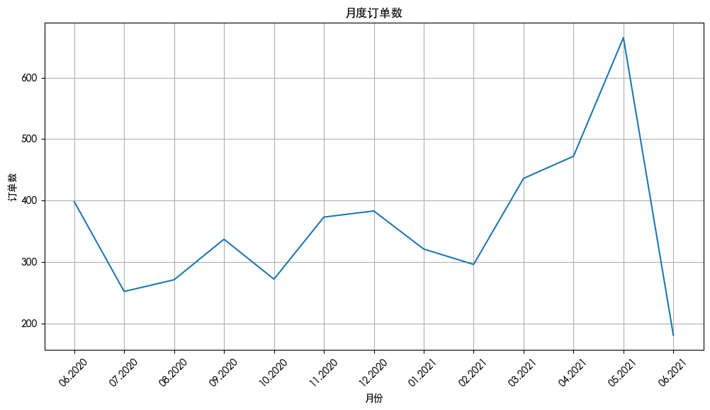

# 【极客时间】零基础实战机器学习 - RFM 模型在用户消费行为分析中的应用

> 作者：黄佳
>
> 极客时间专栏链接：`https://time.geekbang.org/column/intro/438`

## 一、用户消费行为分析与 RFM 模型：从数据到洞察的桥梁

在数字化时代，理解用户行为是企业制定精准运营策略的关键。然而，用户的消费行为本身往往是模糊且难以量化的，直接用于数据分析存在较大局限性。因此，将行为转化为可量化的指标，成为企业洞察用户特征、优化运营决策的第一步。

这些指标不仅能够帮助我们直观地理解用户行为模式，还能广泛应用于广告精准投放、产品推荐系统、用户生命周期管理等多个场景，从而显著提升产品和服务的精准度与转化率。

在众多分析方法中，**RFM 模型**（`Recency`、`Frequency`、`Monetary`）是被广泛采用的经典工具。它通过三个核心维度，将复杂的用户行为简化为清晰的量化指标，为企业提供直观的用户价值评估框架。

### （1）RFM 模型的核心指标

1. **R（Recency，最近消费时间）**

   - **定义**：用户自上次消费以来的间隔天数，衡量用户的活跃度。
   - **示例**：若用户上次消费是 30 天前，则 R 值为 30；若今天再次消费，R 值更新为 1。
   - **意义**：R 值越小，用户越活跃；R 值过大可能意味着用户正在流失。

2. **F（Frequency，消费频率）**

   - **定义**：用户在一定时间内的消费次数，反映用户的黏性和忠诚度。
   - **示例**：一个用户在过去 3 个月内消费了 10 次，F 值为 10。
   - **意义**：高频率用户通常是企业的核心用户群体，值得重点维护。

3. **M（Monetary，消费金额）**
   - **定义**：用户在某个时间段内的消费总金额，直接体现用户的价值贡献。
   - **示例**：某用户在过去一年内消费了 5000 元，M 值为 5000。
   - **意义**：M 值越高，用户对企业的经济贡献越大，是高价值用户的显著特征。

### （2）RFM 模型的应用场景

通过这三个指标的组合，企业可以对用户进行分类或聚类，构建精准的用户画像。例如：

- **高价值用户**：R 值小（最近消费频繁）、F 值高（消费稳定）、M 值高（贡献大）。
- **中等价值用户**：R 值中等、F 值较低但 M 值较高（偶尔大额消费）。
- **低价值用户**：R 值大（很久未消费）、F 值低（消费稀少）、M 值低（贡献小）。

基于这些分类，企业可以制定差异化的运营策略：

- 针对高价值用户，提供专属优惠或会员权益，进一步提升忠诚度；
- 针对中等价值用户，设计促销活动或个性化推荐，激发消费潜力；
- 针对低价值用户，通过召回活动或重新激活策略，尝试挽回流失用户。

### （3）项目实施步骤

本项目将分为两个关键阶段，逐步实现从数据到洞察的转化：

1. **数据提取与 RFM 值计算**

   - 提取用户的历史消费数据（时间、频率、金额）。
   - 计算每位用户的 R、F、M 值，形成结构化的用户行为数据集。

2. **用户分组与画像构建**
   - 根据 RFM 值对用户进行分组（如高、中、低价值群体）。
   - 绘制用户分布图，直观呈现不同价值群体的比例与特征。
   - 结合业务场景，制定针对性的营销策略（如推送优惠券、个性化推荐等）。

通过`RFM`模型，企业不仅能精准识别用户价值，还能动态调整运营策略，实现用户生命周期的精细化管理。这一方法已被众多互联网企业验证为高效、实用的用户分析工具。

## 二、导入数据

```python
import pandas as pd #导入Pandas
df_sales = pd.read_csv('易速鲜花订单记录.csv') #载入数据
df_sales.head() #显示头几行数据
```

|       | **订单号** | **产品码** | **消费日期**  | **产品说明**                 | **数量** | **单价** | **用户码** | **城市** |
| ----- | ---------- | ---------- | ------------- | ---------------------------- | -------- | -------- | ---------- | -------- |
| **0** | 536374     | 21258      | 6/1/2020 9:09 | 五彩玫瑰五支装               | 32       | 10.95    | 15100      | 北京     |
| **1** | 536376     | 22114      | 6/1/2020 9:32 | 茉莉花白色 25 枝             | 48       | 3.45     | 15291      | 上海     |
| **2** | 536376     | 21733      | 6/1/2020 9:32 | 教师节向日葵 3 枝尤加利 5 枝 | 64       | 2.55     | 15291      | 上海     |
| **3** | 536378     | 22386      | 6/1/2020 9:37 | 百合粉色 10 花苞             | 10       | 1.95     | 14688      | 北京     |
| **4** | 536378     | 85099C     | 6/1/2020 9:37 | 橙黄香槟色康乃馨             | 10       | 1.95     | 14688      | 北京     |

**数据解析：**

可以看到这个数据集主要包含了订单号、产品码、消费日期，产品说明、数量、单价、用户码和城市等字段。因为我们求的是用户消费行为的新进度（`R`）、消费的总体频率（`F`），还有消费总金额（`M`），所以在这些信息中，我们重点关注的是以下几个数据：

- 用户码
- 单价
- （订单中产品的）数量
- 消费日期

## 三、数据可视化

```python
import matplotlib.pyplot as plt #导入Matplotlib的pyplot模块

from matplotlib import rcParams

# 配置 matplotlib 使用字体
rcParams['font.sans-serif'] = ['Heiti TC']
rcParams['axes.unicode_minus'] = False  # 解决负号显示问题


#构建月度的订单数的DataFrame
df_sales['消费日期'] = pd.to_datetime(df_sales['消费日期']) #转化日期格式
df_orders_monthly = df_sales.set_index('消费日期')['订单号'].resample('ME').nunique()
#设定绘图的画布
ax = pd.DataFrame(df_orders_monthly.values).plot(grid=True,figsize=(12,6),legend=False)
ax.set_xlabel('月份') # X轴label
ax.set_ylabel('订单数') # Y轴Label
ax.set_title('月度订单数') # 图题
#设定X轴月份显示格式
plt.xticks(
    range(len(df_orders_monthly.index)),
    [x.strftime('%m.%Y') for x in df_orders_monthly.index],
    rotation=45)
plt.show() # 绘图
```



**数据解析：**

我们看到，这个数据集收集了“易速鲜花”公司一整年的订单量。所以啊，我们要求的消费额 M，实际上是每个用户一整年的总消费额。

你可能已经注意到，在最后一个月，也就是 2021 年 6 月，订单量突然大幅下降。其实这是因为运营人员拉这个表的时候，正是 6 月的第一个礼拜。所以，6 月的数据虽然不全，但并不会影响我们对用户 RFM 值的分析。

## 四、数据清洗

```python
df_sales = df_sales.drop_duplicates() #删除重复的数据行
```

```python
df_sales.isna().sum() # NaN出现的次数
```

```text
订单号     0
产品码     0
消费日期    0
产品说明    0
数量      0
单价      0
用户码     0
城市      0
dtype: int64
```

```python
df_sales.describe() #df_sales的统计信息
```

|           | **消费日期**                  | **数量**     | **单价**     | **用户码**   |
| --------- | ----------------------------- | ------------ | ------------ | ------------ |
| **count** | 85920                         | 85920.000000 | 85920.000000 | 85920.000000 |
| **mean**  | 2021-01-04 22:50:58.891759616 | 10.115747    | 3.599711     | 15338.080389 |
| **min**   | 2020-06-01 09:09:00           | -9360.000000 | 0.000000     | 14681.000000 |
| **25%**   | 2020-10-03 12:42:00           | 2.000000     | 1.250000     | 15022.000000 |
| **50%**   | 2021-01-22 11:45:00           | 4.000000     | 1.950000     | 15334.000000 |
| **75%**   | 2021-04-19 13:58:00           | 12.000000    | 3.750000     | 15673.000000 |
| **max**   | 2021-06-09 12:31:00           | 3114.000000  | 38970.000000 | 16019.000000 |
| **std**   | NaN                           | 49.114285    | 134.410498   | 391.309086   |

**数据解析：**

在表中你可以看到这个数据集中，共有 9 万多行的数据（`count` 统计数据条目的数量），每条数据的平均采购数量是 10（`mean` 统计均值），商品平均单价是 3.575 元左右。在概览中我们发现，（订单中产品的）数量的最小值（`min`）是一个负数（-9360），这显然是不符合逻辑的，所以我们要把这种脏数据清洗掉。

具体的处理方式是，用 loc 属性通过字段名（也就是列名）访问数据集，同时只保留“数量”字段大于 0 的数据行：

```python
df_sales = df_sales.loc[df_sales['数量'] > 0] #清洗掉数量小于等于0的数据
```

在 `DataFrame` 对象中，`loc` 属性是通过行、列的名称来访问数据的，我们做数据预处理时会经常用到；还有一个常被用到的属性是 `iloc`，它是通过行列的位置（也就是序号）来访问数据的。由于数据行的名称往往也是数值，这两者非常容易被弄混。

所以，在这里我特地给你做了一张图，来说明什么是行列名、什么是行列序号，帮你弄清楚它们的区别。


```python
df_sales.describe() #df_sales的统计信息
```

|           | **消费日期**                  | **数量**     | **单价**     | **用户码**   |
| --------- | ----------------------------- | ------------ | ------------ | ------------ |
| **count** | 84112                         | 84112.000000 | 84112.000000 | 84112.000000 |
| **mean**  | 2021-01-05 01:14:46.564342784 | 10.760236    | 3.005032     | 15337.732963 |
| **min**   | 2020-06-01 09:09:00           | 1.000000     | 0.000000     | 14681.000000 |
| **25%**   | 2020-10-03 12:42:00           | 2.000000     | 1.250000     | 15021.000000 |
| **50%**   | 2021-01-22 11:45:00           | 5.000000     | 1.950000     | 15333.000000 |
| **75%**   | 2021-04-19 15:08:00           | 12.000000    | 3.750000     | 15674.000000 |
| **max**   | 2021-06-09 12:31:00           | 3114.000000  | 3155.950000  | 16019.000000 |
| **std**   | NaN                           | 34.018906    | 15.365085    | 392.074855   |

再用一次 `describe` 方法，就会看到新的最小数量为 1，这就对了。

## 五、特征工程

```python
df_sales['总价'] = df_sales['数量'] * df_sales['单价'] #计算每单的总价
df_sales.head() #显示头几行数据
```

| \*\*\*\* | **订单号** | **产品码** | **消费日期**        | **产品说明**                 | **数量** | **单价** | **用户码** | **城市** | **总价** |
| -------- | ---------- | ---------- | ------------------- | ---------------------------- | -------- | -------- | ---------- | -------- | -------- |
| **0**    | 536374     | 21258      | 2020-06-01 09:09:00 | 五彩玫瑰五支装               | 32       | 10.95    | 15100      | 北京     | 350.4    |
| **1**    | 536376     | 22114      | 2020-06-01 09:32:00 | 茉莉花白色 25 枝             | 48       | 3.45     | 15291      | 上海     | 165.6    |
| **2**    | 536376     | 21733      | 2020-06-01 09:32:00 | 教师节向日葵 3 枝尤加利 5 枝 | 64       | 2.55     | 15291      | 上海     | 163.2    |
| **3**    | 536378     | 22386      | 2020-06-01 09:37:00 | 百合粉色 10 花苞             | 10       | 1.95     | 14688      | 北京     | 19.5     |
| **4**    | 536378     | 85099C     | 2020-06-01 09:37:00 | 橙黄香槟色康乃馨             | 10       | 1.95     | 14688      | 北京     | 19.5     |

**数据解析：**

现在，在这个数据集中，用户码、总价和消费日期这三个字段，给我们带来了每一个用户的 `R`、`F`、`M` 信息。其中：

- 一个用户上一次购物的日期，也就是最新的消费日期，就可以转化成这个用户的 `R` 值；
- 一个用户下的所有订单次数之和，就是消费频率值，也就是该用户的 `F` 值；
- 把一个用户所有订单的总价加起来，就是消费金额值，也就是该用户的 `M` 值。

不过，我们目前的这个数据集是一个订单的历史记录，并不是以用户码为主键的数据表。而 R、F、M 信息是和用户相关的，每一个用户都拥有一个独立的 `R` 值、`F` 值和 `M` 值，所以，在计算 `RFM` 值之前，我们需要先构建一个用户层级表。

## 六、构建 User 用户表

```python
df_user = pd.DataFrame(df_sales['用户码'].unique()) #生成以用户码为主键的结构df_user
df_user.columns = ['用户码'] #设定字段名
df_user = df_user.sort_values(by='用户码',ascending=True).reset_index(drop=True) #按用户码排序
df_user #显示df_user
```

|         | **用户码** |
| ------- | ---------- |
| **0**   | 14681      |
| **1**   | 14682      |
| **2**   | 14684      |
| **3**   | 14687      |
| **4**   | 14688      |
| **...** | ...        |
| **975** | 16015      |
| **976** | 16016      |
| **977** | 16017      |
| **978** | 16018      |
| **979** | 16019      |

980 rows × 1 columns

**数据解析：**

构建用户层级表，简单来说就是生成一个以用户码为关键字段的 `Dataframe` 对象 `df_user`，然后在这个 `Dataframe` 对象中，逐步加入每一个用户的新近度（`R`）、消费频率（`F`）、消费金额（`M`），以及最终总的分组信息。

## 七、求 R 值

```python
df_sales['消费日期'] = pd.to_datetime(df_sales['消费日期']) #转化日期格式
df_recent_buy = df_sales.groupby('用户码').消费日期.max().reset_index() #构建消费日期信息
df_recent_buy.columns = ['用户码','最近日期'] #设定字段名
df_recent_buy['R值'] = (df_recent_buy['最近日期'].max() - df_recent_buy['最近日期']).dt.days #计算最新日期与上次消费日期的天数
df_user = pd.merge(df_user, df_recent_buy[['用户码','R值']], on='用户码') #把上次消费距最新日期的天数（R值）合并至df_user结构
df_user.head() #显示df_user头几行数据
```

|       | **用户码** | **R 值** |
| ----- | ---------- | -------- |
| **0** | 14681      | 70       |
| **1** | 14682      | **187**  |
| **2** | 14684      | 25       |
| **3** | 14687      | 106      |
| **4** | 14688      | 7        |

**数据解析：**

`R` 值越大，说明该用户最近一次购物日距离当前日期越久，那么这样的用户就越是处于休眠状态。从表中可以看出来，编号为 `14682` 的用户已经有 `187` 天没有购物了。所以我们就可以判断这个用户呈现休眠态，很可能已经被别的购物平台所吸引了，也就是流失了。

## 八、求 F 值

```python
df_frequency = df_sales.groupby('用户码').消费日期.count().reset_index() #计算每个用户消费次数，构建df_frequency对象
df_frequency.columns = ['用户码','F值'] #设定字段名称
df_user = pd.merge(df_user, df_frequency, on='用户码') #把消费频率整合至df_user结构
df_user.head() #显示头几行数据
```

|       | **用户码** | **R 值** | **F 值** |
| ----- | ---------- | -------- | -------- |
| **0** | 14681      | 70       | 7        |
| **1** | 14682      | 187      | 2        |
| **2** | 14684      | 25       | 390      |
| **3** | 14687      | 106      | 15       |
| **4** | 14688      | 7        | 324      |

## 九、求 M 值

```python
df_revenue = df_sales.groupby('用户码').总价.sum().reset_index() #根据消费总额，构建df_revenue对象
df_revenue.columns = ['用户码','M值'] #设定字段名称
df_user = pd.merge(df_user, df_revenue, on='用户码') #把消费金额整合至df_user结构
df_user.head() #显示头几行数据
```

| \*\*\*\* | **用户码** | **R 值** | **F 值** | **M 值** |
| -------- | ---------- | -------- | -------- | -------- |
| **0**    | 14681      | 70       | 7        | 498.95   |
| **1**    | 14682      | 187      | 2        | 52.00    |
| **2**    | 14684      | 25       | 390      | 1201.51  |
| **3**    | 14687      | 106      | 15       | 628.38   |
| **4**    | 14688      | 7        | 324      | 5579.10  |

## 十、小结

要做分组画像，`RFM` 分析是一个不错的方法，它也是目前很多互联网厂商普遍采用的分析方式。我们今天的重点是，根据用户码、总价和消费日期这三个字段，从消费历史数据中求出每位用户的 `R`、`F`、`M` 的值，这就好像给用户贴上了一堆数字化的标签。

因篇幅限制，我们把分类这块放到下一篇文章。
