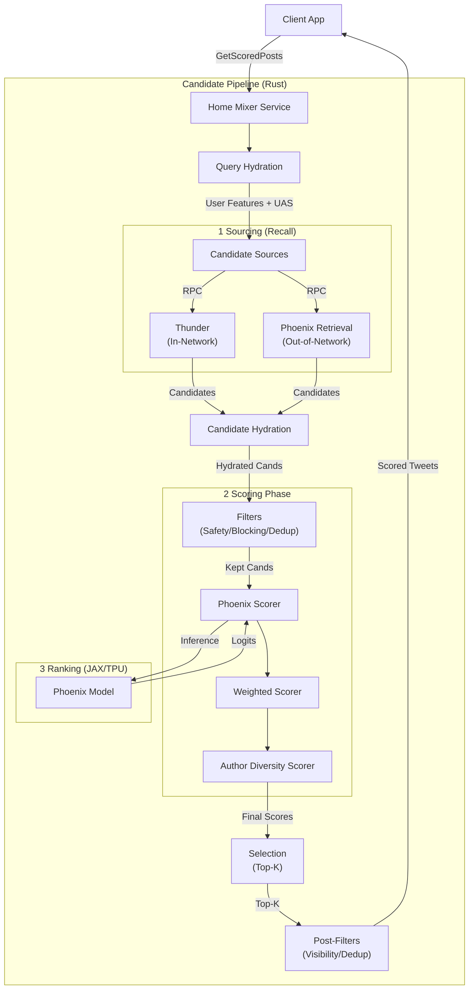

# X (Twitter) For You 推荐算法深度技术解析

本文基于本仓库 `x-algorithm` 的源码与文档，对 X (原 Twitter) "For You" 信息流推荐的核心链路做一次偏工程实现视角的深度拆解，重点覆盖 Rust 编排服务 `home-mixer`、大模型 (Grok-based Transformer) 在排序与召回中的落地方式 (`phoenix`)，以及网络内内容服务 (`thunder`) 的对接方式。本文同时对照 X 官方公开材料，标注“开源缺失/删减”的部分，以便读者正确理解其与真实线上系统之间的差异。

> 代码仓库：https://github.com/xai-org/x-algorithm

---

## 1. 核心架构概览

X 的推荐系统架构可以概括为一个经典的 **漏斗型 (Funnel)** 结构，但在实现上采用了现代化的 **Rust + JAX** 技术栈。系统的核心目标是从数亿条推文中筛选出最相关的几十条展示给用户。

整个流程由 **Home Mixer** 服务编排，主要包含以下阶段（如下图所示）：



1. **Candidate Sourcing (召回)**: 从网络内 (In-Network) 和网络外 (Out-of-Network) 获取数千个候选项。
2. **Hydration (补全)**: 补全推文内容、作者信息、媒体信息等。
3. **Filtering (过滤)**: 基于规则和硬性约束（如黑名单、重复内容）过滤候选项。
4. **Scoring (打分)**: 利用 Grok 模型预测用户对每条推文的交互概率。
5. **Selection (择优)**: 根据加权分数选择最终展示的推文。

官方公开材料对该流水线也给出了类似的分层描述（Candidate Sourcing → Ranking → Heuristics/Filtering），并明确指出 “Home Mixer” 作为时间线的构建服务 (Serving Layer) 的角色。

---

## 2. Home Mixer：推荐系统的“大脑” (Rust)

`home-mixer` 是整个推荐流的编排服务，采用 **Rust** 编写，通过 gRPC 对外提供服务。它不负责具体的模型推理，而是负责调度各个组件。

### 2.1 请求入口与 gRPC 服务边界

Home Mixer 的对外入口为 `ScoredPostsService/GetScoredPosts`。服务在接到请求后，将 proto query 转成内部 `ScoredPostsQuery`，随后调用候选流水线执行，并把 `PostCandidate` 映射回 proto 响应。对应实现位于 `home-mixer/server.rs`。

```rust
// 说明：gRPC handler 将输入 query 转成 ScoredPostsQuery，并执行 pipeline
let query = ScoredPostsQuery::new(
    proto_query.viewer_id,
    proto_query.client_app_id,
    proto_query.country_code,
    proto_query.language_code,
    proto_query.seen_ids,
    proto_query.served_ids,
    proto_query.in_network_only,
    proto_query.is_bottom_request,
    proto_query.bloom_filter_entries,
);
let pipeline_result = self.phx_candidate_pipeline.execute(query).await;
```

> 关键点：`execute` 并不属于 `home-mixer` 本身，而来自一个通用的 pipeline 框架 crate（本仓库 `candidate-pipeline`）。这意味着 Home Mixer 主要工作是“组装 + 配置”，而非把所有业务逻辑堆在一个大函数里。

### 2.2 流水线设计模式与执行语义

代码库中通过 `PhoenixCandidatePipeline` 结构体清晰地定义了处理流：

```rust
// 定义推荐流水线的各个阶段
pub struct PhoenixCandidatePipeline {
    // 查询构建器：用于构建用户特征和上下文
    query_hydrators: Vec<Box<dyn QueryHydrator<ScoredPostsQuery>>>,
    // 召回源：获取候选推文
    sources: Vec<Box<dyn Source<ScoredPostsQuery, PostCandidate>>>,
    // 数据补全器：补充元数据
    hydrators: Vec<Box<dyn Hydrator<ScoredPostsQuery, PostCandidate>>>,
    // 过滤器：移除不符合要求的推文
    filters: Vec<Box<dyn Filter<ScoredPostsQuery, PostCandidate>>>,
    // 打分器：预测交互概率
    scorers: Vec<Box<dyn Scorer<ScoredPostsQuery, PostCandidate>>>,
    // 选择器：选择 Top-K 结果
    selector: TopKScoreSelector,
    // ...
}
```

这种设计模式使得每个阶段（Source, Filter, Scorer）都高度解耦，便于独立迭代。

更关键的是，这套框架对“并发/串行”的执行策略进行了明确约束：

1. `QueryHydrator` 并行执行并 merge 结果。
2. `Source` 并行执行并 append 候选。
3. `Hydrator` 并行执行，但要求输出候选与输入“同序同长”，只允许补字段，不允许丢候选。
4. `Filter` 串行执行，每个 filter 都将候选划分为 kept/removed。
5. `Scorer` 串行执行，要求输出候选与输入“同序同长”，只允许写分数字段，不允许丢候选。
6. `Selector` 排序 + 截断。
7. Post-selection 的 `Hydrator/Filter` 在选中候选上再跑一次（典型用法是 Visibility Filtering）。
8. `SideEffect` 异步触发，不影响主请求返回。

下面的代码片段来自 `candidate-pipeline/candidate_pipeline.rs`，展示了 `execute` 的编排顺序（注释用于解释阶段语义）：

```rust
// 说明：pipeline 执行顺序与并发策略
let hydrated_query = self.hydrate_query(query).await;              // 并行
let candidates = self.fetch_candidates(&hydrated_query).await;     // 并行
let hydrated_candidates = self.hydrate(&hydrated_query, candidates).await; // 并行
let (kept, filtered) = self.filter(&hydrated_query, hydrated_candidates.clone()).await; // 串行
let scored = self.score(&hydrated_query, kept).await;              // 串行
let selected = self.select(&hydrated_query, scored);               // 排序截断
let post_hydrated = self.hydrate_post_selection(&hydrated_query, selected).await; // 并行
let (final_kept, post_filtered) = self.filter_post_selection(&hydrated_query, post_hydrated).await; // 串行
```

> 设计含义：该框架把“高开销 I/O”阶段（召回、补全）放到并行，把“有依赖的业务规则”阶段（过滤、打分的字段覆盖关系）放到串行，从而在可维护性与性能之间取得平衡。来源：本仓库 [candidate-pipeline/candidate_pipeline.rs](../candidate-pipeline/candidate_pipeline.rs)。

### 2.3 查询构建 (Query Hydration)：把用户建模输入做成“序列”

在召回之前，系统首先构建“查询上下文”。除了基本的用户 ID，还包括：

- **User Action Sequence (UAS)**: 用户的历史交互序列（点赞、回复等），这是后续 Transformer 模型最重要的输入。
- **User Features**: 用户的静态特征和偏好。

在代码层面，UAS 的构建并不是简单地“拉一段日志”，而是一套明确的“过滤 → 聚合 → 稠密化 → 截断 → 封装”流程，位于 `home-mixer/query_hydrators/user_action_seq_query_hydrator.rs`：

```rust
// 说明：UAS 聚合流程（过滤 → 聚合 → 后处理 → 截断）
let filtered_actions = self.global_filter.run(thrift_user_actions);
let mut aggregated_actions = self.aggregator.run(&filtered_actions, p::UAS_WINDOW_TIME_MS, 0);
for filter in &self.post_filters {
    aggregated_actions = filter.run(aggregated_actions);
}
if aggregated_actions.len() > p::UAS_MAX_SEQUENCE_LENGTH {
    let drain_count = aggregated_actions.len() - p::UAS_MAX_SEQUENCE_LENGTH;
    aggregated_actions.drain(0..drain_count);
}
```

其中：

1. `UserActionSequenceFetcher` 从数据源取用户行为序列（thrift 格式）。
2. `DefaultAggregator` 负责把行为在时间窗内聚合成更适合建模的“聚合动作”。
3. `DenseAggregatedActionFilter` 负责把聚合后的动作稠密化（降低序列稀疏性，提升模型学习与推理稳定性）。
4. 截断策略选择“保留最新的 N 条”，这是典型的 RecSys 序列建模手法，确保计算成本稳定、并偏向近期兴趣。

这一步的本质：把用户建模从“静态特征拼接”转向“序列建模输入”，为后续 Transformer/大模型提供合适的 token 序列。

User Features 的构建则通过 `StratoClient` 拉取并 decode 成结构化特征 (`UserFeatures`)，位于 `home-mixer/query_hydrators/user_features_query_hydrator.rs`。由于 `clients` 在开源版本中标注为 “excluded for security reasons”，其数据源与具体字段集合在此仓库不可见，这是开源与线上系统的一个显著差异。

---

## 3. 召回层

X 的内容来源主要分为两类：

### 3.1 Thunder (In-Network)

- **定位**: 处理用户关注对象发布的推文（网络内内容）。
- **技术栈**: Rust, Kafka。
- **机制**: `home-mixer` 通过 `ThunderSource` 调用 Thunder 的 gRPC 接口，请求参数包含 `user_id` 与 `following_user_ids`，让 Thunder 返回网络内候选（`ForYouInNetwork`）。在实现上，ThunderSource 还会为 reply 组装 `ancestors`（对话链相关的上游 tweet id），为后续去重/过滤提供上下文。

```rust
// 说明：ThunderSource 构造 In-Network 请求，输入是 user_id 与关注列表
let request = GetInNetworkPostsRequest {
    user_id: query.user_id as u64,
    following_user_ids: following_list.iter().map(|&id| id as u64).collect(),
    max_results: p::THUNDER_MAX_RESULTS,
    exclude_tweet_ids: vec![],
    algorithm: "default".to_string(),
    debug: false,
    is_video_request: false,
};
```

> 对应实现：`home-mixer/sources/thunder_source.rs`。这也解释了为什么 User Features（尤其是 following list）必须在 query hydration 阶段就准备好。（关于 Thunder 的内部存储架构，详见第 6 章）

### 3.2 Phoenix Retrieval (Out-of-Network)

- **定位**: 发现用户未关注但可能感兴趣的内容（网络外内容）。
- **机制**: `home-mixer` 通过 `PhoenixSource` 传入 `user_id` 与聚合后的 UAS，调用 Phoenix Retrieval 服务返回 top-k 候选，再转换为 `PostCandidate`（`ForYouPhoenixRetrieval`）。实现位于 `home-mixer/sources/phoenix_source.rs`。

```rust
// 说明：PhoenixSource 使用 user_id + user_action_sequence 进行检索召回
let response = self
    .phoenix_retrieval_client
    .retrieve(user_id, sequence.clone(), p::PHOENIX_MAX_RESULTS)
    .await?;
```

> 重要事实：这里的“检索输入”并不是一个稀疏特征向量，而是用户行为序列 `UserActionSequence`。这为“同一套大模型同时用于检索与排序”埋下了接口基础。（关于 Phoenix 模型的具体结构，详见第 4 章）

---

## 4. 大模型在推荐系统中的落地：Phoenix

这是当前仓库最值得深入理解的部分：大模型不是被当作一个“黑盒打分器”，而是以 RecSys 序列建模的方式深度嵌入到两个关键环节：

1. **Ranking (重排序/打分)**：预测用户对候选内容发生多种互动的概率 (multi-task)。
2. **Retrieval (召回/检索)**：把用户序列编码为向量表示，与候选向量做相似度检索。

也就是说，Phoenix 在体系中扮演“统一表征学习器 (Unified Representation Learner)”的角色，而不是传统意义上的“单任务 CTR 模型”。

### 4.1 模型架构

排序模型代码位于 `phoenix/recsys_model.py`，基于 **JAX** 与 **Haiku** 实现。其核心思想是把推荐问题改写为“序列到序列”的 Transformer 推理：把“用户 + 历史”作为上下文 token，把“候选内容”作为需要被打分的 token，然后输出每个候选在多个 action 上的 logits。

推理输出的维度在代码中有明确描述：

```python
# 说明：排序模型输出 logits 的形状为 [B, num_candidates, num_actions]
return RecsysModelOutput(logits=logits)
```

对应实现：`phoenix/recsys_model.py` 的 `PhoenixModel.__call__`。

### 4.2 特殊的 Attention Mask 机制

该模型输入并不依赖传统的手工特征拼接，而是以几类“可泛化 token embedding”构造序列：

1. **User / Post / Author 的 Hash Embeddings**：通过多组 hash 函数把高基数 ID 映射到 embedding（减少巨型 embedding table 的存储压力，并具备一定的 OOV 鲁棒性）。
2. **History Actions Embedding**：把用户历史交互（multi-hot）投影到 embedding 维度，用来表达“发生了什么互动”。
3. **Product Surface Embedding**：把产品面 (home timeline、其他入口等) 作为离散特征嵌入到序列中，用于建模不同流量入口对用户行为的影响。

其中动作 embedding 的实现非常关键：它不是把 action 当作离散 token，而是把 multi-hot 向量做一次可学习线性投影（并且把 action 向量转成 signed 形式），这比简单的 embedding lookup 更适合多动作空间扩展。对应实现位于 `phoenix/recsys_model.py` 与 `phoenix/recsys_retrieval_model.py` 的 `_get_action_embeddings`。

```python
# 说明：动作 embedding 的构建不是 lookup，而是 multi-hot → 线性投影
actions_signed = (2 * actions - 1).astype(jnp.float32)
action_emb = jnp.dot(actions_signed.astype(action_projection.dtype), action_projection)
valid_mask = jnp.any(actions, axis=-1, keepdims=True)
action_emb = action_emb * valid_mask
```

这种输入设计对应了一种更“语言模型化”的 RecSys 视角：用户历史不是一堆独立特征，而是一段“事件序列”，每个事件由 (post, author, surface, action) 共同刻画。

### 4.3 关键工程技巧：Candidate Isolation Attention Mask

为了在一次 Transformer 前向中同时给多个候选打分、并避免候选之间互相泄露信息，Phoenix 采用了特殊的 attention mask。实现位于 `phoenix/grok.py` 的 `make_recsys_attn_mask`：

```python
# 说明：候选之间不能互相 attention，仅允许 candidate 自身的 self-attention
causal_mask = jnp.tril(jnp.ones((1, 1, seq_len, seq_len), dtype=dtype))
attn_mask = causal_mask.at[:, :, candidate_start_offset:, candidate_start_offset:].set(0)
candidate_indices = jnp.arange(candidate_start_offset, seq_len)
attn_mask = attn_mask.at[:, :, candidate_indices, candidate_indices].set(1)
```

这种 mask 带来两个直接收益：

1. **推理效率**：一次前向同时处理 C 个候选，而不是 C 次前向。
2. **语义正确性**：candidate 的得分只依赖 user+history+candidate 自身，避免 candidate 之间信息泄露导致排序偏差。

### 4.4 多任务输出：从 logits 到“动作概率向量”

Phoenix 排序模型输出的是 `logits[B, C, A]`，在 `phoenix/runners.py` 的推理侧，通过 `sigmoid` 得到概率，并把每个 action 的概率显式拆出来（例如 `p_favorite_score`、`p_reply_score` 等）。这与 `home-mixer` 侧 `PhoenixScorer` 的字段名完全对齐，说明两端在接口契约上是围绕“多任务动作预测”构建的。

```python
# 说明：推理侧将 logits → probs，并以 primary action (favorite) 排序
probs = jax.nn.sigmoid(logits)
primary_scores = probs[:, :, 0]
ranked_indices = jnp.argsort(-primary_scores, axis=-1)
```

对应实现：`phoenix/runners.py` 的 `hk_rank_candidates`。

> 这里隐含了一个“多任务但单主任务排序”的策略：以某个 primary action 做排序主目标，同时保留其他 action 概率用于后续加权融合与策略层调控。这是工业推荐系统中常见的折中：既保持排序的一致性，又保留更多可解释可调控的信号。

### 4.5 检索模型：同一套 Transformer 用于 User Tower

`phoenix/recsys_retrieval_model.py` 实现了一个两塔 (Two-Tower) 的检索模型，但与传统 two-tower 最大的不同是：User Tower 不是简单的 MLP，而是复用 Phoenix 的 Transformer 对 user+history 序列编码。

1. **User Tower (Transformer encoder)**：把 `user_embeddings + history_embeddings` 输入 Transformer，并对输出做 masked mean pooling 得到 `user_representation[B, D]`，再做 L2 normalize。
2. **Candidate Tower (MLP projection)**：把 (post, author) embedding concat 后过两层 MLP，再做 L2 normalize 得到 `candidate_representation[N, D]`。
3. **Similarity Search**：使用 dot product，相当于 cosine similarity（因为双方均已归一化），并用 `jax.lax.top_k` 找到 top-k 候选。

```python
# 说明：检索阶段用 user_representation 与 corpus_embeddings 做点积并 top_k
scores = jnp.matmul(user_representation, corpus_embeddings.T)
top_k_scores, top_k_indices = jax.lax.top_k(scores, top_k)
```

对应实现：`phoenix/recsys_retrieval_model.py` 的 `_retrieve_top_k`。

> 工程意义：同一套大模型表征既服务于检索 (recall)，也服务于排序 (rank)。这减少了“召回模型与排序模型表征不一致”导致的分布偏移，同时让系统能够通过统一的数据与训练范式持续迭代。

---

## 5. 打分与排名逻辑

模型输出的是概率，而最终排名依赖于一个加权公式。

### 5.1 预测目标

Phoenix 模型是一个多目标预测模型 (Multi-task Learning)，它会同时预测用户对某条推文产生各种互动的概率。代码中定义的 `PhoenixScores` 结构体包含了这些目标：

- `P(Like)` (Favorite)
- `P(Retweet)`
- `P(Reply)`
- `P(Click)` (Click / Profile Click / Photo Expand)
- `P(Share)` (Share / Quote / Share via DM)
- `P(Video View)` (Video Quality View)
- `P(Dwell Time)` (Continuous Value)
- `P(Negative)` (Block / Mute / Report / Not Interested)

需要注意的是，在 `home-mixer` 侧，Phoenix 的预测值并不是直接来自 `sigmoid(logits)` 的显式输出，而是从 `PredictNextActionsResponse` 中读取 `top_log_probs` 并做 `exp` 还原成概率，同时支持连续值（例如 `dwell_time`）。对应实现：`home-mixer/scorers/phoenix_scorer.rs`。

```rust
// home-mixer/scorers/phoenix_scorer.rs
// 1. 从 Phoenix 返回的 log prob 还原为 prob
let action_probs: HashMap<usize, f64> = distribution
    .top_log_probs
    .iter()
    .enumerate()
    .map(|(idx, log_prob)| (idx, (*log_prob as f64).exp()))
    .collect();

// 2. 将概率映射到业务 ActionName (部分示意)
// PhoenixScores 结构体字段对应 ActionName 枚举值
fn extract_phoenix_scores(&self, predictions: &ActionPredictions) -> PhoenixScores {
    PhoenixScores {
        favorite_score: predictions.get_prediction(ActionName::ServerTweetFav),
        reply_score: predictions.get_prediction(ActionName::ServerTweetReply),
        retweet_score: predictions.get_prediction(ActionName::ServerTweetRetweet),
        // ...
        dwell_time: predictions.get_continuous_prediction(ContinuousActionName::DwellTime),
    }
}
```

### 5.2 加权公式

最终分数 `Weighted Score` 是上述概率的线性组合。代码在 `weighted_scorer.rs` 中实现：

```rust
// home-mixer/scorers/weighted_scorer.rs
// 计算加权分数
let vqv_weight = Self::vqv_weight_eligibility(candidate);
let combined_score = Self::apply(s.favorite_score, p::FAVORITE_WEIGHT)
    + Self::apply(s.reply_score, p::REPLY_WEIGHT)
    + Self::apply(s.retweet_score, p::RETWEET_WEIGHT)
    + Self::apply(s.vqv_score, vqv_weight)
    // ... 更多正向信号
    + Self::apply(s.block_author_score, p::BLOCK_AUTHOR_WEIGHT) // 负向信号，通常权重为负
    + Self::apply(s.mute_author_score, p::MUTE_AUTHOR_WEIGHT);

// 视频观看质量分：仅对超过阈值时长的视频启用权重
fn vqv_weight_eligibility(candidate: &PostCandidate) -> f64 {
    if candidate.video_duration_ms.is_some_and(|ms| ms > p::MIN_VIDEO_DURATION_MS) {
        p::VQV_WEIGHT
    } else {
        0.0
    }
}
```

> **注意**：权重参数来自 `home-mixer/params`，而该模块在 `home-mixer/lib.rs` 中标注为 “Excluded from open source release for security reasons”。因此本文只能描述“权重融合的结构”，无法给出真实线上权重值。对应说明：`home-mixer/lib.rs`。

### 5.3 分数归一化与负分偏移的工程动机

`WeightedScorer` 在得到 `combined_score` 后，会做归一化与 offset 处理（调用 `normalize_score` 与 `offset_score`）。这类处理通常用于解决两个工程问题：

1. **跨候选分数尺度不一致**：不同 candidate source 的打分分布可能不同，若直接混排会导致某些 source 被系统性压制。
2. **负向信号导致的负分**：混排/排序阶段常希望 score 处于更稳定的数值范围，便于后续策略处理。

对应实现位于 `home-mixer/scorers/weighted_scorer.rs`，其中 `offset_score` 体现了对负分的平移/缩放策略。

---

## 6. 实时网络内推荐：Thunder (In-Network)

Thunder 作为一个专门的 Rust 服务，负责极低延迟地获取用户关注对象的最新推文。在开源版本中，它展示了一个高性能的内存存储与检索架构。

### 6.1 架构设计

Thunder 的核心并非一个传统数据库，而是一个**基于内存的实时索引系统**。它通过消费 Kafka 的 Tweet 事件流，实时构建用户的“发帖时间线”。

- **写入路径 (Write Path)**:
  - 监听 Kafka Topic (`tweet_events`)。
  - 反序列化事件 (`TweetCreateEvent`, `TweetDeleteEvent`)。
  - 写入内存结构 `PostStore`。

- **读取路径 (Read Path)**:
  - 接收 `home-mixer` 的 gRPC 请求 (含 `user_id` 和 `following_list`)。
  - 并行查询 `following_list` 中所有用户的最近推文。
  - 在内存中做聚合、排序、截断。
  - 返回 `LightPost` 列表。

### 6.2 核心存储结构：PostStore

代码位于 `thunder/posts/post_store.rs`，它使用了 `DashMap` 实现高并发读写，并采用了“数据与索引分离”的存储策略：

```rust
pub struct PostStore {
    // 1. 全量数据表：ID -> Post 内容
    posts: Arc<DashMap<i64, LightPost>>,

    // 2. 索引表：User -> [PostID, Time] (双端队列，保留最近 N 条)
    original_posts_by_user: Arc<DashMap<i64, VecDeque<TinyPost>>>,   // 原创推文
    secondary_posts_by_user: Arc<DashMap<i64, VecDeque<TinyPost>>>,  // 回复/转发
    video_posts_by_user: Arc<DashMap<i64, VecDeque<TinyPost>>>,      // 视频推文

    // 3. 删除表：处理软删除
    deleted_posts: Arc<DashMap<i64, bool>>,
}
```

**关键设计点**：

- **TinyPost**: 索引表中只存 `post_id` 和 `created_at`，极大降低内存占用。
- **VecDeque**: 每个用户的索引是一个双端队列，天然支持时间序，且方便做“滑动窗口”剔除旧数据（Retention Policy）。
- **读写分离**: 写入线程更新 `DashMap`，读取线程（gRPC handler）只读不写，利用 Rust 的 `Arc` 和 `DashMap` 内部锁机制保证线程安全且无锁竞争（lock-free read fast path）。

### 6.3 生产环境差异

需要注意的是，开源版 Thunder 采用了**单机内存版**实现。在真实的 X 生产环境中，针对数亿用户的 In-Network 检索通常依赖于分布式内存存储系统（如 X 内部的 Manhattan 或 Redis Cluster 变种），并且会涉及更复杂的 Tweet 扇出（Fan-out）与写扩散策略。开源代码展示了核心逻辑，但简化了分布式一致性与扩展性处理。

---

## 7. 过滤与安全机制 (Pipeline Filters)

在 `PhoenixCandidatePipeline` 的构建代码 ([home-mixer/candidate_pipeline/phoenix_candidate_pipeline.rs](home-mixer/candidate_pipeline/phoenix_candidate_pipeline.rs)) 中，我们可以看到一个极其严密的过滤链。这些过滤器被分为两类：**Pre-Scoring Filters** (打分前执行，旨在减少打分计算量) 和 **Post-Selection Filters** (排序截断后执行，旨在处理业务展示逻辑)。

### 7.1 打分前过滤 (Pre-Scoring)

这部分过滤器串行执行，任何一个返回 `removed` 都会导致候选被丢弃：

1. **DropDuplicatesFilter**: 简单的 `HashSet` 去重，防止召回源返回重复 ID。

   ```rust
   // home-mixer/filters/drop_duplicates_filter.rs
   let mut seen_ids = HashSet::new();
   for candidate in candidates {
       if seen_ids.insert(candidate.tweet_id) {
           kept.push(candidate);
       } else {
           removed.push(candidate);
       }
   }
   ```

2. **CoreDataHydrationFilter**: 数据完整性检查，剔除 `author_id == 0` 或正文为空的无效推文。

   ```rust
   // home-mixer/filters/core_data_hydration_filter.rs
   let (kept, removed) = candidates
       .into_iter()
       .partition(|c| c.author_id != 0 && !c.tweet_text.trim().is_empty());
   ```

3. **AgeFilter**: 剔除过旧的推文（例如超过 24/48 小时）。

   ```rust
   // home-mixer/filters/age_filter.rs
   fn is_within_age(&self, tweet_id: i64) -> bool {
       snowflake::duration_since_creation_opt(tweet_id)
           .map(|age| age <= self.max_age)
           .unwrap_or(false)
   }
   ```

4. **SelfTweetFilter**: 剔除用户自己发的推文（For You 页通常不展示自己发的内容）。

   ```rust
   // home-mixer/filters/self_tweet_filter.rs
   let (kept, removed): (Vec<_>, Vec<_>) = candidates
       .into_iter()
       .partition(|c| c.author_id != viewer_id);
   ```

5. **RetweetDeduplicationFilter**: 针对转推的去重逻辑。如果原推文 ID 已经出现过（无论是作为原推还是被转推），则后续出现的转推会被移除。

   ```rust
   // home-mixer/filters/retweet_deduplication_filter.rs
   match candidate.retweeted_tweet_id {
       Some(retweeted_id) => {
           if seen_tweet_ids.insert(retweeted_id) { kept.push(candidate); }
           else { removed.push(candidate); }
       }
       None => {
           seen_tweet_ids.insert(candidate.tweet_id as u64);
           kept.push(candidate);
       }
   }
   ```

6. **IneligibleSubscriptionFilter**: 专属内容过滤。如果是订阅专属推文且用户未订阅该作者，则移除。

   ```rust
   // home-mixer/filters/ineligible_subscription_filter.rs
   let (kept, removed): (Vec<_>, Vec<_>) = candidates
       .into_iter()
       .partition(|candidate| match candidate.subscription_author_id {
           Some(author_id) => subscribed_user_ids.contains(&author_id),
           None => true,
       });
   ```

7. **PreviouslySeenPostsFilter**: 客户端去重。
   - **机制**: 检查 `query.seen_ids` 和 `bloom_filter_entries`。
   - **代码亮点**: 使用 Bloom Filter 处理海量已读历史，极大节省带宽。

   ```rust
   // home-mixer/filters/previously_seen_posts_filter.rs
   let bloom_filters = query.bloom_filter_entries.iter().map(BloomFilter::from_entry).collect();
   // 检查 post_id 是否在 seen_ids 或 bloom_filters 中
   ```

8. **PreviouslyServedPostsFilter**: 服务端 Session 去重。
   - **机制**: 确保本次 Session (如 paging 下拉) 不会出现刚刷过的内容。
   - **代码**:

   ```rust
   // home-mixer/filters/previously_served_posts_filter.rs
   get_related_post_ids(c).iter().any(|id| query.served_ids.contains(id))
   ```

9. **MutedKeywordFilter**: 屏蔽词过滤。使用 `TweetTokenizer` 对文本分词，并匹配用户设置的屏蔽词。

   ```rust
   // home-mixer/filters/muted_keyword_filter.rs
   let tokens = tokenizer.tokenize(&candidate.tweet_text);
   let contains_muted_keyword = tokens.iter().any(|token| muted_keywords.contains(token));
   ```

10. **AuthorSocialgraphFilter**: 社交关系过滤（Block/Mute）。检查作者 ID 是否在用户的屏蔽或隐藏列表中。

    ```rust
    // home-mixer/filters/author_socialgraph_filter.rs
    let muted = viewer_muted_user_ids.contains(&author_id);
    let blocked = viewer_blocked_user_ids.contains(&author_id);
    if muted || blocked { removed.push(candidate); }
    ```

### 7.2 排序后过滤 (Post-Selection)

在 Top-K 选择完成后，为了优化最终展示体验和合规性，还会执行两道关键工序：

1. **Visibility Filtering (VF)**
   - **定位**: 法律与安全合规的核心组件。
   - **流程**: 先通过 `VFCandidateHydrator` 调用 VF 服务获取每个推文的 `SafetyLevel`，再通过 `VFFilter` 根据结果决定是否丢弃。
   - **逻辑**: 如果 VF 返回 `Action::Drop`，则必须移除。

   ```rust
   // home-mixer/filters/vf_filter.rs
   match reason {
       Some(FilteredReason::SafetyResult(safety_result)) => {
           matches!(safety_result.action, Action::Drop(_))
       },
       // ...
   }
   ```

2. **DedupConversationFilter (会话树去重)**
   - **定位**: 体验优化。
   - **问题**: 如果原推 A 和它的回复 B 同时分都很高，Feed 里连着出两条会很怪。
   - **策略**: 对同一 `conversation_id` 下的所有候选，只保留**分数最高**的那一个。

   ```rust
   // home-mixer/filters/dedup_conversation_filter.rs
   if let Some((kept_idx, best_score)) = best_per_convo.get_mut(&conversation_id) {
       if score > *best_score {
           // 替换为更高分的候选
           let previous = std::mem::replace(&mut kept[*kept_idx], candidate);
           removed.push(previous);
           *best_score = score;
       } else {
           removed.push(candidate);
       }
   }
   ```

### 7.3 软规则与多样性 (Soft Rules & Diversity)

除了上述硬过滤，多样性控制主要通过 Scorer 阶段的 `AuthorDiversityScorer` 实现。它会对同一作者的后续推文进行降权，而非直接硬删除。这种 "Soft constraint" 策略在现代推荐系统中更为常见，因为它避免了候选集过小的问题。

```rust
// home-mixer/scorers/author_diversity_scorer.rs
// 计算位置相关的衰减系数：(1 - floor) * decay^position + floor
fn multiplier(&self, position: usize) -> f64 {
    (1.0 - self.floor) * self.decay_factor.powf(position as f64) + self.floor
}

// 在 score 方法中：
for (original_idx, candidate) in ordered {
    let entry = author_counts.entry(candidate.author_id).or_insert(0);
    let position = *entry;
    *entry += 1;
    
    let multiplier = self.multiplier(position);
    // 调整分数
    let adjusted_score = candidate.weighted_score.map(|score| score * multiplier);
}
```

---

## 8. 工程实现亮点

### 8.1 Rust + gRPC 的全面拥抱

整个 `home-mixer` 和 `thunder` 均采用 Rust 编写，这在推荐系统中并不多见（通常是 C++ 或 Java）。X 选择 Rust 的理由在代码中体现得淋漓尽致：

- **零成本抽象**: `CandidatePipeline` trait 提供了极佳的模块化抽象，而无运行时性能损耗。
- **内存安全**: 在高并发处理海量请求时，彻底杜绝了空指针与数据竞争。
- **异步生态**: 基于 `tokio` 和 `tonic` (gRPC) 构建了全异步的微服务架构，能够以极低的资源消耗维持数万 QPS。

### 8.2 JAX/Haiku 在 TPU 上的应用

Phoenix 模型选择 **JAX** 而非 PyTorch/TensorFlow，反映了 Google/DeepMind 系技术栈对 X AI 团队的影响（Grok 团队背景）。

- **函数式变换**: `jax.vmap` 和 `jax.pmap` 使得模型代码可以极其简洁地扩展到 batch 维度和多设备并行。
- **XLA 编译**: 模型计算图经 XLA 编译后，在 TPU 上能获得极致的吞吐量，这对于处理 Transformer 这种计算密集型模型至关重要。

---

## 9. 开源版与线上系统的差异总结

阅读源码时，我们需要清醒地认识到开源仓库是“线上系统的快照与简化”：

| 模块         | 开源状态 | 缺失/差异内容                                                                                                   |
| :----------- | :------- | :-------------------------------------------------------------------------------------------------------------- |
| **Data**     | **无**   | 没有任何真实推文、用户数据或模型权重文件。                                                                      |
| **Clients**  | **部分** | `clients` 目录被移除（安全原因）。这意味着我们看不到与 User Data Service、Social Graph Service 的具体通信协议。 |
| **Thunder**  | **简化** | 使用单机内存 `DashMap` 模拟，而非分布式存储集群。                                                               |
| **Training** | **无**   | 仅包含推理代码 (`inference`)，不包含模型训练 pipeline。                                                         |
| **Config**   | **脱敏** | 大量 Feature Switch 和参数配置被设为默认值或移除。                                                              |

尽管如此，这个仓库依然是目前世界上**最完整、最现代化的亿级用户推荐系统开源实现**，对于理解大型推荐系统的架构设计、Pipeline 编排以及大模型落地具有极高的参考价值。

---

## 10. 总结：大模型如何真正改变了推荐系统

从代码层面看，Phoenix (Grok-based Transformer) 的落地价值主要体现在三个维度：

1. **统一用户表征**：用 Transformer 对 UAS 序列建模，把用户兴趣表征从手工特征迁移到模型自动学习的 embedding 空间。
2. **统一检索与排序**：同一套序列表征既服务检索 (user tower) 又服务排序 (multi-task logits)，减少系统内部表征不一致带来的分布偏移。
3. **更强的策略可调控性**：多任务动作概率为策略层提供了高维可解释信号，`home-mixer` 通过 `WeightedScorer` 把这些信号转成一个可调控的最终分数（尽管权重值在开源版本不可见）。

X 的推荐算法演进体现了推荐系统的最新趋势：

1. **Rust 化**: 核心编排层采用 Rust，追求极致的性能和内存安全。
2. **大模型化**: 从传统的 GBDT/LR 转向基于 Transformer 的大模型 (Grok)，利用序列建模能力捕捉用户长短期兴趣。
3. **端到端学习**: 移除了数以百计的手工特征，让模型直接从 ID 和交互序列中学习 User/Item 表示。
4. **实时性**: 通过 Thunder 和 Kafka 架构保证了内容的实时分发。

这份开源代码展示了一个工业级推荐系统如何在保证高性能（Rust）的同时，利用最前沿的 AI 模型（JAX/Grok）来提升分发质量。

---

## 11. 参考资料

1. X Engineering Blog, _Twitter's Recommendation Algorithm_, 2023-03-31, 访问日期：2026-01-25：<https://blog.x.com/engineering/en_us/topics/open-source/2023/twitter-recommendation-algorithm>
2. GitHub, _xai-org/x-algorithm: Algorithm powering the For You feed on X_, 访问日期：2026-01-25：<https://github.com/xai-org/x-algorithm>
3. GitHub, _twitter/the-algorithm: Source code for the X Recommendation Algorithm (Archive)_, 访问日期：2026-01-25：<https://github.com/twitter/the-algorithm>
