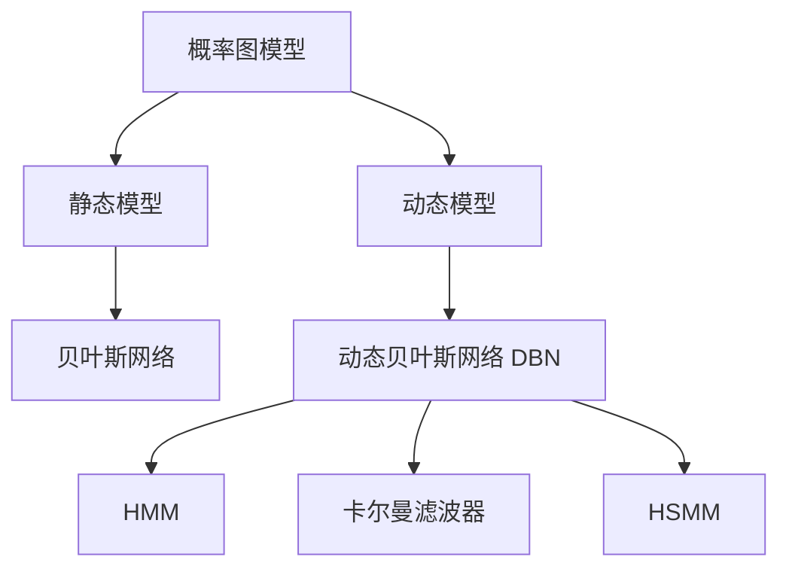

# 一文读懂隐马尔可夫模型（HMM）

隐马尔可夫模型（Hidden Markov Model, HMM）是经典的概率生成模型之一，常用于对时序观测数据进行建模与推断。其关键思想是引入一组不可直接观测的隐藏状态，用“状态转移 + 状态发射”的方式刻画观测序列的生成机制（参考文献见文末）。

文档结构包含九部分：

1. **模型概述**：给出 HMM 的关键假设与马尔可夫链的关系。
2. **模型定义**：用五元组形式化描述状态集合、观测集合与三类参数。
3. **三大基本问题**：评估、解码与学习的输入输出与典型算法。
4. **贯穿示例**：用“天气—活动”示例统一符号与直觉。
5. **核心算法推导**：前向、维特比、Baum-Welch 的计算流程与复杂度。
6. **图模型视角**：说明 HMM 与动态贝叶斯网络的关系。
7. **应用与选型**：讨论典型任务与常见局限。
8. **Python 实践**：用 hmmlearn 进行离散观测 HMM 的建模与解码。
9. **参考文献**：列出关键教材、综述与工具文档。

---

## 一、HMM 概述

隐马尔可夫模型（Hidden Markov Model，简称 HMM）是一种对**含有隐变量的时序数据**进行建模的**概率生成模型**，广泛应用于语音识别、自然语言处理、生物信息学、金融分析等领域。其核心思想是利用一组**不可直接观测的隐藏状态序列**，来解释观测数据随时间变化的依赖结构。HMM 的建模依赖两个关键假设：

> - **一阶马尔可夫性**：当前隐藏状态只依赖于前一个状态，即
>   $P(S_t \mid S_{t-1}, S_{t-2}, ..., S_1) = P(S_t \mid S_{t-1})$
> - **观测条件独立性**：当前观测值仅由当前隐藏状态决定，且与历史状态和观测无关，即
>   $P(O_t \mid S_t, S_{t-1}, ..., S_1, O_{t-1}, ..., O_1) = P(O_t \mid S_t)$

---

### 1.1 HMM 与马尔可夫链的关系

HMM 可以看作是在**马尔可夫链**基础上的扩展，它引入了“**隐藏状态**”这一不可观测层：

| **模型**       | **描述**                                                                            |
| -------------- | ----------------------------------------------------------------------------------- |
| **马尔可夫链** | 建模**可观测状态序列**之间的转移关系，具有无记忆性。                                |
| **HMM**        | 假设真实状态是不可观测的，模型通过这些隐藏状态生成观测值，形成“状态-观测”双层结构。 |

HMM 是一种**生成模型**（`Generative Model`），能够建模状态序列和观测序列的**联合分布**，从而具备模拟与推断能力。

### 1.2 模型结构图解

HMM 的结构可以用以下图示表示：

```text
隐藏状态层：     S₁ → S₂ → S₃ → ... → S_T
                 ↓    ↓    ↓         ↓
观测变量层：     O₁   O₂   O₃  ...   O_T
```

- **$S_t$**：时刻 $t$ 的**隐藏状态**，如天气的“晴”或“雨”，模型无法直接观测。
- **$O_t$**：时刻 $t$ 的**观测值**，如人的活动“散步”或“打游戏”，由 $S_t$ 的发射概率生成。

### 1.3 核心机制

`HMM` 的建模过程可拆分为两个层次：

1. **上层：隐藏状态序列**
   隐藏状态构成一个一阶马尔可夫链，其状态转移由转移概率矩阵 $A$ 控制：
   $S_1 \xrightarrow{A} S_2 \xrightarrow{A} S_3 \xrightarrow{A} \cdots \xrightarrow{A} S_T$

2. **下层：观测值序列**
   每个隐藏状态 $S_t$ 独立地产生一个观测值 $O_t$，其概率由发射矩阵 $B$ 决定：
   $S_t \xrightarrow{B} O_t \quad (t = 1, 2, ..., T)$

这种结构使得 HMM 可以在仅有观测数据的情况下，推断隐藏的状态序列，或用于判断观测序列是否符合某种状态演化模式。

### 1.4 模型特点概览

为便于在后续章节中快速定位 HMM 的能力边界，本小节从“可观测性”“时序依赖”“建模方式”三个角度概括其关键特点。

| 维度               | 描述                                                |
| ------------------ | --------------------------------------------------- |
| **隐状态不可观测** | 模型需要通过观测数据间接推断真实状态序列            |
| **时序依赖性**     | 状态间具有一阶依赖，观测随时间推进生成              |
| **生成建模能力**   | 能模拟 $P(S, O)$ 的联合分布，支持生成与推断两种任务 |

因此，HMM 是处理**部分可观测时序问题（Partially Observable Sequences）**的经典方法，具有很强的建模解释力。

---

## 二、HMM 的基本组成

一个隐马尔可夫模型由以下**五个组成部分**（五元组）定义：

$$
\lambda = (S, O, A, B, \pi)
$$

为避免符号混淆，本文用 $S$ 与 $O$ 表示“状态集合/观测集合”，用 $S_t$ 与 $O_t$ 表示“时刻 $t$ 的状态/观测随机变量”，用 $\boldsymbol{O}$ 表示一段具体的观测序列。

下表列出了各参数的数学定义与物理含义：

| 成分                   | 数学表示                                   | 含义说明                                           | 维度                     |
| ---------------------- | ------------------------------------------ | -------------------------------------------------- | ------------------------ |
| **状态集合** $S$       | $S = \{s_1, s_2, ..., s_N\}$               | 模型可能处于的所有**隐藏状态**（如天气的“晴/雨”）  | $N$ 个离散状态           |
| **观测集合** $O$       | $O = \{o_1, o_2, ..., o_M\}$               | 所有可能出现的**观测符号**（如“散步/购物/打游戏”） | $M$ 个离散观测值         |
| **状态转移矩阵** $A$   | $A_{ij} = P(S_{t+1} = s_j \mid S_t = s_i)$ | 当前状态转移到下一个状态的概率                     | $N \times N$，每行和为 1 |
| **观测概率矩阵** $B$   | $B_j(k) = P(O_t = o_k \mid S_t = s_j)$     | 在隐藏状态 $s_j$ 下生成观测值 $o_k$ 的概率         | $N \times M$，每行和为 1 |
| **初始状态分布** $\pi$ | $\pi_i = P(S_1 = s_i)$                     | 系统在初始时刻处于状态 $s_i$ 的概率                | $N$ 维向量，元素和为 1   |

> 注：
>
> - 实际**观测序列**记作 $\boldsymbol{O} = (O_1, O_2, ..., O_T)$，是从 $O$ 中取出的时序序列。
> - 上述定义基于**离散观测 HMM**；在连续观测场景中，$B$ 通常使用概率密度函数（如高斯分布）替代离散概率表。

### 2.1 参数的可视化示例

以天气预测模型为例，设隐藏状态集合 $S=\{s_1,s_2\}=\{\text{晴},\text{雨}\}$，观测集合 $O=\{o_1,o_2,o_3\}=\{\text{散步},\text{购物},\text{打游戏}\}$。下面给出与第 4 章一致的参数取值，并约定矩阵的行列顺序为：$A$ 的行/列按（晴，雨），$B$ 的行按（晴，雨）、列按（散步，购物，打游戏）。

**状态转移矩阵 $A$：**

$$
A = \begin{bmatrix}
0.7 & 0.3 \\
0.4 & 0.6
\end{bmatrix}
$$

- 晴 → 晴：$A_{\text{晴},\text{晴}} = 0.7$（70%）
- 雨 → 晴：$A_{\text{雨},\text{晴}} = 0.4$（40%）

**观测概率矩阵 $B$：**

$$
B = \begin{bmatrix}
0.6 & 0.3 & 0.1 \\
0.1 & 0.4 & 0.5
\end{bmatrix}
$$

- 晴天散步概率：$P(O_t=\text{散步}\mid S_t=\text{晴}) = 0.6$（60%）
- 雨天打游戏概率：$P(O_t=\text{打游戏}\mid S_t=\text{雨}) = 0.5$（50%）

**初始分布 $\pi$：**

$$
\pi = [0.6,\ 0.4]
\quad
\text{其中 }\pi(\text{晴})=0.6,\ \pi(\text{雨})=0.4
$$

### 2.2 不确定性的来源

HMM 的建模能力依赖于对**双重不确定性**的刻画：

1. **状态转移的不确定性**（由 $A$ 控制）：
   描述系统状态随时间演化的不确定性，例如：“今天晴天，有 30% 可能转为明天下雨”。

2. **观测生成的不确定性**（由 $B$ 控制）：
   描述观测结果与隐藏状态的非确定性关联，例如：“即使是雨天，仍有 40% 的可能观测到‘购物’”。

这种“双层不确定性”结构使得 HMM 能够有效应对现实中**部分可观测的时序系统**，如语音识别、用户行为分析、金融市场建模等。

> 理解 $A, B, \pi$ 三个参数的作用，是后续掌握 HMM 三大基本问题（评估、解码、学习）的基础。

---

## 三、HMM 的三个基本问题

隐马尔可夫模型的核心应用围绕以下三个基本问题展开：**评估、解码与学习**。理解这些问题及其解决方法，是掌握 HMM 的关键。本节以天气预测为例（参数见第 4 章），帮助读者建立直观认知。

### 3.1 评估问题（Evaluation）

> **问题定义**
> 给定模型 $\lambda = (A, B, \pi)$ 和观测序列 $\boldsymbol{O} = (o_1, o_2, ..., o_T)$，计算该观测序列出现的概率 $P(\boldsymbol{O} \mid \lambda)$。

#### 3.1.1 作用意义

- **模型匹配度评估**：判断当前模型是否“合理”地解释观测数据。
- **作为比较基础**：如语音识别中，对比多个模型得分，选择概率最高者。

#### 3.1.2 算法与复杂度

评估问题的核心是高效计算 $P(\boldsymbol{O} \mid \lambda)$。下表给出两种经典动态规划算法及其复杂度对比。

| 算法         | 核心原理                                                             | 时间复杂度 | 空间复杂度 |
| ------------ | -------------------------------------------------------------------- | ---------- | ---------- |
| **前向算法** | 动态规划求 $\alpha_t(j) = P(o_1, ..., o_t, S_t=j \mid \lambda)$      | $O(N^2T)$  | $O(NT)$    |
| **后向算法** | 自右向左递推 $\beta_t(i) = P(o_{t+1}, ..., o_T \mid S_t=i, \lambda)$ | 同前       | 同前       |

**关键公式（前向算法）**：

$$
\alpha_t(j) = \underbrace{\left[\sum_{i=1}^N \alpha_{t-1}(i)A_{ij}\right]}_{\text{路径转移概率和}} \cdot \underbrace{B_j(o_t)}_{\text{观测概率}}
$$

**示例计算**（天气模型，$T=3$）：

- 状态数 $N=2$，共需 $2^2 \times 3 = 12$ 次乘加计算；
- 得到 $P(\boldsymbol{O} \mid \lambda) = \boxed{0.03564}$（其中 $\boldsymbol{O} = (\text{散步}, \text{购物}, \text{打游戏})$，详见第 5 节）。

---

### 3.2 解码问题（Decoding）

> **问题定义**
> 给定模型 $\lambda$ 和观测序列 $\boldsymbol{O}$，寻找最可能的隐藏状态序列：
>
> $$
> S^* = \arg\max_S P(S \mid \boldsymbol{O}, \lambda)
> $$

#### 3.2.1 作用意义

- **状态推断**：通过外在行为反推出隐藏因果过程（如推测天气序列）。
- **广泛应用于序列标注任务**，如词性标注、基因片段识别等。

#### 3.2.2 核心算法

解码问题通常用维特比算法求解。下表概括其核心思想，并说明其与评估问题在递推算子上的差异。

| 算法           | 核心思想                             | 与评估问题的区别                        | 时间复杂度 |
| -------------- | ------------------------------------ | --------------------------------------- | ---------- |
| **维特比算法** | 动态规划记录最优路径概率及其前驱状态 | 将 $\sum$ 替换为 $\max$，并记录回溯路径 | $O(N^2T)$  |

**关键公式（维特比算法）**：

递推步骤（计算到状态 $j$ 的最优路径概率）：

$$
\delta_t(j) = \max_{i=1}^{N} \left[ \delta_{t-1}(i) \cdot A_{ij} \right] \cdot B_j(o_t)
$$

路径记录步骤（记录到达状态 $j$ 的最佳前驱状态）：

$$
\psi_t(j) = \arg\max_{i=1}^{N} \left[ \delta_{t-1}(i) \cdot A_{ij} \right]
$$

- $\delta_t(j)$：表示在时间 $t$ 时，以状态 $j$ 结尾的**最优路径的概率值**。
- $\psi_t(j)$：表示该最优路径在 $t-1$ 时刻来自的**最佳前驱状态**。
- 维特比算法与前向算法类似，使用动态规划，但将所有概率求和（$\sum$）操作替换为最大值（$\max$），用于寻找概率最大的路径而非整体概率。

#### 3.2.3 与 CRF 对比

为帮助理解“生成式/判别式”差异，下表以 CRF 为参照，从建模目标、特征建模与数据需求三个方面做对比。

| 模型类型 | HMM（生成式）               | CRF（判别式）                   |
| -------- | --------------------------- | ------------------------------- |
| 建模目标 | 联合分布 $P(S, \boldsymbol{O})$ | 条件分布 $P(S \mid \boldsymbol{O})$ |
| 特征建模 | 仅依赖当前状态              | 支持复杂上下文特征              |
| 训练数据 | 可缺失状态序列              | 需完整标注序列                  |

### 3.3 学习问题（Learning）

> **问题定义**
> 给定多条观测序列数据集 $\mathcal{D}=\{\boldsymbol{O}^{(1)}, ..., \boldsymbol{O}^{(K)}\}$，估计使数据似然最大化的模型参数：
>
> $$
> \lambda^* = \arg\max_\lambda P(\mathcal{D} \mid \lambda) = \arg\max_\lambda \prod_{k=1}^{K} P(\boldsymbol{O}^{(k)} \mid \lambda)
> $$

#### 3.3.1 作用意义

本小节说明学习问题在无监督建模中的价值，并解释为何需要从观测数据中估计 $A,B,\pi$ 等参数。

- **自动建模**：从观测数据中恢复转移/发射规律，常用于无监督场景。
- **参数估计**：无需人工标注隐藏状态。

#### 3.3.2 算法流程（Baum-Welch / EM）

1. **E 步（期望计算）**：
   利用当前参数计算期望概率：

   $$
   \gamma_t(i) = P(S_t=i \mid \boldsymbol{O}, \lambda), \quad \xi_t(i,j) = P(S_t=i, S_{t+1}=j \mid \boldsymbol{O}, \lambda)
   $$

2. **M 步（最大化）**：
   利用期望更新参数估计：

   $$
   \hat{A}_{ij} = \frac{\sum_t \xi_t(i,j)}{\sum_t \gamma_t(i)}, \quad
   \hat{B}_j(k) = \frac{\sum_t \gamma_t(j) \cdot I(O_t = o_k)}{\sum_t \gamma_t(j)}
   $$

**收敛性说明**：

- EM 算法可保证收敛到局部最优；
- 实践中需尝试多个初始值以获得更优解。

### 3.4 对比与示例场景

为把三类问题的“输入—输出”放到同一个具体语境中，本小节沿用第 4 章的天气示例给出对照表。

| 问题类型 | 输入                      | 输出                     | 应用场景         |
| -------- | ------------------------- | ------------------------ | ---------------- |
| 评估问题 | 模型 $\lambda$ + 活动序列 | 概率 0.03564             | 判断模型合理性   |
| 解码问题 | 模型 $\lambda$ + 活动序列 | 天气序列 \[晴 → 雨 → 雨] | 推测天气状态     |
| 学习问题 | 多组活动序列              | 更新后的 $A,B,\pi$       | 自动发现天气规律 |

### 3.5 算法复杂度小结

从工程实现角度看，三类问题都可以在 $O(N^2T)$ 量级内通过动态规划求解或迭代优化。下表给出典型复杂度与使用建议。

| 问题 | 主要算法         | 时间复杂度                              | 应用建议           |
| ---- | ---------------- | --------------------------------------- | ------------------ |
| 评估 | 前向/后向算法    | $O(N^2T)$                               | 模型评估与匹配     |
| 解码 | 维特比算法       | $O(N^2T)$                               | 状态推断与标注     |
| 学习 | Baum-Welch（EM） | $O(N^2T \cdot K \cdot \text{迭代次数})$ | 离线训练、模型拟合 |

---

## 四、示例：天气与活动预测

为了直观理解隐马尔可夫模型的运行机制，我们构建一个经典的**天气-活动预测模型**。本示例将贯穿后续算法推导全过程，帮助读者建立从理论到实践的完整认知链条。

### 4.1 场景定义与参数设定

本小节先明确隐藏状态与观测变量的语义与符号约定，再给出用于后续手算推导的 $\pi, A, B$ 参数设置。

#### 4.1.1 状态与观测空间

首先明确本示例的隐藏状态空间与观测空间，并给出符号记法，便于后续推导统一引用。

| 概念         | 符号 | 取值               | 说明                                                         |
| ------------ | ---- | ------------------ | ------------------------------------------------------------ |
| **隐藏状态** | $S$  | 晴、雨             | 天气状态，在本模型中视为不可直接观测，仅通过活动行为间接推断 |
| **观测变量** | $O$  | 散步、购物、打游戏 | 可观测的日常活动行为                                         |

#### 4.1.2 参数设计依据

本示例的参数取值采用公开教学示例的经典设置（参考文献 5），并用符合直觉的语言解释每个参数背后的含义；其中观测标签将常见示例中的 “clean” 替换为“打游戏”，不影响推导过程。

为便于把直觉假设映射到 $A$ 与 $B$ 的具体数值，下面用两点概括转移与发射概率背后的设定动机。

- **气象变化假设**：晴天更可能持续，雨天则有一定概率转晴（符合一般气候趋势）
- **行为习惯假设**：晴天偏向户外活动，雨天则偏好室内活动

### 4.2 模型参数可视化

#### 4.2.1 初始状态分布 $\pi$

初始分布用于刻画序列起点处系统处于各隐藏状态的先验概率。下表给出本示例的设定。

| 天气状态 | 概率 | 说明         |
| -------- | ---- | ------------ |
| 晴       | 0.6  | 教学示例设定 |
| 雨       | 0.4  | 教学示例设定 |

#### 4.2.2 状态转移矩阵 $A$

状态转移矩阵刻画隐藏状态随时间演化的规律。下表按“当前天气 → 次日天气”列出转移概率，并检查每行概率和为 1。

| 当前天气 $\backslash$ 次日天气 | 晴  | 雨  | 行和校验 |
| ------------------------------ | --- | --- | -------- |
| 晴                             | 0.7 | 0.3 | **1.0**  |
| 雨                             | 0.4 | 0.6 | **1.0**  |

为便于直觉理解，下面解释两项最常被关注的转移概率：

- **晴 → 晴**：稳定晴天的概率为 70%
- **雨 → 晴**：体现雨过天晴的趋势

#### 4.2.3 观测概率矩阵 $B$

观测概率矩阵（发射概率）刻画“在给定天气状态下，出现各类活动的概率”。下表给出本示例的观测生成机制，并检查每行概率和为 1。

| 天气 $\backslash$ 活动 | 散步 | 购物 | 打游戏 | 行和校验 |
| ---------------------- | ---- | ---- | ------ | -------- |
| 晴                     | 0.6  | 0.3  | 0.1    | **1.0**  |
| 雨                     | 0.1  | 0.4  | 0.5    | **1.0**  |

同样地，为帮助快速建立直觉，下面对两项代表性观测偏好作解释：

- **晴天行为偏好**：60%概率进行户外散步，仅 10%选择打游戏
- **雨天行为偏好**：50%概率选择打游戏，体现典型室内活动倾向

### 4.3 问题定义

假设我们观测到连续三天的活动为：

$$
\boldsymbol{O} = (\text{散步}, \text{购物}, \text{打游戏})
$$

我们希望解决以下两个核心问题：

#### 4.3.1 问题一：评估问题（Evaluation）

计算该活动序列在当前模型下的发生概率：

$$
P(\boldsymbol{O} \mid \lambda) = ?
$$

**现实意义**：用于判断观测行为是否符合模型预测，辅助进行异常检测或行为建模评估。

#### 4.3.2 问题二：解码问题（Decoding）

推断最可能对应的天气状态序列：

$$
S^* = \arg\max_S P(S \mid \boldsymbol{O}, \lambda)
$$

**现实意义**：通过用户行为反推隐藏状态（如天气、情绪、偏好等），常用于序列标注任务。

### 4.4 小结

该示例将在第 5 章中作为贯穿案例，逐步演示以下内容：

1. **前向算法（Forward Algorithm）**：计算 $P(\boldsymbol{O} \mid \lambda) = 0.03564$
2. **维特比算法（Viterbi Algorithm）**：求解最优状态路径 $S^* = (\text{晴}, \text{雨}, \text{雨})$
3. **参数敏感性分析**：当调整转移/发射概率（并保持每行概率和为 1）时，前向概率与最优路径会随之变化，体现模型对参数扰动的响应能力；具体变化以重新运行前向/维特比计算结果为准。

---

## 五、三大核心算法及天气示例推导

我们以天气预测模型为例，系统讲解 HMM 的三大核心算法。模型参数如下（完整定义见第 4 章）：

- **隐藏状态**：$S = \{\text{晴}, \text{雨}\}$
- **观测变量**：$O = \{\text{散步}, \text{购物}, \text{打游戏}\}$
- **参数**：$\lambda = (A, B, \pi)$ 如第 4 章定义
- **观测序列**：$\boldsymbol{O} = (\text{散步}, \text{购物}, \text{打游戏})$

### 5.1 前向算法（评估问题）

本小节通过前向变量的动态规划递推，计算给定观测序列的似然 $P(\boldsymbol{O} \mid \lambda)$。

#### 5.1.1 算法目标

计算观测序列概率 $P(\boldsymbol{O} \mid \lambda)$，评估模型对数据的解释能力。

#### 5.1.2 算法推导

**定义前向变量**：

$$
\alpha_t(j) = P(O_1,...,O_t, S_t=j \mid \lambda) \quad \text{（截止 t 时刻，状态为 j 且生成前 t 个观测的联合概率）}
$$

**递推过程**：

下图概括了前向算法从初始化到递推再到求和的计算流程。


**步骤详解**：

1. **初始化**（$t=1$）：

   $$
   \begin{aligned}
   \alpha_1(\text{晴}) &= \pi(\text{晴}) \cdot B_{\text{晴}}(O_1=\text{散步}) = 0.6 \times 0.6 = 0.36 \\
   \alpha_1(\text{雨}) &= \pi(\text{雨}) \cdot B_{\text{雨}}(O_1=\text{散步}) = 0.4 \times 0.1 = 0.04
   \end{aligned}
   $$

2. **递推计算**（$t=2$，观测为购物）：

   $$
   \begin{aligned}
   \alpha_2(\text{晴}) &= \left(0.36 \times 0.7 + 0.04 \times 0.4\right) \times 0.3 = 0.0804 \\
   \alpha_2(\text{雨}) &= \left(0.36 \times 0.3 + 0.04 \times 0.6\right) \times 0.4 = 0.0528
   \end{aligned}
   $$

3. **递推计算**（$t=3$，观测为打游戏）：

   $$
   \begin{aligned}
   \alpha_3(\text{晴}) &= \left(0.0804 \times 0.7 + 0.0528 \times 0.4\right) \times 0.1 = 0.00774 \\
   \alpha_3(\text{雨}) &= \left(0.0804 \times 0.3 + 0.0528 \times 0.6\right) \times 0.5 = 0.0279
   \end{aligned}
   $$

4. **结果汇总**：
   $$
   P(\boldsymbol{O} \mid \lambda) = 0.00774 + 0.0279 = 0.03564
   $$

**复杂度分析**：

- 时间：$O(N^2T) = 2^2 \times 3 = 12$ 次乘加运算
- 空间：$O(NT) = 2 \times 3 = 6$ 个存储单元

### 5.2 维特比算法（解码问题）

本小节在前向算法的递推框架上将 $\sum$ 替换为 $\max$，并通过回溯得到最可能的隐藏状态路径。

#### 5.2.1 算法目标

寻找最优状态序列 $S^* = \arg\max_S P(S \mid \boldsymbol{O}, \lambda)$。

#### 5.2.2 算法推导

**定义递推变量**：

$$
\delta_t(j) = \max_{s_1,...,s_{t-1}} P(s_1,...,s_{t-1}, S_t=j, O_1,...,O_t \mid \lambda) \quad \text{（截止 t 时刻，状态为 j 的最大路径概率）}
$$

**路径回溯**：

通过 $\psi_t(j)$ 记录最大概率路径的前驱节点。

**步骤详解**：

1. **初始化**（$t=1$）：

   $$
   \begin{aligned}
   \delta_1(\text{晴}) &= 0.6 \times 0.6 = 0.36 \\
   \delta_1(\text{雨}) &= 0.4 \times 0.1 = 0.04
   \end{aligned}
   $$

2. **递推计算**（$t=2$）：

   下表给出在观测为“购物”时，各状态的 $\delta_2$ 值及其对应的最佳前驱状态（用于回溯）。

   | 状态 | 计算过程                                             | 结果   | 前驱状态 |
   | ---- | ---------------------------------------------------- | ------ | -------- |
   | 晴   | $\max(0.36 \times 0.7,\ 0.04 \times 0.4) \times 0.3$ | 0.0756 | 晴       |
   | 雨   | $\max(0.36 \times 0.3,\ 0.04 \times 0.6) \times 0.4$ | 0.0432 | 晴       |

3. **递推计算**（$t=3$）：

   下表给出在观测为“打游戏”时，各状态的 $\delta_3$ 值及其对应的最佳前驱状态。

   | 状态 | 计算过程                                                 | 结果     | 前驱状态 |
   | ---- | -------------------------------------------------------- | -------- | -------- |
   | 晴   | $\max(0.0756 \times 0.7,\ 0.0432 \times 0.4) \times 0.1$ | 0.005292 | 晴       |
   | 雨   | $\max(0.0756 \times 0.3,\ 0.0432 \times 0.6) \times 0.5$ | 0.01296  | 雨       |

4. **路径回溯**：

   下图展示从终止状态开始按 $\psi_t(\cdot)$ 指针回溯得到的最优路径链。

   ```mermaid
   graph LR
       S3(雨) --> S2(雨)
       S2(雨) --> S1(晴)
   ```

   最优路径：$\boxed{\text{晴} \rightarrow \text{雨} \rightarrow \text{雨}}$

**复杂度对比**：

下表对比前向与维特比在时间/空间复杂度上的一致性，以及它们在目标上的关键差异。

| 算法       | 时间      | 空间    | 核心区别           |
| ---------- | --------- | ------- | ------------------ |
| 前向算法   | $O(N^2T)$ | $O(NT)$ | 计算所有路径概率和 |
| 维特比算法 | $O(N^2T)$ | $O(NT)$ | 跟踪最大概率路径   |

### 5.3 Baum-Welch 算法（学习问题）

本小节给出 Baum-Welch（EM）在 HMM 上的实例化，用于在状态不可观测时估计模型参数。

#### 5.3.1 算法原理

基于 EM 框架迭代优化参数：

**E 步（期望计算）**：

- 计算前向概率 $\alpha_t(i)$ 和后向概率 $\beta_t(i)$
- 推导状态驻留期望 $\gamma_t(i)$ 和转移期望 $\xi_t(i,j)$

**M 步（参数更新）**：

$$
\begin{aligned}
\hat{A}_{ij} &= \frac{\sum_{t=1}^{T-1} \xi_t(i,j)}{\sum_{t=1}^{T-1} \gamma_t(i)} \\
\hat{B}_j(k) &= \frac{\sum_{t=1}^T \gamma_t(j) \cdot I(O_t = o_k)}{\sum_{t=1}^T \gamma_t(j)} \\
\hat{\pi}_i &= \gamma_1(i)
\end{aligned}
$$

**示例场景**：

若观测到多组活动序列（如 $\{\text{散步→购物→打游戏}, \text{购物→打游戏→打游戏}\}$），通过迭代更新可逐步优化天气模型的 $A,B,\pi$ 参数。

### 5.4 算法关联性总结

为便于从“问题驱动”的角度回顾三类任务，本小节将输入输出、典型算法与核心思想汇总如下。

| 问题类型 | 输入                  | 输出                         | 算法       | 核心思想           |
| -------- | --------------------- | ---------------------------- | ---------- | ------------------ |
| 评估问题 | $\lambda, \boldsymbol{O}$ | $P(\boldsymbol{O} \mid \lambda)$ | 前向算法   | 动态规划求路径和   |
| 解码问题 | $\lambda, \boldsymbol{O}$ | $S^*$                        | 维特比算法 | 动态规划求最优路径 |
| 学习问题 | $\{\boldsymbol{O}\}$      | $\lambda^*$                  | Baum-Welch | EM 期望最大化      |

---

## 六、HMM 与贝叶斯网络的关系

隐马尔可夫模型（HMM）与贝叶斯网络（Bayesian Network, BN）同属**概率图模型**家族，但针对不同场景设计。二者关系可通过以下维度深入解析：

### 6.1 形式化关系：HMM 是动态贝叶斯网络的特例

本小节从动态图模型的时间展开形式出发，说明 HMM 如何作为 DBN 的一个受限特例被表达。

#### 6.1.1 概率图视角

从动态图模型的谱系出发，可以将 HMM 视为动态贝叶斯网络（DBN）的一类最简特例。下图给出常见图模型之间的层级关系。



- **HMM 的图结构**：

  ```text
  S₁ → S₂ → S₃ → ... → S_T
  ↓    ↓    ↓         ↓
  O₁   O₂   O₃  ...   O_T
  ```

  满足两个核心约束：

  1. **一阶马尔可夫性**：$S_t \perp \{S_{1:t-2}\} \mid S_{t-1}$
  2. **观测独立性**：$O_t \perp \{S_{1:t-1}, O_{1:t-1}\} \mid S_t$

- **与 DBN 的关系**：  
  HMM 是最简形式的动态贝叶斯网络，其特点包括：
  - 仅包含单个隐变量节点和单个观测节点的时间展开
  - 转移概率与发射概率的时间齐次性（参数共享）

### 6.2 建模能力对比

本小节对齐结构假设与推理任务，比较 HMM 与一般贝叶斯网络在表达能力与计算方式上的差异。

#### 6.2.1 结构特性

下表从时间建模、隐变量设置、条件独立性与参数共享四个维度，对比 HMM 与一般贝叶斯网络的结构差异。

| 维度             | HMM                         | 一般贝叶斯网络     |
| ---------------- | --------------------------- | ------------------ |
| **时间建模**     | 显式建模离散时间序列        | 无固有时间维度     |
| **隐变量必要性** | 必须包含隐变量              | 可仅包含观测变量   |
| **条件独立性**   | 强假设（马尔可夫+观测独立） | 任意条件独立性结构 |
| **参数共享**     | 时间步间参数相同（齐次性）  | 通常无参数共享     |

#### 6.2.2 推理任务对比

下表对齐两类模型在“状态推断、边际计算、参数学习”三项核心推理任务上的典型算法。

| 任务类型         | HMM 专用方法               | 贝叶斯网络通用方法  |
| ---------------- | -------------------------- | ------------------- |
| **状态推断**     | 维特比算法（最大后验路径） | 最大后验估计（MAP） |
| **边际概率计算** | 前向-后向算法              | 变量消除、信念传播  |
| **参数学习**     | Baum-Welch（EM 算法特例）  | EM、梯度下降、MCMC  |

### 6.3 生成式 vs 判别式视角

本小节从建模目标出发，解释生成式 HMM 与判别式序列模型在概率分解与特征利用上的不同。

#### 6.3.1 HMM 的生成式特性

HMM 是典型的**生成式模型**，其建模对象为联合分布：

$$
P(S_{1:T}, O_{1:T}) = \pi(S_1) \prod_{t=2}^T P(S_t|S_{t-1}) \prod_{t=1}^T P(O_t|S_t)
$$

可同时生成状态序列和观测序列。

#### 6.3.2 对比判别式模型（以 CRF 为例）

以线性链条件随机场（CRF）为代表的判别式序列模型，在特征建模能力与数据要求上与 HMM 存在典型差异。下表给出要点对照。

| 特性       | HMM（生成式）            | CRF（判别式）             |
| ---------- | ------------------------ | ------------------------- |
| 建模目标   | $P(S,\boldsymbol{O})$        | $P(S \mid \boldsymbol{O})$    |
| 特征工程   | 仅当前状态相关特征       | 可包含任意上下文特征      |
| 数据要求   | 可无标注（EM）或监督训练 | 需要状态序列标注          |
| 计算复杂度 | $O(N^2T)$                | $O(N^kT)$（k 为特征阶数） |

### 6.4 动态贝叶斯网络的扩展

在放宽 HMM 的独立性假设或增强表示能力时，常见做法是引入更复杂的状态结构或显式持续时间建模。下表列出若干典型扩展。

HMM 的局限性催生了更复杂的动态贝叶斯网络：

| 扩展模型  | 核心改进                       | 应用场景               |
| --------- | ------------------------------ | ---------------------- |
| **HSMM**  | 显式建模状态持续时间分布       | 手势识别、行为分析     |
| **LDS**   | 连续隐状态空间（线性高斯模型） | 传感器滤波、运动追踪   |
| **HHMM**  | 分层隐马尔可夫结构             | 文档结构分析、语音分段 |
| **IOHMM** | 引入输入控制变量               | 控制系统、强化学习     |

### 6.5 与深度学习模型的关联

在现代系统中，HMM 常与神经网络互补使用：神经网络负责表征学习或概率参数化，HMM 负责结构化解码。下表给出几种常见组合方式。

现代时序建模框架常融合 HMM 与神经网络：

| 混合架构            | 实现方式                           | 优势领域                 |
| ------------------- | ---------------------------------- | ------------------------ |
| **HMM+RNN**         | RNN 生成观测特征，HMM 解码状态序列 | 语音识别、视频分析       |
| **神经 HMM**        | 用神经网络参数化转移/发射概率      | 自然语言生成、对话系统   |
| **Transformer+HMM** | Transformer 编码上下文，HMM 解码   | 蛋白质结构预测、序列标注 |

### 6.6 小结

本章结论可以概括为三点，分别回答“是什么”“怎么演进”“如何选型”。

1. **模型定位**：HMM 是动态贝叶斯网络中结构最简、应用最广的特例，其高效性源于强假设带来的结构约束。
2. **演进方向**：
   - 增加状态依赖长度 → 高阶 HMM
   - 放松观测独立性 → 输入输出 HMM（IOHMM）
   - 结合深度学习 → 神经隐马尔可夫模型
3. **选型建议**：

   | 场景特点               | 推荐模型       |
   | ---------------------- | -------------- |
   | 简单时序、标注数据少   | 经典 HMM       |
   | 复杂特征、丰富标注数据 | CRF 或神经 CRF |
   | 部分可观测、非线性关系 | 粒子滤波 + HMM |

---

## 七、应用场景一览

隐马尔可夫模型（HMM）作为经典时序建模工具，在以下领域展现独特价值。我们通过**建模逻辑**、**技术实现**和**典型挑战**三个维度解析其应用细节。

### 7.1 核心应用场景分析

本小节从“观测是什么、隐状态是什么、建模逻辑是什么”三个角度，对典型应用做并列对照，帮助快速建立迁移思路。

| 领域             | 观测序列 $O$                       | 隐状态 $S$                     | 建模逻辑                | 技术实现                                     | 典型挑战       | 扩展模型             |
| ---------------- | ---------------------------------- | ------------------------------ | ----------------------- | -------------------------------------------- | -------------- | -------------------- |
| **语音识别**     | 声学特征帧序列（MFCC、FBank 等）   | 音素序列                       | 语音帧 → 音素映射       | HMM 状态对应音素；用 GMM 或 DNN 建模发射分布 | 口音、噪声干扰 | DNN-HMM 等混合架构   |
| **自然语言处理** | 单词序列                           | 词性标签、命名实体             | 词序列 → 序列标注       | 维特比解码最优路径；结合语言模型或特征工程   | 长程依赖建模   | CRF 等判别式序列模型 |
| **用户行为分析** | 点击流序列（页面 ID、停留时长等）  | 兴趣状态（探索、决策、流失等） | 行为模式 → 用户意图映射 | Baum-Welch 无监督训练；用信息准则选择状态数  | 行为稀疏性     | 层次化 HMM（HHMM）   |
| **生物信息学**   | DNA 碱基序列（A/T/C/G）            | 功能区域（外显子、内含子等）   | 碱基序列 → 结构注释     | Profile HMM；用对数概率避免数值下溢          | 序列差异性     | Profile HMM          |
| **金融风控**     | 交易特征序列（金额、地点、频率等） | 风险等级（正常、可疑、高危等） | 行为突变检测            | 滑动窗口特征；结合规则或阈值策略进行预警     | 模式随时间演化 | HSMM 等扩展模型      |

### 7.2 典型应用案例详解

本小节选取两个最常见的落地场景，分别从“输入是什么、状态如何定义、解码如何做”三个层面给出教学化拆解。

#### 7.2.1 案例 1：语音识别系统

本案例以“语音帧序列 → 音素/词序列”的典型流水线为背景，从输入特征、HMM 结构与解码流程三个层面概述 HMM 在语音识别中的使用方式。

- **输入**：语音波形 → 分帧提取 MFCC 特征（每帧 39 维）
- **HMM 配置**：
  - 每个音素对应 3 状态 HMM（起始-稳定-结束）
  - 高斯混合模型（GMM）建模观测概率 $B$
- **解码流程**：

  ```mermaid
  graph LR
      A[语音特征] --> B[音素 HMM 拼接]
      B --> C[维特比搜索]
      C --> D[最优词序列]
  ```

- **评价方式**：该类系统通常需要结合具体数据集与评价协议进行指标评估，本文不在此给出通用数值结论。

#### 7.2.2 案例 2：基因剪切位点识别

本案例以“碱基序列 → 功能区域状态序列”的序列标注任务为例，说明如何定义状态、构造发射概率并组织训练数据来源。

- **输入**：DNA 序列片段（如 "ATGCTAGCTA..."）
- **HMM 结构**：
  - 状态：外显子/内含子/启动子等
  - 发射概率：基于密码子偏好性统计
- **训练数据**：GENCODE 人类基因组注释集（参考文献 6）
- **评价方式**：需基于具体数据集与标注标准评估，本文仅说明建模思路。

### 7.3 技术选型建议

在实际工程中，模型选型往往取决于观测类型、特征复杂度与标注可得性。下表给出常见场景特征与推荐方案。

| 场景特征           | 推荐方案 | 优势                 | 注意事项             |
| ------------------ | -------- | -------------------- | -------------------- |
| 短序列、强时序依赖 | 基础 HMM | 计算高效             | 需人工设计状态空间   |
| 长序列、局部依赖   | HSMM     | 显式建模状态驻留时间 | 参数与训练复杂度增加 |
| 多模态观测数据     | GMM-HMM  | 灵活建模复杂分布     | 需 EM 算法充分收敛   |
| 高维连续观测       | DNN-HMM  | 自动特征提取         | 需 GPU 加速训练      |
| 丰富上下文特征     | CRF      | 突破观测独立性限制   | 需完全标注数据       |

### 7.4 应用扩展方向

在保持 HMM 可解释性与可解码性的前提下，常见扩展方向包括多模态融合、层次结构、在线学习等。下面给出几个代表性方向。

1. **多模态融合**：HMM + 视觉特征 → 视频行为识别（如手势识别）
2. **时空建模**：HMM + 空间拓扑约束 → 移动轨迹预测（用户 LBS 数据分析）
3. **层次化建模**：层次 HMM（HHMM）→ 文档结构分析（章节-段落-句子层级）
4. **在线学习**：增量式 Baum-Welch → 实时用户画像更新（电商场景）

### 7.5 局限性及应对

HMM 的高效性来自结构假设，但这些假设也会带来典型局限。下表给出常见局限、可观测现象与对应改进思路。

| 局限性               | 现象                   | 解决方案             |
| -------------------- | ---------------------- | -------------------- |
| **马尔可夫假设过强** | 长程依赖建模失败       | 改用 RNN/Transformer |
| **观测独立性限制**   | 上下文特征无法利用     | 升级为 CRF/MEMM      |
| **参数先验依赖**     | 初始值敏感导致局部最优 | 多组初始化+模型平均  |
| **状态空间固定**     | 动态场景适应性差       | 在线 EM+状态分裂合并 |

---

## 八、Python 实践（hmmlearn）

下面以天气预测模型为例，展示如何使用 `hmmlearn` 库实现 HMM 建模与解码。本节给出可执行代码，并补充若干常见的工程实践注意事项。

### 8.1 环境配置与数据准备

本小节先给出依赖安装方式，再将中文观测值编码为离散符号，构造 hmmlearn 所需的二维输入张量。

```bash
# 安装依赖
pip install hmmlearn numpy
```

```python
import numpy as np
from hmmlearn import hmm

# 观测序列编码映射
activity_map = {"散步": 0, "购物": 1, "打游戏": 2}
state_map = {0: "晴", 1: "雨"}

# 构造观测序列（hmmlearn 期望二维数组，形状为 (T, n_features)）
obs_seq = np.array(
    [activity_map["散步"], activity_map["购物"], activity_map["打游戏"]],
    dtype=int,
).reshape(-1, 1)

# 反向映射，便于还原观测值
activity_reverse_map = {v: k for k, v in activity_map.items()}
```

### 8.2 模型构建与参数设置

本小节演示如何创建离散观测 HMM，并显式设置 $\pi, A, B$ 三类参数；当参数未知时，可改用 `fit` 进行 Baum-Welch 学习。不同版本的 `hmmlearn` 对“离散符号观测”对应的类名略有差异，下面代码会自动选择可用实现（参考文献 4）。

```python
if hasattr(hmm, "CategoricalHMM"):
    model = hmm.CategoricalHMM(
        n_components=2,  # 隐藏状态数（晴、雨）
        n_iter=100,      # EM 算法最大迭代次数
        tol=1e-3,        # 收敛阈值
        verbose=True,    # 显示训练日志
    )
else:
    model = hmm.MultinomialHMM(
        n_components=2,  # 隐藏状态数（晴、雨）
        n_iter=100,      # EM 算法最大迭代次数
        tol=1e-3,        # 收敛阈值
        verbose=True,    # 显示训练日志
    )

# 设置已知参数（若参数未知，需使用 fit 方法从数据学习）
model.startprob_ = np.array([0.6, 0.4])  # 初始状态分布π

if hasattr(model, "n_trials"):
    model.n_trials = 1

model.transmat_ = np.array([             # 状态转移矩阵 A
    [0.7, 0.3],  # 晴 → 晴, 晴 → 雨
    [0.4, 0.6]   # 雨 → 晴, 雨 → 雨
])

model.emissionprob_ = np.array([         # 观测概率矩阵 B
    [0.6, 0.3, 0.1],  # 晴 → 散步, 购物, 打游戏
    [0.1, 0.4, 0.5]   # 雨 → 散步, 购物, 打游戏
])
```

### 8.3 状态解码与结果解析

本小节使用维特比算法对观测序列进行解码，并输出对数概率与还原后的可读标签。

```python
# 维特比解码获取最优路径
viterbi_log_prob, hidden_states = model.decode(obs_seq, algorithm="viterbi")

# 前向算法计算观测序列对数似然（用于评估问题）
log_likelihood = model.score(obs_seq)

# 将数值结果转换为可解释标签
decoded_weather = [state_map[s] for s in hidden_states]
observed_activities = [activity_reverse_map[idx] for idx in obs_seq.flatten()]

# 结果输出
print(f"观测活动序列: {observed_activities}")
print(f"推测天气序列: {decoded_weather}")
print(f"维特比对数概率（最优路径）: {viterbi_log_prob:.4f} => 路径概率: {np.exp(viterbi_log_prob):.4f}")
print(f"前向对数似然（观测序列）: {log_likelihood:.4f} => 观测概率: {np.exp(log_likelihood):.4f}")

# 模型检查（验证概率矩阵合法性）
assert np.allclose(model.transmat_.sum(axis=1), 1.0), "转移矩阵行和必须为 1"
assert np.allclose(model.emissionprob_.sum(axis=1), 1.0), "发射矩阵行和必须为 1"
```

### 8.4 输出示例与解析

为便于对照第 5 章的手算结果，下面给出一组典型输出示例，并解释每个字段的含义。

```text
观测活动序列: ['散步', '购物', '打游戏']
推测天气序列: ['晴', '雨', '雨']
维特比对数概率（最优路径）: -4.3450 => 路径概率: 0.0130
前向对数似然（观测序列）: -3.3347 => 观测概率: 0.0356
```

**关键输出解读**：

1. **状态序列**：显示最可能的天气变化路径
2. **维特比对数概率**：对应“最优路径”概率，用于解码问题的最优路径评分
3. **前向对数似然**：对应 $P(\boldsymbol{O} \mid \lambda)$，用于评估问题，需取指数还原为概率

### 8.5 工程实践技巧

在真实数据训练中，初始化、持久化、观测类型选择与评估方式往往决定了模型是否可用。下面列出几个高频实践点。

1. **参数初始化策略**：

   ```python
   # 随机初始化示例（适用于无先验知识场景）
   model.startprob_ = np.random.dirichlet(np.ones(2))
   model.transmat_ = np.random.dirichlet(np.ones(2), size=2)
   ```

2. **模型持久化**：

   ```python
   import joblib
   joblib.dump(model, "weather_hmm.pkl")  # 保存模型
   loaded_model = joblib.load("weather_hmm.pkl")  # 加载模型
   ```

3. **处理连续观测值**（使用 GaussianHMM）：

   ```python
   from hmmlearn import hmm
   model = hmm.GaussianHMM(n_components=2, covariance_type="diag")
   model.fit(temperature_observations)  # 输入为连续温度值
   ```

4. **模型评估**：

   ```python
   # 计算序列平均困惑度（对数似然的指数形式）
   perplexity = np.exp(-model.score(obs_seq) / obs_seq.shape[0])
   ```

---

## 九、参考文献

1. Rabiner, L. R. (1989). _A tutorial on hidden Markov models and selected applications in speech recognition_. Proceedings of the IEEE, 77(2), 257-286.
2. Koller, D., & Friedman, N. (2009). _Probabilistic Graphical Models: Principles and Techniques_. MIT Press.
3. Jurafsky, D., & Martin, J. H. (2024). _Speech and Language Processing (3rd ed. draft)_. [https://web.stanford.edu/~jurafsky/slp3/](https://web.stanford.edu/~jurafsky/slp3/)
4. hmmlearn documentation. [https://hmmlearn.readthedocs.io/](https://hmmlearn.readthedocs.io/)
5. Wikipedia contributors. Hidden Markov model. [https://en.wikipedia.org/wiki/Hidden_Markov_model](https://en.wikipedia.org/wiki/Hidden_Markov_model)
6. GENCODE. The Reference Human Genome Annotation Project. [https://www.gencodegenes.org/](https://www.gencodegenes.org/)
