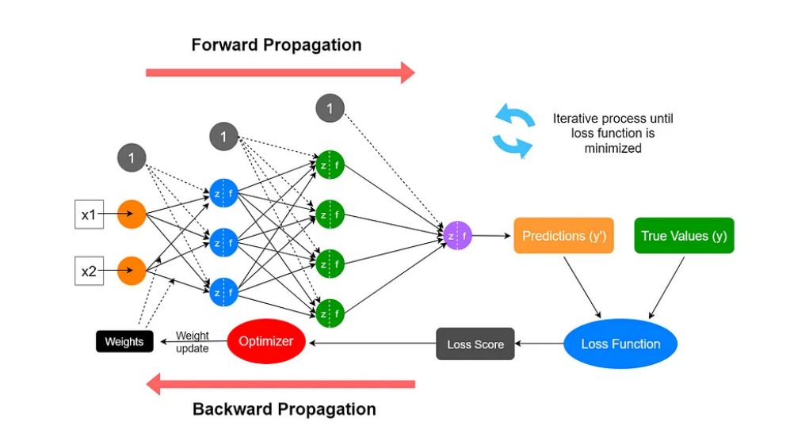
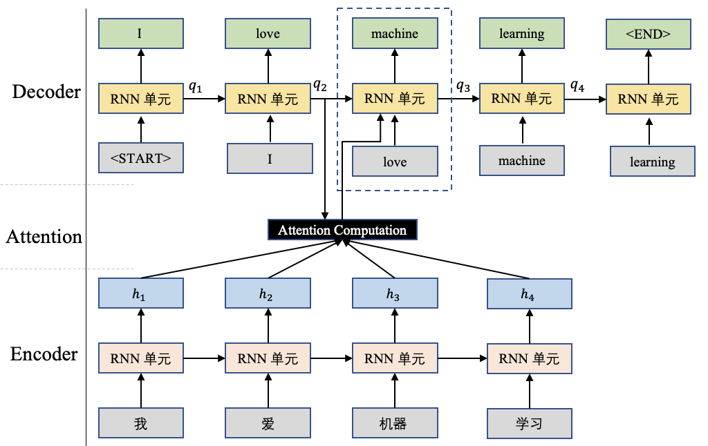

# 深度学习概述

本文是对深度学习的概述，包括深度学习的起源与发展、深度学习的应用场景、核心概念与基本结构。

> 参考视频：https://www.bilibili.com/video/BV1o64y1i7yw/

---

## 第一部分：深度学习的起源与发展

深度学习（`Deep Learning`, DL）是近年来人工智能（AI）领域最具变革性的技术之一。其**核心目标**是通过构建多层神经网络，模拟人脑处理信息的方式，实现对图像、语音、文本等高维感知数据的建模与理解。

作为机器学习（`Machine Learning`）领域的关键分支，深度学习已在语音识别、计算机视觉、自然语言处理等多个任务中取得突破，深刻改变了 `AI` 系统的能力边界，并催生了新一代技术产业浪潮。

### 1. 理论奠基与早期探索

深度学习的理论基础可追溯至20世纪中期提出的人工神经网络（`Artificial Neural Networks`, **ANN**）。1958年，`Frank Rosenblatt` 提出感知机（`Perceptron`）模型，奠定了神经网络的基本形式。随后，**多层前馈神经网络**与**反向传播算法**（`Backpropagation`, 1986）进一步拓展了神经网络的建模能力，使其能够处理更复杂的非线性问题。

然而，受限于硬件性能和算法训练机制，传统神经网络难以有效训练超过两三层的网络，易出现梯度消失、局部最优等问题，导致其应用长期受限。

---

> 感知机之父：Frank Rosenblatt 的故事

> 20 世纪 50 年代，随着计算机科学的兴起，研究人员开始尝试模拟人脑的感知与学习能力。1958 年，美国心理学家 **Frank Rosenblatt** 在康奈尔航空实验室提出了划时代的**感知机（Perceptron）模型**，这是最早可被实现的神经网络架构之一。感知机能够根据输入数据的线性组合进行分类，并通过简单的学习算法（如权重更新规则）自动调整参数完成训练，体现了机器“自主学习”的早期雏形。

> Rosenblatt 不仅在理论上提出模型，还投入大量精力将其工程化。他主持研制了名为 **“Mark I Perceptron”** 的硬件设备，并获得美国海军的大力资助。那时的媒体对此高度追捧，曾一度宣称感知机“未来可以学会翻译语言，作曲，甚至意识”。Rosenblatt 本人也对其前景充满信心，认为这项技术有朝一日将实现通用人工智能。

> 然而，感知机的辉煌很快遭遇挑战。**1969 年，人工智能学者 Marvin Minsky 与 Seymour Papert 合著《Perceptrons》一书，系统地指出了单层感知机的表达能力局限，特别是其无法解决 XOR 等非线性可分问题。**尽管该批评仅针对感知机的特定形式，并未否定多层神经网络的潜力，但由于当时尚未出现有效的训练算法（如反向传播），这一观点在学术界引发广泛共鸣。

> Minsky 的严厉批评及其符号主义 AI 理论的兴起，几乎将感知机研究彻底边缘化，标志着 **第一次 AI 寒冬** 的到来。Rosenblatt 所代表的“联结主义”路线被认为缺乏理论深度与实际效用，而他的研究项目也逐渐失去资金与支持。

> 更令人唏嘘的是，**1971 年，Frank Rosenblatt 在纽约长岛划船时不幸溺水身亡，年仅 43 岁。**彼时他仍致力于扩展感知机模型，并开始思考如何突破其线性局限。可惜未能亲眼见证 1986 年反向传播算法的提出，以及神经网络在此后几十年的重新崛起。

> 今天回望，Rosenblatt 的感知机虽然在建模能力上存在不足，但其所开启的联结主义研究路径、所展现的工程化尝试与学习机制，已成为 **现代深度学习的滥觞**。他用短暂的一生，点燃了一个时代最早的“智能火种”。

---

**梯度消失问题：阻碍深层网络训练的核心难题**：

随着神经网络层数的加深，虽然其理论上具备更强的表达能力，但在实际训练过程中却遭遇了严重的**梯度消失（Vanishing Gradient）问题**，这是深度学习发展早期面临的核心技术瓶颈之一。

在基于反向传播（Backpropagation）的训练过程中，梯度从输出层逐层向输入层反传。对于使用 Sigmoid 或 Tanh 等传统激活函数的网络，梯度在每一层传播时都会乘以一个小于 1 的导数值，导致：

> _当网络足够深时，靠近输入层的梯度会呈指数级缩小，几乎为零，进而**无法有效更新参数**。_

这种现象直接导致网络训练停滞，即便有再多的数据与迭代轮次，也无法有效学习到深层特征。这不仅限制了神经网络的深度拓展，还造成大量早期模型无法在复杂任务上取得实质突破。

### 2. 深度学习的兴起：2006 年的转折点

2006年，多伦多大学教授 `Geoffrey Hinton` 及其团队在《`Science`》杂志发表了具有开创性的研究成果，提出了深度置信网络（**Deep Belief Networks, DBN**）及其基于受限玻尔兹曼机（**Restricted Boltzmann Machine, RBM**）的逐层无监督预训练方法。这一策略为深层神经网络的有效训练提供了可行路径，**有效缓解了**长期困扰该领域的**梯度消失问题**。

该方法通过逐层训练 `RBM` 来学习数据的层次化表示，为深层网络提供良好的权重初始化，使网络在开始有监督微调之前，已具备合理的特征表示基础。这种"自下而上"的逐层预训练过程，通过无监督学习捕获数据的内在结构，有效改善了网络在高维非凸空间中的优化表现，显著提高了训练深层结构的可行性与稳定性。

此后数年，基于 `RBM` 的预训练策略在**语音识别、图像分类**等任务中取得了重要成果，极大推动了深度神经网络在实际应用中的落地和普及。需要注意的是，`DBN` 的预训练策略应与后续发展出的**深度自编码器（Deep Autoencoder）**方法加以区分，尽管二者都采用了无监督的逐层预训练思想，但在网络结构和训练机制上有所不同。

该成果被广泛视为**现代深度学习兴起的重要起点**，对后续深度架构（如卷积神经网络、循环神经网络、深度自编码器等）的研究和发展具有深远影响。

---

### 3. 技术突破与关键里程碑

深度学习的快速发展伴随着多个技术与应用节点的推动：

* **2010 年**，美国国防高级研究计划局（`DARPA`）正式资助深度学习研究项目，标志其战略价值被国家级机构认可；
* **2011 年起**，微软与谷歌研究团队率先将深度神经网络应用于语音识别任务，在 `TIMIT` 数据集上显著降低错误率，推动语音产品商业化进程；
* **2012 年**，`Alex Krizhevsky`、`Ilya Sutskever` 与 `Geoffrey Hinton` 提出深度卷积神经网络 `AlexNet`，首次在 `ImageNet` 图像分类挑战中大幅降低错误率（从**26%**降至**16%**）。该模型使用 `ReLU` `激活函数、Dropout` 正则化和 `GPU` 加速训练，标志着深度学习正式进入计算机视觉主流；
* 同年，谷歌 `X Lab` 使用 `16000` 个 `CPU` 构建无监督深度神经网络，在未标注数据中自动学会“猫”的概念，展示出强大的自主表示学习能力；
* **2014 年以后**，深度学习架构持续创新。例如，`ResNet` 通过引入残差连接（`Residual Connection``）有效解决了深层网络退化和梯度消失问题；DenseNet` `通过密集连接提升特征复用和梯度流动；EfficientNet` 则通过复合缩放策略在参数量和性能间取得平衡。这些创新极大推动了模型性能提升和实际应用落地。`Transformer`、`GAN`、`BERT` 等创新架构推动 `NLP`、`CV` 等领域突破。

### 4. 深度结构的表达力与建模优势

深度神经网络的显著特点是其“深度”结构，即由多个隐含层组成的非线性变换堆叠。这种多层结构使模型具备如下优势：

* **自动特征学习**：无需手工特征工程，模型通过端到端训练自动学习抽象程度逐级提升的特征表示；
* **表达能力强大**：理论上，深层网络可使用较少参数逼近复杂函数，具备远超浅层模型的建模能力；
* **泛化性能优越**：在大规模训练数据和正则化策略支持下，深度模型能在复杂任务中展现良好泛化能力；
* **易于迁移与复用**：通过迁移学习，可将预训练模型迁移至新任务，大幅降低样本需求和训练成本。

以图像识别为例，浅层模型可能仅提取边缘或纹理等低层特征，而深层模型可逐级抽象出对象轮廓、部件组合乃至语义类别，形成更具判别力的表示。

### 5. 训练挑战与优化机制演进

深度学习模型训练过程中面临诸多挑战，包括：

* **梯度消失问题**：在深层网络反向传播过程中，梯度会经过多次链式求导运算。当激活函数的导数小于1时（如sigmoid的导数最大值为0.25），多层相乘导致梯度指数级衰减，使得前层参数难以得到有效更新。
* **梯度爆炸问题**：相反地，当权重初始化不当或网络结构设计不合理时，梯度可能指数级增长，导致参数更新过大，训练不稳定。
* **优化陷入局部最优**：网络初始参数随机化易导致收敛至非最优点；
* **计算资源消耗巨大**：训练深层网络需大量计算力与内存支持。

为应对这些挑战，2006 年起流行的“**贪婪式无监督逐层训练**”策略成为深度网络训练的重要路径。该方法通过逐层优化降低训练难度，并增强特征可解释性。

随着技术演进，现代深度学习模型已广泛采用如下优化机制：

* **激活函数更新**：`ReLU` 函数解决了 `sigmoid`/`tanh` 饱和问题；
* **参数初始化策略**：如 `Xavier`、`He` 初始化方案，有效控制初始梯度规模；
* **批归一化（Batch Normalization）**：加快收敛速度并缓解内部协变量偏移；
* **残差连接（Residual Connection）**：允许信号直接跨层传播，有效训练超深网络。

此外，分布式训练框架（如 `TensorFlow`、`PyTorch`）、高性能硬件（如 `GPU`、`TPU`）等基础设施的发展也为深度模型训练提供了坚实支撑，使得端到端训练成为主流方式。

---

## 二、深度学习的应用场景

深度学习在多个感知与决策任务中展现了强大能力，成为现代人工智能系统的关键支撑技术。以下是几个典型应用领域：

### 2.1 计算机视觉（Computer Vision, CV）

深度学习显著提升了图像理解与视觉识别任务的性能，在以下子领域表现突出：

* **图像分类**（如 Ima`geNet` 任务）：`AlexNet`、`VGG`、`ResNet` 等模型引领性能飞跃；
* **目标检测与实例分割**：`YOLO`、`Faster R-CNN`、`Mask R-CNN` 等在实时性与精度间取得平衡；
* **人脸识别与验证**：`FaceNet`、`ArcFace` 等广泛应用于身份认证与安防；
* **图像生成与修复**：`GAN`、`Diffusion Models`（如 `Stable Diffusion`）推动生成式 `AI` 应用；
* **自动驾驶感知系统**：融合多传感器视觉信息进行物体识别、车道检测等。

深度神经网络通过端到端训练替代了传统视觉系统中复杂的手工特征工程，大幅提升了泛化能力与部署效率。

### 2.2 自然语言处理（Natural Language Processing, NLP）

在 NLP 领域，深度学习驱动了从统计方法到预训练语言模型的范式转变。关键应用包括：

* **文本分类与情感分析**：用于舆情监测、商品评价等；
* **序列生成任务**：如机器翻译（`NMT`）、摘要生成（`Abstractive Summarization`）；
* **问答系统与阅读理解**：如 `SQuAD`、`MRC` 任务；
* **对话系统与生成对话**：从 `Seq2Seq` 到 `Transformer` 架构，再到 `ChatGPT`、`DialoGPT` 等对话大模型；
* **信息抽取与命名实体识别（NER）**：服务于知识图谱与文本结构化分析。

深度学习模型从最初的 `RNN`、`LSTM` 发展到 `Transformer` 架构，涌现出 `BERT`、`RoBERTa`、`GPT` 系列等大规模预训练语言模型，成为 `NLP` 系统的核心引擎。

### 2.3 语音与音频处理

深度学习技术显著推动了语音与音频任务的进步，覆盖以下典型方向：

* **自动语音识别（ASR）**：如 `DeepSpeech`、`Conformer`，实现端到端语音转文本；
* **语音合成（TTS）**：`Tacotron`、`WaveNet` 等模型支持高质量语音生成；
* **语音源分离与降噪**：用于会议语音提取、噪声鲁棒识别；
* **说话人识别与验证**：`x-vector`、`ECAPA-TDNN` 等用于语音安全与个体身份识别；
* **音乐生成与音频风格迁移**：如 `Jukebox`、`AudioLM` 展示深度生成能力。

这些任务共同支撑了语音助手、智能客服、实时翻译等实际系统。

### 2.4 强化学习与智能体系统

深度强化学习（`Deep Reinforcement Learning`, `DRL`）将深度神经网络引入传统强化学习框架，使智能体能够从高维状态中学习策略。代表性应用包括：

* **博弈智能体**：`AlphaGo`、`AlphaZero`、`OpenAI Five` 等；
* **机器人控制与操作策略学习**：如操纵臂抓取、路径规划；
* **自动驾驶决策模块**：用于车道保持、路径变换；
* **推荐系统中的策略学习**：结合环境反馈优化长期用户满意度。

DRL 支持从交互数据中学习长期最优策略，已在复杂环境中展现超越人类水平的表现。

### 2.5 多模态学习与生成模型

多模态学习旨在建模不同模态（图像、文本、音频、视频）间的关联，典型模型包括：

* **CLIP / BLIP**：通过联合训练图文数据，实现图文匹配、文本生成图像描述等任务；
* **DALL·E / Stable Diffusion**：实现从自然语言生成高质量图像；
* **Video-to-Text / Audio-to-Image**：跨模态生成（如 Whisper + VLM）；
* **多模态大模型（Multimodal Foundation Models）**：如 Gemini、GPT-4-V 展现跨模态理解与生成统一能力。

多模态模型强化了 AI 系统对世界的整体感知能力，支撑了“AI 原生”内容生成与理解能力的突破。

---

## 三、核心概念与基本结构

深度学习的核心概念与基本结构，是理解其原理与应用的基础。

### 3.1 神经网络的基本组成

神经网络是深度学习的基础，它模拟人脑神经元之间的连接方式，通过多个“神经元”组成的层级结构，对输入数据进行逐层处理，从而完成复杂的非线性建模。

#### （1）神经元的工作机制：像“加权投票”的评估系统

每个神经元可以类比为一个“简单判断器”，它接收来自上一层的多个输入，并对每个输入给予一个“权重”（即重视程度），将加权结果汇总后再加上一个偏置项，最后通过**激活函数**做非线性处理，决定是否将该信息传递给下一层。

> 类比：可以把每个神经元想象成一名评审专家，对输入数据“打分”并投票，而激活函数则像是一个“裁判标准”，决定这个投票结果是否“足够强”才能传递下去。

数学表达：

$$
y = \sigma\left(\sum_{i=1}^{n} w_i x_i + b \right)
$$

其中：

* $x_i$：输入值
* $w_i$：权重
* $b$：偏置项
* $\sigma$：激活函数，如 ReLU、Sigmoid

#### （2）常见激活函数：让网络拥有“非线性理解能力”

神经网络之所以强大，在于它能学习非线性关系，而这正是激活函数的作用：

* **Sigmoid**：输出范围为 (0,1)，常用于二分类任务，但在深层网络中容易造成梯度消失。
* **Tanh**：与 Sigmoid 类似，但输出范围为 (-1,1)，在某些场景下收敛更快。
* **ReLU（Rectified Linear Unit）**：当前最常用，计算简单，仅保留正值部分，有助于训练深层网络。
* **Leaky ReLU / GELU**：改进 ReLU 对负值完全抑制的问题，使模型在不同任务中更加鲁棒。

> 通俗理解：激活函数决定“神经元是否被激活”，如同开关——某些输入组合能“触发”某个神经元的响应，而无效输入则被“静音”。

#### （3）神经网络的训练过程：从“试错”中学习最优参数

神经网络的训练过程本质是“不断试错”，通过前向传播计算预测值，与真实标签进行对比，利用**损失函数**评估误差，再通过**反向传播**和**优化器**更新每一层的权重参数。

* **前向传播（Forward Propagation）**：从输入到输出，逐层计算预测结果。
* **损失函数（Loss Function）**：衡量预测与实际的差距，例如：
  * 回归任务：均方误差（`MSE`）
  * 分类任务：交叉熵（`Cross Entropy`）
* **反向传播（Backpropagation）**：应用链式法则计算梯度，从输出层向输入层反向传播误差信号。
* **优化器（Optimizer）**：根据梯度更新参数，常见有：

  * **SGD（随机梯度下降）**：基础方法，简单但收敛慢
  * **Adam**：目前最常用，自适应调整学习率，收敛速度快，效果稳定

> 类比：训练神经网络就像用导航系统学习路线——每次尝试后根据偏差修正路径，逐渐找到最优路线（即最优模型参数）。

#### （4）神经网络结构的基本单元：层（Layer）

* **输入层（Input Layer）**：接收原始数据（如像素、文本编码等）
* **隐藏层（Hidden Layers）**：模型的“加工处理区”，包含大量神经元，负责提取特征和模式
* **输出层（Output Layer）**：生成最终预测结果（如分类概率、回归值）

---

### 3.2 常见网络结构

深度学习中的“网络结构”决定了模型如何处理不同类型的数据和任务。以下是几类经典结构及其特点：

#### （1）全连接层（Fully Connected Layer / Dense Layer）

* **功能**：每个神经元与上一层所有神经元相连，信息充分融合。
* **应用**：适用于结构化数据、分类/回归等任务的输出阶段。
* **特点**：参数数量大，计算量高，不具备空间或时间结构感知能力。

> 类比：像一个“全体会议”，每个人都能听到所有发言，适合做综合判断。

#### （2）卷积层（Convolutional Layer）

* **功能**：通过局部感受野提取图像的空间特征，识别边缘、纹理、形状等。
* **应用**：计算机视觉任务（如图像分类、目标检测、图像生成等）。
* **特点**：参数共享、局部连接，有效减少计算量并提升泛化能力。

> 类比：像滑动放大镜，在图像上局部扫描，逐步识别不同区域的特征。

常见组件：

* 卷积核（filter）：提取特定类型的特征。
* 步幅（stride）与填充（padding）：控制特征图的大小和边缘处理。

#### （3）池化层（Pooling Layer）

* **功能**：对局部特征进行汇聚，减少特征维度，增强模型的鲁棒性。
* **应用**：通常跟在卷积层后，提取图像主干信息。
* **类型**：

  * `MaxPooling`：取局部区域的最大值，保留最显著特征。
  * `AveragePooling`：取局部区域平均值，平滑特征。

> 类比：像压缩图片，把每个小区域代表性地“浓缩”为一个像素。

#### （4）循环层（Recurrent Layer）

* **功能**：引入“记忆”机制，建模序列间的时序依赖。
* **应用**：语言模型、时间序列预测、语音识别等。
* **主要结构**：

  * **RNN（Recurrent Neural Network）**：基本结构，处理短期依赖效果较差。
  * **LSTM（Long Short-Term Memory）**：引入门控机制，有效缓解梯度消失问题。
  * **GRU（Gated Recurrent Unit）**：结构简化的 LSTM，性能相近。

> 类比：像“记笔记”的人，一边听新内容，一边记住重要信息，持续更新记忆。

#### （5）归一化层（Normalization Layer）

* **功能**：将每层输出标准化，避免梯度爆炸或消失，加速训练收敛。
* **常见形式**：

  * **Batch Normalization**：对每一批样本标准化。
  * **Layer Normalization**：对单个样本内部的所有通道进行标准化。
* **作用**：改善梯度传播、提高训练稳定性。

> 类比：像考试前的“预习整理”，把不同格式的资料统一归一处理，更方便后续理解。

#### （6）注意力机制（Attention Mechanism）

* **功能**：在处理复杂信息时，为关键部分分配更高的权重。
* **典型机制**：`Self-Attention`（自注意力），用于捕捉序列中任意位置之间的依赖关系。
* **应用**：广泛用于 `NLP`（如 `Transformer`、`BERT`、`GPT`）、图像生成与多模态任务。

> 类比：像读书时做重点标记，模型会“重点记住”对结果最有影响的信息。

**注意力机制简介**

注意力机制是一种模拟人类注意力分配的策略，使神经网络能够在处理输入数据时，动态地关注对当前任务最相关的部分。在自然语言处理（NLP）中，注意力机制允许模型在生成每个输出词时，重点关注输入序列中与之最相关的词汇，从而提高翻译、摘要等任务的性能。

自注意力机制是注意力机制的一种形式，广泛应用于`Transformer`架构中。它通过计算输入序列中各个位置之间的相关性，来捕捉全局依赖关系。这一机制使得模型在处理长序列时，能够有效地建模远距离的依赖关系。

**注意力机制示意图**

以下示意图展示了自注意力机制的基本结构：

*来源：[PaddleEdu 自注意力机制教程](https://paddlepedia.readthedocs.io/en/latest/tutorials/deep_learning/model_tuning/attention/self_attention.html)*

在图中，输入序列首先被映射为查询（Q）、键（K）和值（V）向量。然后，通过计算查询与键的相似度，得到注意力权重，进而对值向量进行加权求和，生成最终的输出。

---

## 四、典型深度学习网络架构

| 任务类型  | 代表架构                        | 关键特征           |
| ----- | --------------------------- | -------------- |
| 图像分类  | `LeNet`, `AlexNet`, `VGG`, `ResNet` | 卷积结构，深层网络，残差连接 |
| 目标检测  | `R-CNN`, `SSD`, `YOLO`            | 区域提取与分类回归结合    |
| 文本处理  | `RNN`, `LSTM`, `Transformer`      | 序列建模与全局依赖捕捉    |
| 多模态任务 | `CLIP`, `BLIP`                  | 融合图像与文本信息      |
| 文本生成  | `GPT`, `T5`                     | 自回归或编码-解码结构    |
| 图像生成  | `GAN`, `VAE`, `Diffusion`         | 学习数据分布并进行高质量生成 |

---

### 4.1 图像分类

* **任务目标**：判别输入图像属于哪一类，广泛用于人脸识别、医学影像分析等。
* **传统方法**：依赖人工设计特征（如 SIFT、HOG），结合支持向量机（SVM）或随机森林进行分类。
* **深度学习方法**：利用卷积神经网络（`CNN`）自动学习多层次图像特征，大幅提升准确率。
* **代表架构**：

  * LeNet：早期手写数字识别模型，引入基础 CNN 结构。
  * AlexNet：通过更深网络和 ReLU 激活推动 ImageNet 竞赛突破。
  * VGG：采用统一小卷积核堆叠，结构规整。
  * ResNet：引入残差连接，解决深层网络退化问题。
* **优势与挑战**：

  * 优势：端到端训练，特征提取能力强，迁移性好。
  * 挑战：对大规模标注数据和计算资源依赖高，易过拟合。

---

### 4.2 目标检测

* **任务目标**：在图像中定位并分类出所有目标对象。
* **传统方法**：基于滑动窗口 + HOG + SVM 的多尺度检测方式，效率低下。
* **深度学习方法**：集成区域提取与分类回归，统一框架端到端训练。
* **代表架构**：

  * R-CNN 系列：通过候选区域生成 + CNN 分类实现初代深度检测。
  * SSD：单阶段多尺度预测，提升推理速度。
  * YOLO：端到端回归目标位置与类别，强调实时性。
* **优势与挑战**：

  * 优势：检测精度与速度兼顾，适配多种场景。
  * 挑战：小目标、遮挡和多类别检测仍具挑战，模型复杂度高。

---

### 4.3 文本处理（自然语言建模）

* **任务目标**：理解和处理自然语言文本，如情感分析、文本分类、命名实体识别等。
* **传统方法**：使用 TF-IDF、词袋模型（Bag-of-Words）等稀疏表示配合逻辑回归、SVM。
* **深度学习方法**：从 RNN 到 Transformer，建模序列中的上下文与全局依赖。
* **代表架构**：

  * RNN / LSTM：可处理序列信息，但难以捕捉长距离依赖。
  * Transformer：利用自注意力机制实现并行计算与全局建模。
* **优势与挑战**：

  * 优势：自动获取语义表示，显著提升任务效果。
  * 挑战：对长文本推理、语言歧义理解仍存在局限。

---

### 4.4 多模态任务

* **任务目标**：联合处理多种模态数据（如图像 + 文本），实现图文匹配、跨模态检索等。
* **传统方法**：采用特征拼接或简单投影方式融合不同模态，表达力有限。
* **深度学习方法**：通过跨模态注意力机制或对比学习统一模态表示空间。
* **代表架构**：

  * CLIP：基于对比学习联合训练图像与文本编码器，实现零样本图像分类。
  * BLIP：结合图像编码、文本生成与理解，支持多模态问答、生成。
* **优势与挑战**：

  * 优势：具备强泛化能力，可适配开放领域任务。
  * 挑战：跨模态对齐复杂，受限于训练数据质量与覆盖度。

---

### 4.5 文本生成

* **任务目标**：根据输入生成连贯自然的文本内容，用于对话系统、自动摘要、代码生成等。
* **传统方法**：基于 n-gram 或概率图模型（如 HMM）进行句子建模，易出现语法错误。
* **深度学习方法**：采用自回归语言模型或 Seq2Seq 框架，从上下文中预测后续内容。
* **代表架构**：

  * GPT：基于 Transformer 的自回归模型，擅长自然语言生成。
  * T5：统一任务为文本到文本的转换，支持翻译、问答、摘要等多任务。
* **优势与挑战**：

  * 优势：文本流畅度与语义连贯性大幅提升，支持迁移与微调。
  * 挑战：生成可控性差，易产生虚假或重复内容。

---

### 4.6 图像生成

* **任务目标**：根据训练样本生成与原图风格一致或指定条件下的图像。
* **传统方法**：基于图像拼接、样本变换的启发式方法，生成质量较低。
* **深度学习方法**：学习数据分布以生成新样本，涵盖无监督（GAN、VAE）与扩散模型。
* **代表架构**：

  * GAN：通过生成器与判别器对抗优化，实现真实感图像生成。
  * VAE：引入概率建模，兼顾可控性与生成质量。
  * Diffusion Models：通过噪声扩散与反向还原建模复杂分布，实现 SOTA 水平图像合成。
* **优势与挑战**：

  * 优势：生成质量高，可扩展至图像修复、超分辨率等任务。
  * 挑战：训练稳定性差，易出现模式崩溃或内容重复。

---

## 五、主流开发框架与工具生态

深度学习的快速发展离不开强大的开发框架和丰富的工具支持。本节将从主流训练框架出发，结合数据处理、可视化调试、训练管理与模型复用工具，构建出完整的深度学习工程实践视图。

### 5.1 主流框架

| 框架 | 特点与适用场景 |
| -------------- | ----------------------------------------------------------------------------------- |
| **TensorFlow** | Google 推出，支持静态图与动态图，生态完善，适合部署与生产环境（TF Serving、TFLite）；社区资源丰富，支持多语言接口（Python、C++ 等）。 |
| **PyTorch**    | 动态计算图，调试友好，符合 Python 编程习惯，是当前学术与工业界的主流框架之一；支持分布式训练（DDP）、TorchScript 导出等。            |
| **JAX**        | Google 推出，强调函数式编程与可组合性，提供自动微分（`grad`）、加速编译（`jit`），广泛用于高性能研究如强化学习与微分编程。              |
| **MindSpore**  | 华为开源，主打软硬件协同优化，适配昇腾芯片；强调图优化与分布式执行，适合在国产生态下部署 AI 模型。                                 |
| **ONNX**       | 通用模型交换格式，支持从 PyTorch、TensorFlow 等导出模型，用于跨平台部署、兼容多种推理引擎（如 ONNX Runtime、TensorRT）。    |

> **建议实践组合**：开发者可在 PyTorch 中训练模型，导出为 ONNX 格式，通过 TensorRT 加速部署于边缘设备或在线服务中。

---

### 5.2 常用工具

深度学习项目不仅仅是模型训练，整个流程涉及数据准备、训练监控、实验管理、模型部署等多个环节。以下工具在各环节中广泛使用：

#### 数据处理与增强

| 工具                 | 功能说明                                |
| ------------------ | ----------------------------------- |
| **NumPy**          | 提供高效的多维数组操作，是所有科学计算的基础工具。           |
| **Pandas**         | 适合结构化数据（如 CSV、表格）的处理与清洗，常用于数据预处理。   |
| **OpenCV**         | 计算机视觉领域图像处理的基础库，支持图像加载、增强与几何变换等操作。  |
| **NLTK / spaCy**   | 自然语言处理基础工具，支持分词、词性标注、命名实体识别等文本清洗功能。 |
| **Albumentations** | 高效图像增强库，适用于图像分类与目标检测中的数据增强。         |

#### 可视化与调试

| 工具                       | 用途说明                                                      |
| ------------------------ | --------------------------------------------------------- |
| **TensorBoard**          | TensorFlow 自带的训练过程可视化工具，也可与 PyTorch 联动使用。支持指标、网络结构、图像等展示。 |
| **WandB**                | 支持训练指标可视化、超参数追踪、实验对比等功能，适用于团队协作与实验管理。                     |
| **Matplotlib / Seaborn** | 通用绘图库，适合绘制统计图、误差曲线、热图等。                                   |
| **Netron**               | 可视化 ONNX / PyTorch / Keras 模型结构，便于理解网络构成。                 |

#### 训练与实验管理

| 工具                           | 说明                                           |
| ---------------------------- | -------------------------------------------- |
| **PyTorch Lightning**        | 对 PyTorch 的训练流程进行高度抽象，提升代码组织性，支持多卡训练、分布式训练等。 |
| **Keras**                    | 高层封装 API，适用于初学者快速构建模型，现为 TensorFlow 的一部分。    |
| **Weights & Biases (WandB)** | 除可视化外，还支持模型 checkpoint 存储、训练回滚、报告生成等功能。      |

#### 模型管理与复用

| 工具                           | 说明                                             |
| ---------------------------- | ---------------------------------------------- |
| **HuggingFace Transformers** | NLP 与多模态任务中最常用的预训练模型库，支持 BERT、GPT、T5 等模型加载与微调。 |
| **TensorFlow Hub**           | 提供可复用的 TensorFlow 模型模块，支持快速迁移学习与部署。            |
| **ONNX Model Zoo**           | 收录了多个标准模型的 ONNX 实现，适合跨平台推理部署。                  |

---

### 小结

深度学习生态体系正在快速演化，从单一训练框架向工具链协同、自动化训练与高效部署方向发展。实际项目中，开发者往往需要组合使用上述多个工具：

> 例如：使用 PyTorch Lightning 编写训练流程，结合 WandB 进行可视化与实验管理，模型训练完成后导出为 ONNX 格式，并使用 TensorRT 在边缘设备上部署推理服务。

掌握主流框架与工具的定位和协同方式，将大大提升深度学习项目的开发效率与工程可维护性。

---

## 六、深度学习训练流程与实践

深度学习模型的成功依赖于系统性且高效的训练流程。合理的数据处理、模型设计、优化策略及工程实践，是提升模型性能与部署可行性的关键。本节围绕训练流程与常见训练技巧进行梳理，帮助读者构建起从实验到落地的系统认知。

### 6.1 基本流程

1. **数据准备**

   * 收集与清洗数据，处理缺失值、异常点；
   * 数据划分（训练集 / 验证集 / 测试集），常见比例为 8:1:1 或 7:2:1；
   * 特征标准化或归一化处理（如 Z-Score、Min-Max），确保模型收敛性；
   * 数据增强（如图像翻转、文本同义词替换）可在此阶段并入管线。

2. **模型设计**

   * 选择网络结构（如 CNN、RNN、Transformer）及其深度宽度；
   * 配置激活函数（如 ReLU、GELU）、损失函数（如 CrossEntropy、MSE）；
   * 若用于多任务学习，还需设计多头结构与损失加权机制。

3. **训练与验证**

   * 采用前向传播和反向传播计算损失与梯度，使用优化器（如 Adam、SGD）更新参数；
   * 在每个 epoch 结束后，使用验证集评估模型性能，避免过拟合；
   * 支持 Early Stopping 策略防止训练过度。

4. **调参与优化**

   * 超参数包括学习率（可用学习率调度器调整）、Batch Size、权重衰减等；
   * 使用正则化（L1/L2）、Dropout、Label Smoothing 等提升泛化能力；
   * 可引入 Grid Search、Random Search、Bayesian Optimization 进行自动化调参。

5. **测试与部署**

   * 使用独立测试集评估模型最终性能，避免测试集泄漏；
   * 模型部署形式包括 RESTful API 服务、边缘设备导出、嵌入移动端（如 TFLite）；
   * 需关注推理效率、模型压缩（量化/剪枝）与兼容性问题。

---

### 6.2 常见训练技巧

以下列出深度学习训练中广泛应用的技术方法，结合其**作用机制、适用场景与配置要点**。

| 技巧 | 作用与说明 |
| -------------------------------- | ---------------------------------------------------------------------- |
| **Batch Normalization**          | 对中间层输出进行规范化，缓解梯度消失问题，加快收敛；可替代 Dropout 于部分网络中。                          |
| **数据增强（Data Augmentation）**      | 通过旋转、裁剪、加噪声等方式增加数据多样性，降低过拟合风险；图像领域尤为常见。                                |
| **迁移学习 / 微调（Transfer Learning）** | 在预训练模型（如 ResNet、BERT）基础上进行下游任务训练，显著减少数据需求与训练时间。                        |
| **预训练模型使用**                      | 可从 HuggingFace、TorchVision 等平台加载，在工业与科研中已成常规做法。                        |
| **分布式训练**                        | 使用 DataParallel（单机多卡）或 DistributedDataParallel（多机多卡）加速训练；需合理划分数据与同步梯度。 |
| **混合精度训练（AMP）**                  | 使用 float16 和 float32 混合精度减少显存占用，加速训练，常配合 NVIDIA Apex / PyTorch AMP。    |
| **学习率调度（Scheduler）**             | 如 StepLR、CosineAnnealingLR，可动态调整学习率提升收敛效果，配合 warmup 初期热身更有效。           |

---

### 6.3 小结

深度学习的训练过程是一个高度工程化的系统工程。掌握基础流程仅是第一步，更重要的是通过技巧与工具提升训练效率、模型表现与部署可行性：

> 例如，在图像分类任务中，可使用预训练的 ResNet，结合数据增强与混合精度训练，在分布式集群上加速模型收敛，并通过 ONNX 导出部署至边缘端，实现从实验到产品的闭环。

针对不同任务与计算资源，训练策略应灵活调整，以达成性能、效率与工程成本的平衡。

---
