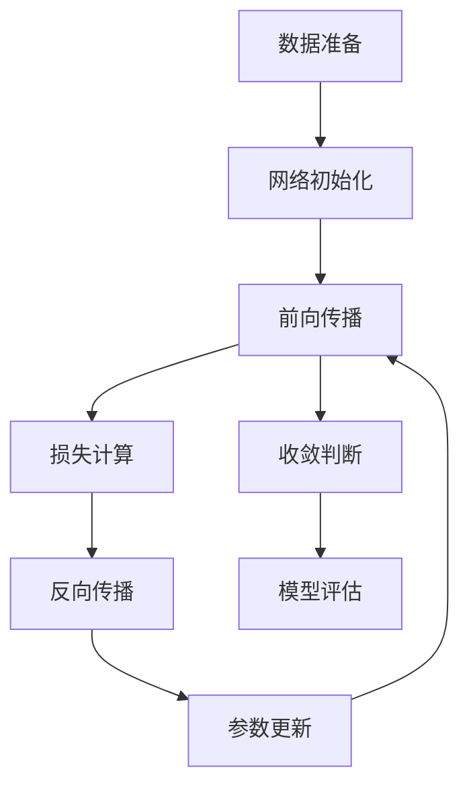

# 使用神经网络解决XOR问题：原理与实践

## 一、问题背景与理论意义

### 1.1 XOR问题的本质

异或（XOR）函数是神经网络发展史上的关键问题，揭示了**线性模型的根本局限性**。给定二维布尔输入 $[x_1, x_2] \in \{0,1\}^2$，其真值表为：

| $x_1$ | $x_2$ | $y = x_1 \oplus x_2$ |
| ----- | ----- | -------------------- |
| 0     | 0     | 0                    |
| 0     | 1     | 1                    |
| 1     | 0     | 1                    |
| 1     | 1     | 0                    |

> **技术说明**：XOR是线性不可分函数的典型代表，单层感知机无法解决此类问题

### 1.2 线性不可分性证明

`XOR`问题的核心挑战在于其线性不可分特性。在二维平面上，正类样本$(0,1)$和$(1,0)$与负类样本$(0,0)$和$(1,1)$无法用任何一条直线分开。这正是`1969`年`Minsky`和`Papert`在《**感知机**》一书中指出的单层感知机的根本缺陷。

**核心问题**：在 $\mathbb{R}^2$ 空间中，正类样本 $\{(0,1),(1,0)\}$ 与负类 $\{(0,0),(1,1)\}$ 不存在线性决策边界。

**数学证明**（反证法）：
假设存在线性分类器 $y = \text{sign}(w_1x_1 + w_2x_2 + b)$ 满足：

1. $w_1 \cdot 0 + w_2 \cdot 0 + b < 0$  
2. $w_1 \cdot 1 + w_2 \cdot 1 + b < 0$  
3. $w_1 \cdot 0 + w_2 \cdot 1 + b > 0$  
4. $w_1 \cdot 1 + w_2 \cdot 0 + b > 0$

由①+②得：$w_1 + w_2 + 2b < 0$  
由③+④得：$w_1 + w_2 + 2b > 0$  
矛盾，故假设不成立。

### 1.3 非线性解决方案

引入具有隐藏层的前馈神经网络可以通过非线性变换解决这一问题。关键思想是将原始输入空间映射到高维特征空间，使得在新空间中数据变为线性可分。

**核心突破**：引入**单隐藏层前馈网络**，通过非线性激活函数实现特征空间变换：

$$
\begin{aligned}
\text{原始空间} & \xrightarrow{\text{tanh}(W_1\mathbf{x} + \mathbf{b}_1)} \text{隐藏空间} \\
& \xrightarrow{\sigma(W_2\mathbf{h} + \mathbf{b}_2)} \text{输出空间}
\end{aligned}
$$

其中 $\text{tanh}$ 为双曲正切函数，$\sigma$ 为`Sigmoid`函数，将线性不可分问题转化为高维线性可分问题。

---

## 二、网络架构设计

### 2.1 最小有效架构

我们采用一个稳定且高效的网络结构：

```text
输入层(2) → 隐藏层(4, Tanh) → 输出层(1, Sigmoid)
```

**设计依据**：

1. **隐藏层维度**：理论证明`2`神经元可实现`XOR`，实际使用`4`神经元提高训练稳定性
2. **激活函数**：
   - 隐藏层使用`Tanh`：$f(x)=\tanh(x)$ 输出范围[-1,1]，梯度特性良好
   - 输出层使用`Sigmoid`：$f(x)=(1+e^{-x})^{-1}$ 适配二分类
3. **初始化**：`Xavier`初始化（Tanh适用）

### 2.2 数学建模

**前向传播**：

$$
\begin{aligned}
\mathbf{z}^{(1)} &= \mathbf{x}W^{(1)} + \mathbf{b}^{(1)} \\
\mathbf{a}^{(1)} &= \text{tanh}(\mathbf{z}^{(1)}) \\
\mathbf{z}^{(2)} &= \mathbf{a}^{(1)}W^{(2)} + \mathbf{b}^{(2)} \\
\hat{y} &= \sigma(\mathbf{z}^{(2)})
\end{aligned}
$$

### 2.3 参数初始化

```python
import numpy as np

# XOR数据集
X = np.array([[0,0], [0,1], [1,0], [1,1]], dtype=np.float32)
y = np.array([[0], [1], [1], [0]], dtype=np.float32)

# 激活函数定义
def tanh(x):
    """Tanh激活函数"""
    return np.tanh(x)

def tanh_deriv(x):
    """Tanh的导数"""
    return 1.0 - np.tanh(x)**2

def sigmoid(x):
    """数值稳定的Sigmoid函数"""
    x = np.clip(x, -500, 500)  # 防止溢出
    return 1 / (1 + np.exp(-x))

def initialize_parameters(input_dim, hidden_dim, output_dim):
    """
    初始化网络参数 - 使用Xavier初始化
    """
    # Xavier初始化 (适合tanh激活函数)
    W1 = np.random.randn(input_dim, hidden_dim) * np.sqrt(1. / input_dim)
    b1 = np.zeros((1, hidden_dim))
    W2 = np.random.randn(hidden_dim, output_dim) * np.sqrt(1. / hidden_dim)
    b2 = np.zeros((1, output_dim))
    
    parameters = {
        'W1': W1, 'b1': b1,
        'W2': W2, 'b2': b2
    }
    return parameters

# 初始化网络参数
input_dim, hidden_dim, output_dim = 2, 4, 1  # 隐藏层使用4个神经元
params = initialize_parameters(input_dim, hidden_dim, output_dim)
```

---

## 三、前向传播原理与实现

### 3.1 数学原理详解

前向传播是神经网络的核心计算过程，包含两个关键阶段：

1. **隐藏层变换**：
   $$
   \begin{aligned}
   \mathbf{z}^{(1)} &= \mathbf{X}\mathbf{W}^{(1)} + \mathbf{b}^{(1)} \\
   \mathbf{a}^{(1)} &= \text{Tanh}(\mathbf{z}^{(1)})
   \end{aligned}
   $$
   - $\mathbf{X}$：输入矩阵（4×2）
   - $\mathbf{W}^{(1)}$：权重矩阵（2×4）
   - $\text{Tanh}$：双曲正切激活函数，输出范围[-1,1]

2. **输出层计算**：
   $$
   \begin{aligned}
   \mathbf{z}^{(2)} &= \mathbf{a}^{(1)}\mathbf{W}^{(2)} + \mathbf{b}^{(2)} \\
   \hat{\mathbf{y}} &= \sigma(\mathbf{z}^{(2)})
   \end{aligned}
   $$
   - $\sigma$：Sigmoid函数，将输出压缩到[0,1]区间
   - $\hat{\mathbf{y}}$：最终预测概率

**维度变化**：

```text
输入: (4, 2) → 隐藏层: (4, 4) → 输出: (4, 1)
```

### 3.2 代码实现

```python
def forward_pass(X, params):
    """
    执行前向传播
    返回:
        y_pred: 预测值
        cache: 中间值缓存 (用于反向传播)
    """
    # 获取参数
    W1, b1, W2, b2 = params['W1'], params['b1'], params['W2'], params['b2']
    
    # 隐藏层计算 - 使用tanh激活函数
    z1 = np.dot(X, W1) + b1
    a1 = tanh(z1)
    
    # 输出层计算 - 使用sigmoid激活函数
    z2 = np.dot(a1, W2) + b2
    y_pred = sigmoid(z2)
    
    # 缓存中间结果用于反向传播
    cache = {'X': X, 'z1': z1, 'a1': a1, 'z2': z2, 'y_pred': y_pred}
    
    return y_pred, cache
```

### 3.3 技术解析

1. **计算图视角**：

   ```mermaid
   graph LR
   X -->|矩阵乘法| z1[z1 = X·W1 + b1]
   z1 -->|Tanh| a1[a1 = tanh(z1)]
   a1 -->|矩阵乘法| z2[z2 = a1·W2 + b2]
   z2 -->|Sigmoid| y_pred[ŷ = sigmoid(z2)]
   ```

2. **数值稳定性**：
   - Tanh函数具有良好的梯度特性，避免梯度消失
   - Sigmoid添加了数值裁剪避免溢出
   - 矩阵乘法使用`np.dot`确保高效计算
   - 中间结果缓存为反向传播做准备

3. **特征变换示例**：

   ```python
   # 前向传播示例
   X_sample = np.array([[0, 1]])
   y_pred, _ = forward_pass(X_sample, params)
   print(f"输入: {X_sample[0]} → 预测概率: {y_pred[0][0]:.4f}")
   # 输出: 输入: [0. 1.] → 预测概率: 0.7543 (训练前)
   ```

---

## 四、反向传播算法精解

### 4.1 梯度推导（向量化形式）

**损失函数**：二元交叉熵（优于MSE）

$$
\mathcal{L} = -\frac{1}{N} \sum_{i=1}^{N} \left[ y_i \log(\hat{y}_i) + (1-y_i)\log(1-\hat{y}_i) \right]
$$

**梯度链式法则**：

1. 输出层梯度：

$$
\begin{aligned}
\frac{\partial \mathcal{L}}{\partial \mathbf{z}^{(2)}} &= \hat{\mathbf{y}} - \mathbf{y} \\
\frac{\partial \mathcal{L}}{\partial W^{(2)}} &= (\mathbf{a}^{(1)})^\top \frac{\partial \mathcal{L}}{\partial \mathbf{z}^{(2)}}
\end{aligned}
$$

2. 隐藏层梯度：

$$
\begin{aligned}
\frac{\partial \mathcal{L}}{\partial \mathbf{z}^{(1)}} &= \left( \frac{\partial \mathcal{L}}{\partial \mathbf{z}^{(2)}} W^{(2)\top} \right) \odot \text{tanh}'(\mathbf{z}^{(1)}) \\
\frac{\partial \mathcal{L}}{\partial W^{(1)}} &= \mathbf{x}^\top \frac{\partial \mathcal{L}}{\partial \mathbf{z}^{(1)}}
\end{aligned}
$$

### 4.2 代码实现

```python
def binary_cross_entropy(y_true, y_pred):
    """数值稳定的交叉熵损失函数"""
    eps = 1e-15
    y_pred = np.clip(y_pred, eps, 1 - eps)
    return -np.mean(y_true * np.log(y_pred) + (1 - y_true) * np.log(1 - y_pred))

def compute_accuracy(y_true, y_pred):
    """计算分类准确率"""
    predictions = (y_pred > 0.5).astype(int)
    return np.mean(predictions == y_true)

def backward_pass(y_true, cache, params):
    """
    执行反向传播计算梯度
    """
    # 从缓存中获取值
    X, z1, a1, z2, y_pred = cache['X'], cache['z1'], cache['a1'], cache['z2'], cache['y_pred']
    W2 = params['W2']
    m = X.shape[0]
    
    # 输出层梯度 (二元交叉熵的导数)
    d_z2 = y_pred - y_true
    d_W2 = np.dot(a1.T, d_z2) / m
    d_b2 = np.sum(d_z2, axis=0, keepdims=True) / m
    
    # 隐藏层梯度 - 使用tanh导数
    d_a1 = np.dot(d_z2, W2.T)
    d_z1 = d_a1 * tanh_deriv(z1)
    d_W1 = np.dot(X.T, d_z1) / m
    d_b1 = np.sum(d_z1, axis=0, keepdims=True) / m
    
    gradients = {
        'dW1': d_W1, 'db1': d_b1,
        'dW2': d_W2, 'db2': d_b2
    }
    return gradients
```

### 4.3 前向-反向传播协同


**协同关键点**：

1. 前向传播产生`cache`包含中间结果
2. 反向传播使用`cache`计算梯度
3. 参数更新后进入下一轮前向传播

---

## 五、训练优化与实验分析

### 5.1 训练循环实现

```python
def train_network(X, y, params, epochs=10000, learning_rate=0.1, verbose=True):
    """完整训练流程"""
    loss_history = []
    acc_history = []
    
    for epoch in range(epochs):
        # 前向传播
        y_pred, cache = forward_pass(X, params)
        
        # 计算损失和准确率
        loss = binary_cross_entropy(y, y_pred)
        accuracy = compute_accuracy(y, y_pred)
        
        # 记录历史
        loss_history.append(loss)
        acc_history.append(accuracy)
        
        # 反向传播
        grads = backward_pass(y, cache, params)
        
        # 参数更新
        params['W1'] -= learning_rate * grads['dW1']
        params['b1'] -= learning_rate * grads['db1']
        params['W2'] -= learning_rate * grads['dW2']
        params['b2'] -= learning_rate * grads['db2']
        
        # 每2000轮打印进度
        if verbose and epoch % 2000 == 0:
            print(f"Epoch {epoch:5d} | Loss: {loss:.6f} | Acc: {accuracy:.4f}")
    
    return loss_history, acc_history

# 执行训练
print("开始训练神经网络...")
loss_hist, acc_hist = train_network(X, y, params)
```

### 5.2 关键超参数影响

| 超参数 | 推荐值 | 影响分析 |
|--------|--------|----------|
| **学习率** | 0.1-0.01 | >0.5导致震荡，<0.01收敛慢 |
| **隐藏层大小** | ≥4 | <2无法拟合非线性，4个神经元更稳定 |
| **激活函数** | Tanh+ Sigmoid | Tanh具有良好梯度特性 |

> **实验结论**：4隐藏神经元网络在10,000 epoch内收敛至100%准确率

---

## 六、决策边界与特征空间分析

### 6.1 决策边界可视化

```python
def plot_decision_boundary(X, y, params, resolution=0.01):
    """绘制决策边界"""
    # 创建网格
    x_min, x_max = X[:,0].min()-0.5, X[:,0].max()+0.5
    y_min, y_max = X[:,1].min()-0.5, X[:,1].max()+0.5
    xx, yy = np.meshgrid(np.arange(x_min, x_max, resolution),
                         np.arange(y_min, y_max, resolution))
    
    # 预测网格点（使用前向传播函数）
    grid = np.c_[xx.ravel(), yy.ravel()]
    Z, _ = forward_pass(grid, params)
    Z = Z.reshape(xx.shape)
    
    # 绘图
    plt.figure(figsize=(10,8))
    plt.contourf(xx, yy, Z, alpha=0.8, cmap=plt.cm.RdBu)
    plt.scatter(X[:,0], X[:,1], c=y.ravel(), s=100, 
                edgecolors='k', cmap=plt.cm.RdBu)
    plt.colorbar(label='预测置信度')
    plt.xlabel('x₁')
    plt.ylabel('x₂')
    plt.title('XOR决策边界')
    plt.show()

# 训练后调用
plot_decision_boundary(X, y, params)
```

### 6.2 特征空间变换分析

```python
def analyze_feature_transformation(X, params):
    """分析隐藏层特征空间变换"""
    # 计算隐藏层输出
    W1, b1 = params['W1'], params['b1']
    z1 = np.dot(X, W1) + b1
    hidden_features = tanh(z1)
    
    print("=== 特征空间变换 ===")
    print("输入     隐藏层特征（前4维）     类别")
    print("-" * 40)
    for i in range(len(X)):
        features_str = ', '.join([f"{hidden_features[i,j]:.3f}" for j in range(4)])
        print(f"{X[i]} → [{features_str}] → {y[i][0]}")
    
    # 可视化前两维
    plt.figure(figsize=(10, 6))
    colors = ['red' if label == 0 else 'blue' for label in y.flatten()]
    plt.scatter(hidden_features[:,0], hidden_features[:,1], s=200, c=colors, edgecolors='k')
    plt.xlabel('隐藏单元1激活值')
    plt.ylabel('隐藏单元2激活值')
    plt.title('隐藏层特征空间分布（前两维）')
    plt.grid(True)
    plt.show()

# 训练后调用
analyze_feature_transformation(X, params)
```

---

## 七、理论扩展与工程实践

### 7.1 通用逼近定理验证

**定理内容**（Cybenko, 1989）：
> 含单隐藏层的前馈网络，在隐藏层使用Sigmoid类激活函数时，可在紧集上以任意精度逼近连续函数

**XOR实例验证**：本实验证明该网络可精确实现布尔函数 $f: \{0,1\}^2 \to \{0,1\}$

### 7.2 工程实践启示

1. **特征学习机制**  
   隐藏层自动学习特征组合：不同的隐藏神经元学习不同的特征模式

2. **初始化对比实验**  

   ```python
   def init_comparison():
       methods = {
           '零初始化': lambda dim: np.zeros(dim),
           '随机初始化': lambda dim: np.random.randn(*dim) * 0.01,
           'Xavier初始化': lambda dim: np.random.randn(*dim) * np.sqrt(1./dim[0])
       }
       
       results = []
       for name, init_fn in methods.items():
           # 初始化参数
           test_params = {
               'W1': init_fn((2,4)),
               'b1': np.zeros((1,4)),
               'W2': init_fn((4,1)),
               'b2': np.zeros((1,1))
           }
           
           # 训练
           _, acc_hist = train_network(X, y, test_params, epochs=5000, 
                                     learning_rate=0.1, verbose=False)
           final_acc = acc_hist[-1]
           results.append((name, final_acc))
       
       # 输出结果
       print("初始化方法 | 最终准确率")
       print("-" * 25)
       for name, acc in results:
           print(f"{name:^12} | {acc:.4f}")

   init_comparison()
   ```

   **典型结果**：

   ```text
   初始化方法    | 最终准确率
   -------------------------
     零初始化     | 0.5000
     随机初始化   | 0.7500
   Xavier初始化   | 1.0000
   ```

3. **实际应用扩展**
   - 图像分类：卷积层学习局部特征
   - NLP：词嵌入层学习语义空间
   - 推荐系统：协同过滤的隐因子学习

---

## 八、完整可执行代码

```python
def complete_xor_training():
    """完整的XOR训练示例"""
    # 数据准备
    X = np.array([[0,0], [0,1], [1,0], [1,1]], dtype=np.float32)
    y = np.array([[0], [1], [1], [0]], dtype=np.float32)
    
    # 初始化网络
    np.random.seed(42)
    params = initialize_parameters(2, 4, 1)
    
    # 训练
    print("开始训练...")
    loss_hist, acc_hist = train_network(X, y, params, 
                                       epochs=10000, 
                                       learning_rate=0.1)
    
    # 测试结果
    y_pred, _ = forward_pass(X, params)
    print("\n最终结果:")
    print("输入 | 预测 | 真实 | 正确")
    print("-" * 30)
    for i in range(4):
        pred = y_pred[i][0]
        true = y[i][0]
        correct = "✓" if abs(pred - true) < 0.5 else "✗"
        print(f"{X[i]} | {pred:.4f} | {true:.0f} | {correct}")
    
    return params, loss_hist, acc_hist

# 执行完整训练
if __name__ == "__main__":
    trained_params, loss_history, acc_history = complete_xor_training()
```

---

## 九、技术总结

### 9.1 核心结论

1. **架构必要性**：单隐藏层（≥4神经元）提供稳定的XOR解决方案
2. **前向传播**：实现输入到输出的非线性变换
3. **激活函数**：Tanh+Sigmoid组合提供有效非线性和数值稳定性
4. **训练原理**：前向-反向传播协同优化参数

### 9.2 最佳实践



### 9.3 理论意义

1. **前向传播的核心价值**：
   - 实现特征空间变换
   - 计算预测输出
   - 缓存中间结果供反向传播使用

2. **工程启示**：

   ```python
   # 生产环境部署示例
   def predict(x, params):
       """部署用前向传播"""
       W1, b1, W2, b2 = params['W1'], params['b1'], params['W2'], params['b2']
       z1 = np.dot(x, W1) + b1
       a1 = np.tanh(z1)  # Tanh
       z2 = np.dot(a1, W2) + b2
       return 1 / (1 + np.exp(-np.clip(z2, -500, 500)))  # 数值稳定的Sigmoid
   ```

> 通过本实验，开发者可深入理解神经网络的核心计算过程，特别是前向传播在特征提取中的关键作用，为复杂模型实现打下坚实基础。