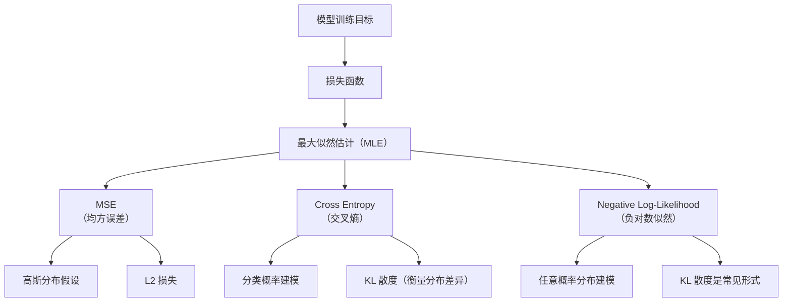

# 一文通俗讲透机器学习中的损失函数、似然、交叉熵与 KL 散度

在机器学习中，我们的目标是让模型不断“**学得更好**”，即在看过大量样本后，能够做出更加准确的预测。

但“学得好”到底意味着什么？我们必须给模型一个明确的标准，用来衡量它做得对不对，这个标准就是 —— **损失函数**（`Loss Function`）。

围绕损失函数展开，机器学习中还有一系列紧密相关的核心概念，比如：
**似然**（`Likelihood`）、**最大似然估计**（`MLE`）、**交叉熵**（`Cross Entropy`）、**KL 散度**（`KL Divergence`）、**最小二乘法**（`Least Squares`）、**正则化**（`Regularization`） 和 **贝叶斯估计**（`Bayesian Estimatio`n） 等。

这些概念不仅是算法公式的基础，更是理解“模型训练为什么这么设计”的关键。

> 本文将用通俗直白的语言，系统梳理这些概念之间的联系和区别，带你从“误差是怎么定义的”出发，一步步理解模型训练背后的逻辑与原理。

---

## 一、背景：模型学习的核心问题是什么？

在现实生活中，我们经常遇到“根据已有信息做出判断”的问题，比如：

* 根据身高、体重预测一个人的体脂率；
* 根据用户浏览记录推荐感兴趣的视频；
* 根据病人病史判断是否可能患某种疾病。

在机器学习中，我们的目标就是让**计算机自动学习一个规律或函数**，用来把输入（特征）转化为输出（结果）。我们可以形式化地表示为：

$$
\hat{y} = f(x; \theta)
$$

* $x$：输入（如年龄、学历、浏览记录）
* $\theta$：模型的参数（可以理解为“知识”）
* $\hat{y}$：模型预测的结果
* $f$：我们想学习的函数形式

---

### 问题来了：我们到底想让模型学到什么？

在训练阶段，我们有很多“样本”（也叫“训练数据”），它们是这样一对对地存在的：

$$
(x_1, y_1), (x_2, y_2), \dots, (x_n, y_n)
$$

也就是说，对于每一个输入 $x_i$，我们知道它的真实结果 $y_i$。

> 我们的目标，就是找到一个函数 $f(x; \theta)$，使得：
>
> 对所有样本来说，预测结果 $\hat{y}_i = f(x_i; \theta)$ 尽可能接近真实值 $y_i$。

---

### 这就引出了两个核心问题：

1. **“准不准”怎么衡量？**
   ——我们需要一个指标来衡量预测值和真实值的差距，这个指标就是“损失函数（Loss Function）”。

2. **“最好的参数”怎么找到？**
   ——我们需要找到一组最优参数 $\theta$，使得在所有训练样本上的总损失最小。

换句话说：

> 训练模型 = 设定一个损失函数 + 最小化这个损失函数。

就像你打靶，我们要：

* 有一个标准（靶心）来衡量准不准（损失函数）；
* 然后不断调整姿势和方向（参数 $\theta$）来让误差尽量小（优化过程）。

---

### 小结一下

我们让机器学习的目标，其实就是让模型“在训练数据上表现得尽量好”，然后“在新数据上依然能保持不错的表现”。
而这背后的关键步骤离不开下面这几个问题：

| 关键问题             | 解决方式                   |
| ---------------- | ---------------------- |
| 怎么判断预测得准不准？      | 设计合适的损失函数              |
| 怎么把真实世界的问题转换成模型？ | 构建合适的函数 $f(x; \theta)$ |
| 怎么找到表现最好的模型？     | 优化损失函数，找到最优参数 $\theta$ |
| 怎么防止过于贴近训练数据而失真？ | 引入正则化、概率建模等机制          |

接下来，我们就要进入这些关键概念的世界：损失函数、似然、最大似然估计、交叉熵、KL 散度、最小二乘法、正则化……每一个都是我们训练模型时不可缺少的工具。

---

非常好！下面是对你给出的内容进行扩展和润色的版本，使其 **更易懂、更具有教学性和逻辑性**，并加入了一些小示例来帮助理解：

---

## 二、损失函数：模型好坏的“量尺”

训练一个机器学习模型，最核心的事情之一就是：

> 如何判断这个模型好不好？

我们不能拍脑袋说“这个模型感觉挺不错”，而是需要一个**数学指标**，来衡量模型预测值 $\hat{y}$ 与真实值 $y$ 的差距，这就是：

### 损失函数（Loss Function）

你可以把“损失函数”理解为一个**“打分系统”**：

* 分数越高 → 模型越差
* 分数越低 → 模型越好

我们训练模型的目标，就是让这个“损失”**尽量小**，从而找到最优的模型参数 $\theta$。

---

### 不同任务，损失函数也不同

根据预测问题的不同，常用的损失函数也各不相同：

| 任务类型     | 常用损失函数                 | 通俗解释               |
| -------- | ---------------------- | ------------------ |
| **回归问题** | **最小二乘法（MSE）**         | 预测值和真实值差得越小越好      |
| **分类问题** | **交叉熵（Cross Entropy）** | 预测“可能性”越接近真实标签越好   |
| **概率建模** | **负对数似然（NLL）或 KL 散度**  | 模型预测的概率分布越接近真实分布越好 |

---

### 1. 均方误差（Mean Squared Error, MSE）

最常用于回归任务，比如预测房价、身高等数值。它的形式是：

$$
\text{MSE} = \frac{1}{n} \sum_{i=1}^{n} (y_i - \hat{y}_i)^2
$$

它的含义非常直观：

* 把每个预测误差（差值）平方
* 然后求平均

平方的作用是：把负误差也变成正值，并放大大的误差（罚得更重）。

> 使用 MSE 损失函数，本质上是用“最小二乘法”来指导模型训练，让整体预测误差平方尽可能小。

#### 举个例子：

* 真实值是 100，预测值是 80 → 误差是 20 → 损失是 400
* 真实值是 100，预测值是 95 → 误差是 5 → 损失是 25
  
> 明显后者更准，MSE 能反映这一点。

---

这段关于“交叉熵（Cross Entropy）”的内容整体清晰通俗，是很好的科普/教学材料。以下是对内容的逐项检查与改进建议，以确保表达更准确、通俗性与数学性兼顾：

---

### 2. 交叉熵（Cross Entropy）

交叉熵是**分类任务中最常用的损失函数之一**，尤其适用于输出是**概率分布**的模型。

---

#### 举个例子：

你让一个模型判断一张图片是“猫”还是“狗”，它输出的概率是：

* 猫：0.9
* 狗：0.1

而真实标签是“猫”（也就是真实概率应该是猫 = 1，狗 = 0），我们当然希望模型预测的概率分布**越接近真实分布越好**。

---

#### 二分类时的交叉熵公式为：

$$
\text{CE}(y, \hat{y}) = -[y \log(\hat{y}) + (1 - y)\log(1 - \hat{y})]
$$

其中：

* $y \in \{0, 1\}$：真实标签
* $\hat{y} \in (0, 1)$：模型预测输出的概率

---

#### 通俗理解：

交叉熵惩罚的是什么？

* 如果真实标签是 1（比如猫），但你只给了 0.1 的概率 → 惩罚非常大
* 如果你预测得非常接近真实标签（如 0.95 接近 1）→ 惩罚就很小

它的含义可以理解为：

> “预测越接近真实分布，损失越小；越不像，惩罚越大。”

---

#### 小知识扩展（可选）：

交叉熵来源于**信息论**，它衡量的是：

> “用预测分布 $\hat{y}$ 去逼近真实分布 $y$ 时，平均要多花多少信息量。”

在机器学习中，交叉熵损失实际上等价于最大似然估计（MLE）在概率模型下的对数损失。

---

### 3. 概率建模中的损失：负对数似然 & KL 散度

在很多机器学习任务中，我们不仅关心模型的输出是否“对”，还希望它预测出的概率分布，**越接近真实概率分布越好**。

比如：

> 不是仅仅说“这是猫”，而是模型说“这是猫的概率是 95%”更靠谱。

这时候，衡量模型性能的损失函数，就不再是简单的误差（比如数值差），而是**两个概率分布之间的差距**。

常见的有两个核心概念：

---

#### 1. 负对数似然（Negative Log-Likelihood, NLL）

这是概率建模中最基础的损失函数之一，公式是：

$$
\text{NLL} = -\log P(y \mid x; \theta)
$$

含义是：

> **如果一个事件真实发生了，我们希望模型给它的概率尽可能大。**

NLL 的本质：

* 是对真实标签 $y$ 出现的概率取对数（防止概率太小），然后取负号（因为我们希望概率越大损失越小）
* 和“最大似然估计”是两个视角的一体两面：最大似然就是最小化 NLL

**举例：**

* 若模型对正确标签给出 0.9 的概率，损失是 $-\log(0.9) \approx 0.105$
* 若模型只给出 0.1，损失是 $-\log(0.1) \approx 2.302$

这说明：**预测得越准（越确信），损失越小；预测得越差（越不确定），惩罚越大。**

> 多分类问题中，交叉熵 = NLL
> 二分类中，交叉熵公式也是 NLL 的特例

---

#### 2. KL 散度（Kullback-Leibler Divergence）

KL 散度是用来衡量两个概率分布 $P$ 和 $Q$ 之间差异的“距离”，公式如下：

$$
D_{KL}(P \| Q) = \sum_{i} P(i) \log \frac{P(i)}{Q(i)}
$$

这里：

* $P$ 是真实的分布（比如标签分布）
* $Q$ 是模型预测出来的分布

KL 散度的含义是：

> **如果我们用 Q 来近似 P，平均会多“损失”多少信息？**

#### 注意：

* KL 散度不是对称的：$D_{KL}(P \| Q) \ne D_{KL}(Q \| P)$
* 这意味着在训练时选择哪个方向进行 KL 优化，会导致模型行为不同，可能更保守或更激进。
* 它不是严格的“距离”，但在信息论中非常重要

---

#### KL 散度与交叉熵的关系：

交叉熵可以拆解为：

$$
H(P, Q) = H(P) + D_{KL}(P \| Q)
$$

其中：

* $H(P)$：真实分布自身的信息熵（不依赖模型）
* $D_{KL}(P \| Q)$：模型预测和真实分布的差异

这意味着：

> **最小化交叉熵 = 最小化 KL 散度**（因为 $H(P)$ 是固定的）

---

#### 总结一句话：

| 概念    | 直观含义                                    |
| ----- | --------------------------------------- |
| NLL   | 模型对“真实发生”的事件给了多小的概率（越小惩罚越大）             |
| KL 散度 | 模型学到的分布与真实分布之间的差距（信息损失）                 |
| 交叉熵   | 同时考虑了真实分布和预测分布的距离，本质是 NLL 或带 KL 散度的衡量方式 |

---

### 模型太“聪明”？引入正则化来防止过拟合

在训练过程中，有时候模型会变得**太聪明**：

> 它记住了所有训练数据的细节，却对新数据表现很差——这就是**过拟合**。

解决办法之一，就是让模型“别学太过火”，也就是：

> 限制参数不要太大，加入“正则化项”。

---

#### L1 / L2 正则化：让参数“收敛一点”

正则化，就是在原来的损失函数上，加一个“惩罚项”来约束模型参数。

##### L2 正则化（常用于岭回归 Ridge）

公式：

$$
\text{Loss}_{L2} = \text{原始损失} + \lambda \sum_{j} \theta_j^2
$$

特点：

* 惩罚的是参数的**平方和**
* 越大的参数惩罚越重 → 让模型“偏爱小系数”
* 不会让参数变成 0，但会让它们更“平滑”

##### L1 正则化（常用于套索回归 Lasso）

公式：

$$
\text{Loss}_{L1} = \text{原始损失} + \lambda \sum_{j} |\theta_j|
$$

特点：

* 惩罚的是参数的**绝对值和**
* 可以把一些参数**直接压成 0** → 自动进行特征选择
* 模型变得更加稀疏，利于解释

---

#### Lasso vs Ridge：哪个适合我？

| 方式        | 适用情况      | 特点              |
| --------- | --------- | --------------- |
| L2（岭回归）   | 所有特征都可能有用 | 参数趋于平滑，但不会归零    |
| L1（Lasso） | 特征太多、需要筛选 | 参数可以变为 0，具有选择功能 |

> 也有折中方法叫 **弹性网（Elastic Net）**，结合 L1 和 L2，同时兼顾平滑性与稀疏性。
其损失形式为：

$$
\text{Loss} = \text{原始损失} + \lambda_1 \sum_j |\theta_j| + \lambda_2 \sum_j \theta_j^2
$$

---

#### 总结一句话：

**正则化 = 在损失函数中加“惩罚”，让模型别学太偏。**

它从优化角度解决了模型复杂度太高的问题，也是现代机器学习中不可或缺的一环。

---

### 损失函数是桥梁

损失函数连接了**模型预测**和**真实数据**之间的差距，是训练优化的核心。
可以这样理解：

> 想让模型“长记性”？就得靠损失函数来“惩罚错误”！

---

### 下一步

现在我们知道，损失函数是我们优化的目标。那么：

* 损失函数从哪来？
* 有没有什么“理论依据”告诉我们，这种损失设计是合理的？
* 又如何通过概率视角解释这些损失？

这就引出了下一个重要概念——**似然函数和最大似然估计（MLE）**。

---

## 三、似然与最大似然估计（MLE）

### 1. 什么是“似然”？

我们经常说“模型要能解释数据”。那么**怎么衡量一个模型解释数据的能力强不强**？

这就用到了一个概念：**似然（Likelihood）**。

> 似然描述的是：**在模型参数为 $\theta$ 的情况下，观察到这些数据的可能性有多大？**

你可以这样理解：

* 比如你认为一枚硬币正面概率是 0.6
* 然后你实际抛了 10 次，结果 7 次正面、3 次反面
* 那你就会问：“**如果这枚硬币的正面概率真的是 0.6，那我看到这种数据的可能性有多大？**”

这个“可能性”就是 **似然**。记作：

$$
P(\text{data} \mid \theta)
$$

注意：这里不是问参数 $\theta$ 的概率（它是已知的假设），而是问 **数据在给定参数下出现的可能性**。

---

### 2. 最大似然估计（Maximum Likelihood Estimation，MLE）

知道了“似然”这个概念，我们就可以提出一个训练模型的策略：

> 在所有可能的参数（模型）中，找出一个让观察到的数据**最可能出现**的！

这就是**最大似然估计（MLE）**：

$$
\hat{\theta}_{\text{MLE}} = \arg\max_{\theta} P(\text{data} \mid \theta)
$$

也就是说：找出**让当前数据出现概率最高的参数**，这就是我们的最佳模型。

#### 类比理解：

你在玩“谁是卧底”游戏，观察大家说的话，然后猜谁最不像。
而 MLE 是反过来：你观察数据，选出最像真的那个“玩家”。

---

### 3. 从最大似然到“损失函数”：为什么用负对数？

我们前面讲了很多损失函数，比如：

* MSE（回归）
* 交叉熵（分类）

这些都是“**我们希望最小化的目标**”。

而 MLE 是“**希望最大化似然**”，看起来好像有点对不上？

其实只需要一个小技巧就能统一起来：

#### ➤ MLE 转换为最小化负对数似然（Negative Log-Likelihood, NLL）：

$$
\text{NLL} = - \log P(\text{data} \mid \theta)
$$

> 所以训练模型本质上就是：**最小化 NLL = 最大化似然！**

为什么要取对数？

* 概率通常是乘起来的，容易数值下溢，取对数能简化乘法为加法；
* 负号是因为我们希望最小化，而不是最大化目标。

#### 举个例子（分类问题）：

假设我们有个分类模型输出 $\hat{y}$ 表示预测为正类的概率，真实标签 $y$ 是 0 或 1，那么它的负对数似然是：

$$
\text{NLL} = -[y \log(\hat{y}) + (1 - y)\log(1 - \hat{y})]
$$

你有没有觉得眼熟？这就是我们熟悉的 **交叉熵损失**！

---

### 4. 贝叶斯估计 vs 最大似然估计

很多同学会问：

> 只看当前数据来估计参数，靠谱吗？能不能考虑我们已有的“经验”或“背景知识”？

这正是 **贝叶斯估计（Bayesian Estimation）** 的出发点。

#### ✅ 最大似然估计（MLE）：

* 只关注当前数据的似然：$P(\text{data} \mid \theta)$
* 假设所有参数一开始都一样可能（没有偏好）

#### ✅ 贝叶斯估计（MAP: Maximum A Posteriori Estimation）：

* 在数据的基础上**加入先验知识**（先验分布 $P(\theta)$）
* 寻找的是参数的**后验概率最大值**：

$$
\hat{\theta}_{\text{MAP}} = \arg\max_{\theta} P(\theta \mid \text{data}) = \arg\max_{\theta} \frac{P(\text{data} \mid \theta) P(\theta)}{P(\text{data})}
$$

#### 类比理解：

MLE 就像是“看谁说得最像真的”；
贝叶斯更像是“我本来就觉得这个人靠谱，现在又说得很像真的，那我更相信他”。

---

### 总结一张表：MLE vs 贝叶斯估计

| 方法          | 依赖什么        | 优点            | 缺点             |
| ----------- | ----------- | ------------- | -------------- |
| 最大似然估计（MLE） | 仅依赖数据的似然    | 简单高效，推导清晰     | 无法引入先验知识，容易过拟合 |
| 贝叶斯估计（MAP）  | 数据似然 + 参数先验 | 可以融合历史经验，鲁棒性强 | 推导复杂，计算量大      |

---

## 四、交叉熵：用于分类的损失函数

在多分类任务中，我们经常会用到**交叉熵（Cross Entropy）损失函数**。它的目标很明确：

> **让模型预测的概率分布尽可能接近真实标签的分布。**

### 定义公式：

$$
H(p, \hat{p}) = - \sum_i p_i \log \hat{p}_i
$$

* $p$：真实分布，通常是 one-hot，比如 `[0, 0, 1, 0]`
* $\hat{p}$：模型预测的概率分布，比如 `[0.1, 0.2, 0.6, 0.1]`

这个公式的含义是：

> **真实标签是哪一类，就取该类预测概率的对数并取负数作为损失**。

---

### 举个例子：

假设一张图片的真实类别是“猫”，标签 one-hot 是 `[1, 0]`：

* 如果模型预测是 `[0.9, 0.1]` → 交叉熵是：$ -\log(0.9) \approx 0.105$
* 如果模型预测是 `[0.1, 0.9]` → 交叉熵是：$ -\log(0.1) = 2.302$

> 预测越准确，损失越小；
> 如果你信心满满地预测错了，损失就非常大！

---

### 为什么 KL 散度不是对称的？

$$
D_{KL}(P \| Q) \neq D_{KL}(Q \| P)
$$

* 因为它只在 $P(x)$ 存在时才惩罚 $Q(x)$
* 类似于“只从真实情况出发去衡量误差”

这也解释了为什么生成模型中选择 $D_{KL}(Q \| P)$ 还是 $D_{KL}(P \| Q)$ 会导致不同的行为。

---

### 信息论视角下的三大概念

这些损失背后，其实有着深厚的信息论基础。以下是几个关键概念：

| 概念 | 数学定义 | 含义 |
| ------------------------------------------ | --------------------------------------------- | ---------------------------------------- |
| **信息熵** $H(p)$                           | $-\sum_i p_i \log p_i$                   | 描述真实分布 $p$ 的**不确定性**（平均信息量）            |
| **交叉熵** $H(p, \hat{p})$                  | $-\sum_i p_i \log \hat{p}_i$             | 描述模型预测 $\hat{p}$ 对真实分布 $p$ 的**拟合程度** |
| **KL 散度** $D_{\text{KL}}(p \| \hat{p})$ | $\sum_i p_i \log \frac{p_i}{\hat{p}_i}$ | 测量两个分布之间的“距离”（非对称）                       |

它们之间有一个非常重要的关系：

$$
\boxed{H(p, \hat{p}) = H(p) + D_{\text{KL}}(p \| \hat{p})}
$$

#### 通俗解释：

> 交叉熵 = 真正的不确定性 + 模型与真相的距离

---

### 你可以这样理解这三个量的关系：

* **信息熵 $H(p)$**：现实到底有多复杂？（和模型无关）
* **交叉熵 $H(p, \hat{p})$**：模型“以为”现实多复杂
* **KL 散度 $D_{\text{KL}}$**：模型和现实差了多少？

---

### 小结

* 交叉熵不仅仅是一个损失函数，更是连接**概率论与信息论的桥梁**
* 它自然地出现在**最大似然估计**和**对数损失函数**的推导中
* 从信息论角度看，它反映了模型预测的“平均代价”

---

## 六、损失函数的总结图谱

---

### 损失函数是“训练目标”的核心桥梁：

我们在训练一个模型时，本质是在**最小化损失函数**。而这些损失函数的背后，往往都可以从**最大似然估计（MLE）**的角度进行解释。

---

### 总结一句话：

> 大多数损失函数本质上是从概率建模出发，通过最大似然推导出来的。理解这一点，可以帮助我们从更本质的角度设计或选择合适的损失函数。

